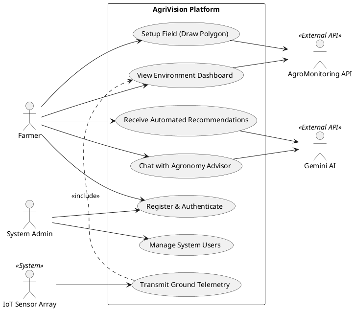

# 3. Use Case Diagram & Usage Scenarios

## 3.1 Actors Description
*   **Farmer (Primary Human Actor):** Interacts with the mobile application to manage fields, upload crop images, view dashboards, and converse with the AI chatbot.
*   **System Admin (Secondary Human Actor):** Manages user accounts, oversees system health, and handles backend configurations.
*   **IoT Sensor Array (System Actor):** Physical ESP32 nodes planted in the field that continuously transmit telemetry (moisture, temperature, NPK) via the MQTT bridge.
*   **AgroMonitoring API (External Actor):** Third-party service providing satellite imagery, NDVI statistics, weather, and soil data based on geographical polygons.
*   **Gemini AI (External Actor):** Google's GenAI model that processes visual and textual inputs alongside field data to generate agronomic recommendations.

## 3.2 Use Case Diagram
*You can copy the code block below and paste it directly into PlantText.com or any PlantUML editor.*

## 3.3 Primary Usage Scenario: Field Setup & Satellite Integration

**Use Case:** Setup Field (Draw Polygon)
**Primary Actor:** Farmer
**Secondary Actors:** AgroMonitoring API
**Pre-condition:** The Farmer has successfully authenticated and is viewing the empty field dashboard.

**Main Success Scenario (Flow of Events):**
1.  The Farmer selects the "Add New Field" option from the mobile application menu.
2.  The system renders an interactive map interface centered on the user's current GPS location.
3.  The Farmer taps on the map to draw a geographical boundary (polygon) that outlines their physical farm.
4.  The Farmer names the field and selects the current crop type (e.g., "Wheat").
5.  The Farmer clicks "Save Field".
6.  The backend system receives the GeoJSON polygon data and transmits it to the **AgroMonitoring API**.
7.  The external API registers the boundary and returns a unique `Polygon_ID`.
8.  The system immediately triggers asynchronous background workers (`sync_field_background`) to fetch Sentinel-2 satellite imagery, NDVI (health) statistics, soil moisture profiles, UV indices, and a 5-day weather forecast for that specific polygon.
9.  The system stores the field profile and satellite data in the local database.
10. The Farmer is redirected to the Dashboard, which successfully populates with live weather data, UVI, soil profiles, and a satellite view of their newly created field.

**Alternative Flows (Exceptions):**
*   **3a. Invalid Polygon:** If the lines of the polygon intersect or the area is too large, the system prompts the farmer to redraw the boundary.
*   **7a. API Timeout:** If the AgroMonitoring API fails to respond, the system saves the polygon locally and marks the satellite sync status as "Pending Retry" to prevent blocking the user's workflow.
