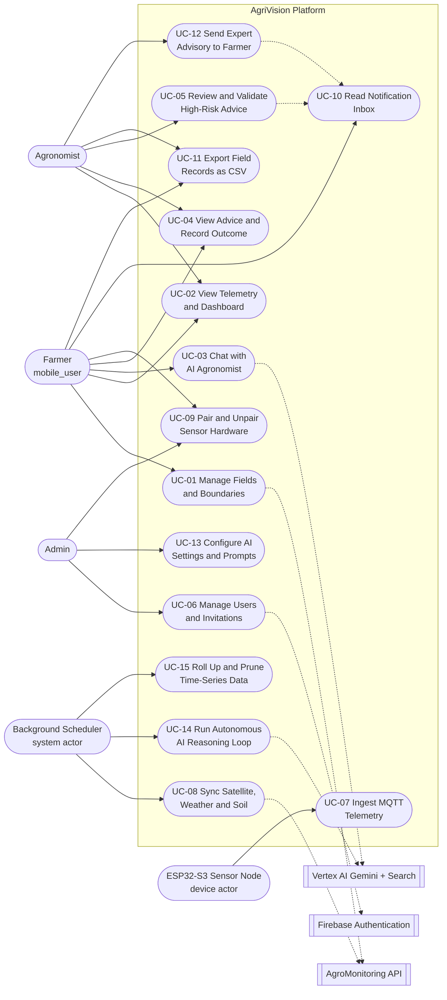

# 3. Use Case Diagram

## 3.1 Overview of Platform Use Cases
The AgriVision platform provides structured interactions tailored to each user role and edge hardware node. The use case model illustrates the boundaries between platform actors, internal subsystems, and external cloud services.

## 3.2 UML Use Case Diagram

## 3.3 Complete Use Case Inventory & Actor Association

| UC ID | Use Case Name | Primary Actor | Secondary Actors | Pre-Conditions | Post-Conditions |
| :--- | :--- | :--- | :--- | :--- | :--- |
| **UC-01** | Manage Fields & Polygons | Farmer | AgroMonitoring API | Authenticated as `mobile_user`; fewer than 5 active fields | Polygon validated by `ST_IsValid`, area computed in hectares, provider link created |
| **UC-02** | View Telemetry, Dashboard & Satellite Layers | Farmer, Agronomist | Database | Field readable by the caller | Aggregated dashboard snapshot rendered from sensors, observations and the latest scene |
| **UC-03** | Chat with AI Agronomist | Farmer | Vertex AI Gemini | Field active; `Idempotency-Key` supplied | Grounded reply persisted to the field's `farmer` chat thread with sanitised attachments |
| **UC-04** | View Advice & Record Outcome | Farmer | Database | Field has generated recommendations | Advice displayed; farmer feedback and applied/not-applied outcome recorded |
| **UC-05** | Review & Validate High-Risk Advice | Agronomist | Notification subsystem | Recommendation held at `expert_status="pending"` | Verdict, reviewer identity and timestamp recorded; owner notified |
| **UC-06** | Manage Users & Invitations | Admin | Firebase Auth | Authenticated as `admin` | Invitation stored as `pending` and a Firebase sign-in link emailed; role elevated at the invitee's next session bootstrap |
| **UC-07** | Ingest MQTT Telemetry | ESP32-S3 Node | Mosquitto Broker | Node connected to WiFi; device flood limit not exceeded | Reading upserted into the TimescaleDB hypertable on `(time, sensor_id)` |
| **UC-08** | Synchronise Satellite, Weather & Soil | Background Scheduler | AgroMonitoring API | Field has a registered provider polygon | Scene, NDVI/true-colour rasters, weather, soil and UVI observations cached |
| **UC-09** | Pair & Unpair Sensor Hardware | Farmer, Admin | Database | `device_id` verified and unclaimed | Sensor bound to field and owner, or released |
| **UC-10** | Read Notification Inbox | Farmer | Database | Authenticated session | Notifications listed; individual or bulk read state persisted |
| **UC-11** | Export Field Records as CSV | Farmer, Agronomist | Database | Field readable by the caller | Streaming CSV of readings, recommendations, observations, scenes or chat |
| **UC-12** | Send Expert Advisory to Farmer | Agronomist, Admin | Notification subsystem | Field readable by staff; under 30 advisories/hour | Free-text advisory delivered to the owner's inbox, optionally linked to a recommendation |
| **UC-13** | Configure AI Settings & Prompts | Admin | `system_settings` | Authenticated as `admin` | Model, prompt and interval configuration updated without redeployment |
| **UC-14** | Run Autonomous AI Reasoning Loop | Background Scheduler | Vertex AI Gemini + Search | Field context available and reasoning interval elapsed | Analysis run, recommendations, field health and season memory persisted |
| **UC-15** | Roll Up & Prune Time-Series Data | Background Scheduler | TimescaleDB | Hourly worker tick | Hourly buckets upserted; raw rows beyond the retention window deleted |

## 3.4 Detailed Usage Scenarios

### Scenario 1: Field Creation & Satellite Polygon Synchronization
* **Actor:** Farmer (`mobile_user`)
* **Trigger:** Farmer completes drawing the field perimeter on the MapKit canvas and taps "Save Field".
* **Pre-conditions:** Mobile client authenticated via Firebase; fewer than five active fields; device online.
* **Main Success Scenario:**
  1. Mobile app transmits `POST /api/fields` with the polygon coordinate ring, name, crop type and optional sensor pairings.
  2. Backend takes a per-tenant advisory lock, enforces the five-active-field limit and the 20-creations-per-hour rate limit.
  3. Backend validates ring topology via PostGIS `ST_IsValid` and computes acreage via `ST_Area(geography)/10000`, rejecting anything outside 1–3,000 ha.
  4. Row inserted into `fields`; any supplied sensors are bound to the new field in the same transaction.
  5. Backend awaits an initial AgroMonitoring sync bounded by `AGRO_INITIAL_SYNC_TIMEOUT_SECONDS` (15 s default) so the field can return with imagery already attached; if the provider is slower, the sync is handed to a background task instead.
  6. The provider polygon identifier is written to `field_provider_links` (`provider="agromonitoring"`, `external_id`, `sync_status`), not to the `fields` row.
  7. An AI reasoning run for the new field is queued as a background task, and the API responds `201 Created` with the field entity.
* **Post-conditions:** Field visible on the mobile dashboard with its provider sync state; NDVI available as soon as the first scene lands.

### Scenario 2: IoT Telemetry Ingestion & Hourly Rollup
* **Actor:** Physical ESP32-S3 Hardware Node
* **Trigger:** The firmware's non-blocking publish timer elapses every 5 seconds.
* **Pre-conditions:** Node's `DEVICE_ID` matches a paired `sensors` row; WiFi credentials valid; broker reachable.
* **Main Success Scenario:**
  1. Firmware averages the analog soil-moisture reading on GPIO 5 and reads the DS18B20 1-Wire probe on GPIO 6.
  2. Probe fault detection discards open-circuit and short-circuit readings; if no probe returned valid data the turn is suppressed entirely rather than publishing zeros.
  3. Firmware serialises the surviving fields into JSON and publishes to `agrivision/sensors/{device_id}/readings` (PubSubClient, QoS 0).
  4. The FastAPI consumer validates that the payload's `device_id` matches the topic segment, applies the per-device flood limit (120 messages / 60 s) and the 5-minute clock-skew guard, then enqueues the sample.
  5. The async writer drains the queue in batches of up to 50 and upserts with `ON CONFLICT (time, sensor_id)`, auto-registering an unknown `device_id` as a new unassigned sensor.
  6. The hourly worker rolls the trailing 24 hours into `sensor_readings_hourly`; once daily at 03:00 UTC it prunes raw rows past the retention window.
* **Post-conditions:** Telemetry available to the fleet analytics dashboards; raw rows queued for retention pruning.

### Scenario 3: AI Advisory Interception & Agronomist Clinical Approval
* **Actor:** Agronomist (`agronomist`) and the autonomous AI reasoning scheduler
* **Trigger:** The reasoning loop finds the field's context fingerprint has changed and its reasoning interval has elapsed.
* **Pre-conditions:** Field has recent telemetry, observations or a satellite scene.
* **Main Success Scenario:**
  1. Scheduler assembles the context snapshot (sensor trends, weather, soil, UVI, NDVI, season memory) and opens an `ai_analysis_runs` row recording model, prompt version and policy version.
  2. Gemini returns structured recommendations, a field-health payload and a season-memory update against a constrained response schema.
  3. `_apply_safety_policy` inspects each item: chemical or dosage advice, or advice whose cited evidence is not an approved source, is forced to `safety_level="high_risk"` with `requires_expert_confirmation=True`.
  4. The recommendation is inserted into `field_recommendations` with `expert_status="pending"`, so the farmer sees it flagged as awaiting expert confirmation rather than as actionable advice.
  5. The agronomist opens `AIAdvisoryView`, which lists the queue from `GET /api/recommendations/expert/pending` alongside the originating analysis run and its context snapshot.
  6. The agronomist records a verdict through `POST /api/recommendations/{id}/expert-validate`, attaching clinical notes.
  7. The backend writes `expert_status`, `reviewed_by_id` and `reviewed_at` as an audit trail, and creates a `user_notifications` record for the field owner carrying the verdict, the advice summary and the reviewer's note.
* **Post-conditions:** Farmer sees the verified verdict in the in-app notification inbox; a reviewer of record is permanently attached to the recommendation.
