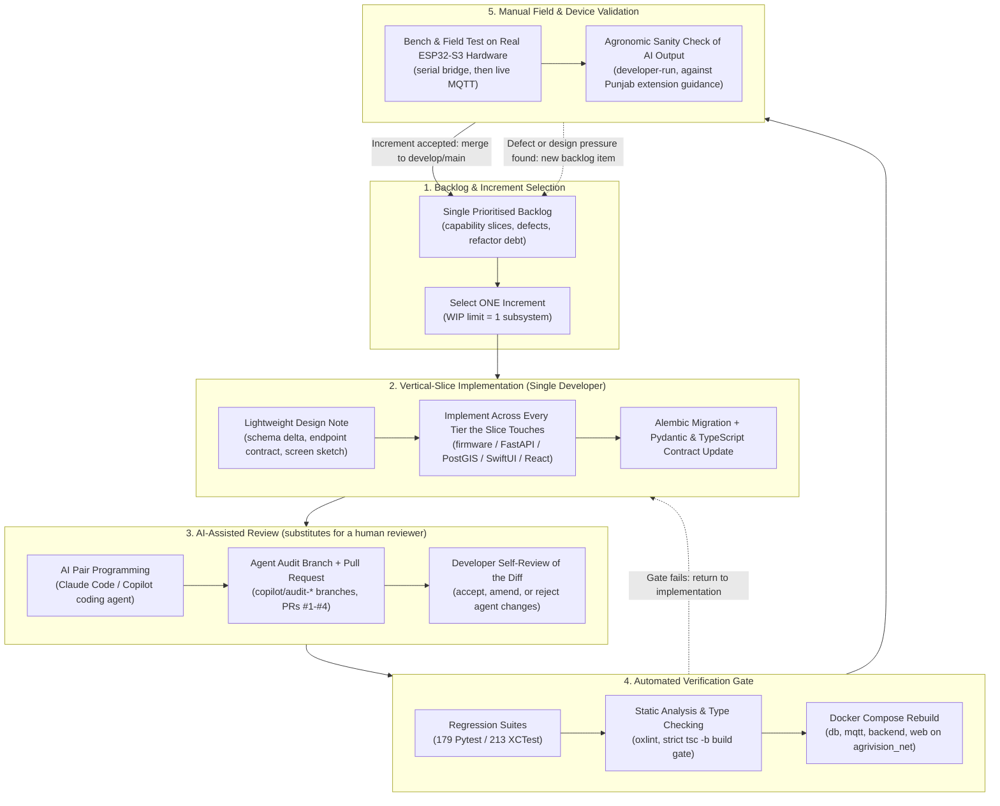
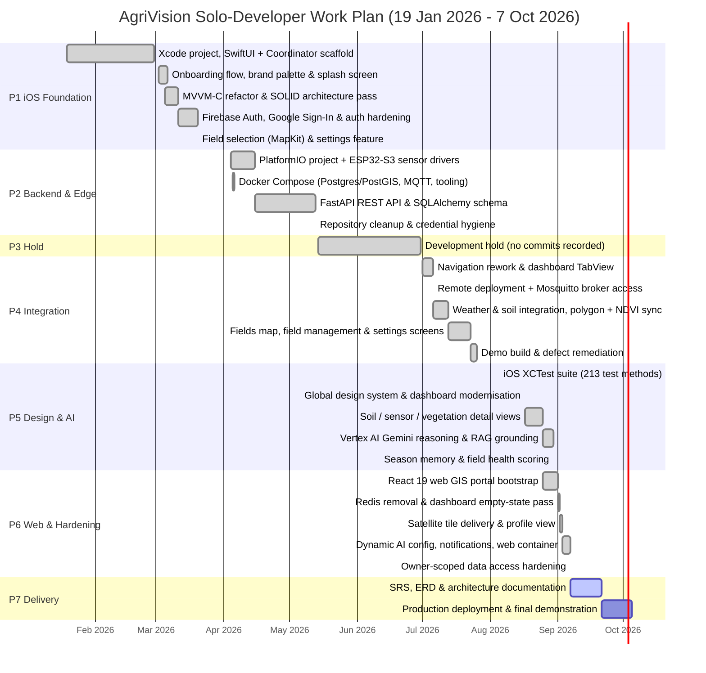

# 4. Adopted Methodology

## 4.1 Development Context & Resourcing Constraint
AgriVision is engineered and maintained by a **single solo developer** who performs every role on the project: systems analyst, database architect, backend engineer, embedded firmware engineer, AI engineer, iOS developer, web developer, QA engineer, and DevOps operator. There is no team, no pairing partner, no dedicated tester, and no separate reviewer.

This constraint is not incidental — it *determines* the methodology. Any process that depends on multiple concurrent contributors (Scrum ceremonies, daily standups, pair programming, cross-team integration meetings, a separate QA function, or parallel feature tracks staffed by different engineers) is structurally unavailable. The methodology described below is therefore the process actually followed, and it is corroborated by the project's version control history rather than asserted retrospectively.

**Verification basis.** Every claim in Sections 4 and 5 is derived from the project Git repository: 119 commits between **19 January 2026** and **7 September 2026**, authored by a single human contributor (98 commits) supplemented by automated agent commits raised through pull requests (20 commits from the GitHub Copilot coding agent, 1 from an image-optimization bot).

## 4.2 Adopted Process: Solo Iterative & Incremental Development with AI-Assisted Engineering
The project follows a **solo iterative and incremental process organised as a single-lane Kanban with a work-in-progress limit of one subsystem at a time**, augmented by **AI-assisted pair programming** and **automated pull-request review** as substitutes for the human collaboration practices a team would otherwise provide.

The defining characteristics are:

* **Vertical-slice increments.** Each increment delivers one user-visible capability end-to-end across every tier it touches (firmware → broker → API → database → client UI) rather than completing a horizontal layer in isolation. Example: the field-creation increment of July 2026 spanned the iOS MapKit drawing canvas, the `POST /api/fields` handler, PostGIS validation, the AgroMonitoring polygon registration call, and the NDVI sync — committed together as one working slice.
* **WIP limit of one.** With a single developer, concurrency is a liability rather than a throughput gain. The repository history shows subsystems being developed in sequence, not in parallel: the native iOS client (Jan–Mar), the edge firmware and cloud backend (Apr–May), integration and the satellite pipeline (Jul), the AI engine and design system (Aug), and finally the web portal and notification layer (late Aug–Sep).
* **AI-assisted pair programming.** Claude Code and the GitHub Copilot coding agent stand in for the second pair of eyes a solo developer does not have. Their contributions enter the codebase through the same pull-request gate as hand-written work — visible in the merged reviews of PRs #1–#4, and in dedicated agent branches such as `copilot/audit-firebase-auth-implementation` and `copilot/audit-codebase-architecture`.
* **Automated review as the quality gate.** Because no human reviewer exists, correctness is enforced by an automated regression suite (**179 Pytest test functions** across 25 backend test modules and **213 XCTest test methods** across 11 iOS test suites), static analysis (`oxlint` and a strict TypeScript `tsc -b` build gate on the web client; typed Pydantic contracts and the test suite itself on the backend, which carries no separate linter configuration), and reproducible container builds via Docker Compose.
* **Refactor-on-evidence.** Rather than pre-designing for architectural purity, the process admits deliberate, dated refactor passes once a design pressure is proven by working code. The history records several: the MVVM-C and SOLID enforcement pass (5 March 2026), the auth-layer deduplication and hardening pass (18 March 2026), the global design-system standardisation pass (17 August 2026), and the Redis removal that eliminated an unused dependency (1 September 2026).
* **Honest cadence, not a fictional one.** Commit density is uneven by design: 44 commits in March 2026, 4 in April, 3 in May, **none in June 2026** (an academic hold), then 10 in July. A solo project does not sustain a fixed two-week sprint rhythm alongside competing obligations, and the plan in Section 5 reflects the real calendar rather than an idealised one.

## 4.3 Solo Iterative Development Workflow

## 4.4 Sequential Subsystem Order (Evidenced by Version Control)
Because only one developer is available, subsystems were built in sequence. The order below is taken directly from the first and last commit touching each part of the repository.

| Order | Subsystem | Repository Path | First Commit | Most Recent Commit | Commits |
| :--- | :--- | :--- | :--- | :--- | :--- |
| 1 | Native iOS Client (SwiftUI, MVVM-C) | `AgriVision/` | 2026-01-19 | 2026-09-07 | 66 |
| 2 | Embedded Edge Firmware (ESP32-S3) | `esp/` | 2026-04-04 | 2026-09-07 | 9 |
| 3 | Cloud Backend, GIS & AI Services | `AgriVision-Backend/` | 2026-04-05 | 2026-09-07 | 22 |
| 4 | Engineering Documentation & SRS | `Docs/` | 2026-05-13 | 2026-09-07 | 6 |
| 5 | Automated iOS Test Suite | `AgriVisionTests/` | 2026-08-05 | 2026-08-05 | 1 |
| 6 | Enterprise Web GIS Portal (React 19) | `AgriVision-Web/` | 2026-08-25 | 2026-09-07 | 5 |

The iOS client was started first and remains the longest-lived subsystem because it defined the product's data requirements; the backend was only begun once those requirements were stable, which is precisely the ordering a solo developer must adopt to avoid building a server for a client that does not yet exist.

## 4.5 Engineering Practices Actually Applied
1. **Trunk-with-feature-branches version control.** Work is developed on named branches (`onboarding-screens`, `auth`, `develop`, `copilot/audit-*`, `agent-building`) and merged into the mainline through pull requests, giving a solo developer an explicit review checkpoint that direct commits to `main` would not provide.
2. **Automated regression testing.** 179 backend Pytest test functions cover multi-tenancy isolation, MQTT ingestion, satellite sync, AI safety policy, rate limiting, export, and full end-to-end lifecycle; 213 iOS XCTest cases cover every ViewModel, the API client, and validation/error handling.
3. **Schema evolution through migrations.** All 16 Alembic revisions are versioned and reversible, so the database can be rebuilt deterministically without a DBA on hand.
4. **Contract-first cross-tier consistency.** Pydantic response models on the backend and TypeScript interfaces on the web client are updated in the same increment, so the two clients cannot drift apart — the discipline that a cross-team integration meeting would otherwise enforce.
5. **Containerised reproducibility.** A single `docker-compose.yml` brings up the database, broker, API, and web portal on an isolated bridge network, removing the "works on my machine" class of defect that a solo developer has no colleague to diagnose.
6. **Physical hardware validation.** Firmware is validated first over a tethered serial bridge and then over live WiFi MQTT against the containerised broker, because no hardware lab or separate test rig exists.

## 4.6 Methodology Comparison & Rationale

| Evaluation Dimension | Waterfall | Scrum (team-based) | Spiral / RUP | Solo Iterative + AI-Assisted (Adopted) | Justification for AgriVision |
| :--- | :--- | :--- | :--- | :--- | :--- |
| **Fit to a one-person team** | Workable but front-loads all risk | **Not viable** — ceremonies, roles and velocity metrics presuppose a team | Heavy ceremony and documentation overhead for one person | **Optimal** — no coordination cost, WIP limit of one | A single developer cannot hold a standup, run a retrospective with themselves, or pair-program. |
| **Absorbing requirement change** | High rework cost late in the cycle | Good | Good | **Good** — each increment is a small, discardable vertical slice | Field-health scoring, season memory and the notification centre were all added after the core schema shipped. |
| **Hardware/firmware risk** | Defects surface only at integration | Reduced by sprint demos | Reduced by prototyping cycles | **Reduced** — firmware slice validated on real ESP32-S3 before dependent work starts | The moisture-probe fault thresholds could only be established against physical soil, not from a specification. |
| **AI prompt & safety tuning** | Infeasible to specify prompts up front | Feasible with a review cadence | Slow feedback loop | **Feasible** — prompt, policy and guardrail versions are data (`AI_PROMPT_VERSION`, `AI_POLICY_VERSION`) tuned per increment | Guardrail thresholds required repeated empirical adjustment against real model output. |
| **Quality assurance without a reviewer** | Relies on a separate QA phase | Relies on a QA team member | Relies on formal review boards | **Automated gate** — 392 automated tests, static analysis, agent-raised audit PRs | Machine review is the only reviewer available; it is therefore made mandatory rather than optional. |
| **Sustainable cadence** | Assumes continuous staffing | Assumes a fixed sprint rhythm | Assumes continuous staffing | **Tolerates variable availability**, including a full development hold in June 2026 | A solo developer with competing obligations cannot guarantee a fixed velocity; the process must not break when work pauses. |

## 4.7 Solo-Development Risks & Mitigations

| Risk | Consequence | Mitigation Applied |
| :--- | :--- | :--- |
| **Single point of failure (bus factor = 1)** | All project knowledge resides with one person | Inline architectural commentary in source, 16 versioned migrations, and this SRS as the durable design record |
| **No independent code review** | Defects and security gaps go unchallenged | Mandatory pull-request gate with AI agent review; dedicated audit branches for auth and architecture |
| **No dedicated QA function** | Regressions reach the working build unnoticed | 392 automated test cases run before merge; end-to-end lifecycle test exercises the full stack |
| **Context switching across five technology stacks** | Shallow work and half-finished subsystems | WIP limit of one subsystem; sequential ordering evidenced in Section 4.4 |
| **Uneven availability** | Schedule slippage against a fixed plan | Increment-sized work items that can be completed or abandoned atomically; the plan in Section 5 records real, not idealised, dates |
| **No agronomy domain expert on the team** | Unsafe agricultural advice reaching farmers | Safety guardrails force chemical and dosage advice into a `requires_expert_confirmation` review queue rather than delivering it directly, and RAG grounding restricts advice to approved extension sources |

---

# 5. Work Plan (Use MS Project to create Schedule/Work Plan)

## 5.1 Scheduling Basis
The work plan below is a **single-resource schedule**: every task is assigned to the same person, so no two tasks may overlap except where one is a background/waiting activity. Task dates are reconstructed from the repository's commit record between 19 January 2026 and 7 September 2026 rather than from an aspirational plan, and the June 2026 development hold is shown explicitly because concealing it would misrepresent the schedule.

**Resource:** 1 × Solo Developer (wearing, by phase, the systems-analyst, database-architect, backend-engineer, embedded-engineer, AI-engineer, iOS-developer, web-developer, QA and DevOps hats). **Assisting tools:** Claude Code and the GitHub Copilot coding agent, used as review and implementation assistants under the developer's control.

## 5.2 Project Schedule & Gantt Chart

## 5.3 Work Breakdown Structure (WBS) & Task Schedule
All tasks are assigned to the single available resource. The "Role Hat" column records which discipline the developer was operating in, not a separate person.

| WBS | Task Name | Predecessor | Start | Finish | Duration | Role Hat (Solo Developer) | Deliverable / Evidence |
| :--- | :--- | :--- | :--- | :--- | :--- | :--- | :--- |
| **1.0** | **iOS Client Foundation** | — | 2026-01-19 | 2026-03-20 | 61 d | Mobile / Architecture | Authenticated SwiftUI application shell |
| 1.1 | Xcode project, SwiftUI migration & Coordinator scaffold | — | 2026-01-19 | 2026-02-28 | 41 d | iOS Developer | Programmatic UI, `AppCoordinator`, Dashboard stub |
| 1.2 | Onboarding flow, brand palette & splash screen | 1.1 | 2026-03-02 | 2026-03-06 | 5 d | iOS Developer / Designer | Animated onboarding, brand colour tokens |
| 1.3 | MVVM-C and SOLID architecture refactor | 1.2 | 2026-03-05 | 2026-03-11 | 7 d | Software Architect | DRY/OCP/SRP/DIP debt cleared (PRs #1–#3) |
| 1.4 | Firebase Authentication, Google Sign-In & error hardening | 1.3 | 2026-03-11 | 2026-03-20 | 10 d | iOS / Security | Login, signup, reset; `AgriVisionError` mapping |
| 1.5 | Field selection (MapKit) & settings feature | 1.4 | 2026-03-20 | 2026-03-20 | 1 d | iOS Developer | Polygon drawing screen, settings coordinator |
| **2.0** | **Edge Hardware & Cloud Backend** | 1.0 | 2026-04-04 | 2026-05-13 | 40 d | Embedded / Backend / DevOps | Running API and telemetry-capable node |
| 2.1 | PlatformIO project & ESP32-S3 sensor drivers | 1.5 | 2026-04-04 | 2026-04-15 | 12 d | Embedded Engineer | Moisture (ADC pin 5) + DS18B20 (pin 6) reads |
| 2.2 | Docker Compose: PostGIS/TimescaleDB, Mosquitto, pgAdmin | 2.1 | 2026-04-05 | 2026-04-06 | 2 d | DevOps Engineer | `agrivision_net` container network |
| 2.3 | FastAPI REST API, SQLAlchemy models & Alembic baseline | 2.2 | 2026-04-15 | 2026-05-13 | 29 d | Backend / DB Architect | 13 routers, 22-entity schema, migrations |
| 2.4 | Repository cleanup & credential hygiene | 2.3 | 2026-05-13 | 2026-05-13 | 1 d | DevOps / Security | Secrets removed from version control |
| **3.0** | **Scheduled Development Hold** | 2.0 | 2026-05-14 | 2026-06-30 | 48 d | — | No commits recorded (competing obligations) |
| **4.0** | **Client–Backend Integration & Satellite Pipeline** | 3.0 | 2026-07-01 | 2026-07-26 | 26 d | iOS / Backend | Live data flowing into the mobile client |
| 4.1 | Navigation rework & dashboard TabView with bottom sheet | 3.0 | 2026-07-01 | 2026-07-06 | 6 d | iOS Developer | Injected `authService`, dynamic profile |
| 4.2 | Remote server deployment & Mosquitto broker exposure | 4.1 | 2026-07-06 | 2026-07-06 | 1 d | DevOps Engineer | Device-reachable broker endpoint |
| 4.3 | Weather/soil integration, polygon registration & NDVI sync | 4.2 | 2026-07-06 | 2026-07-13 | 8 d | Backend / GIS | `field_provider_links`, instant NDVI on create |
| 4.4 | Fields map, field management & settings screens | 4.3 | 2026-07-13 | 2026-07-23 | 11 d | iOS Developer | Field CRUD from the mobile client |
| 4.5 | Demo build & defect remediation | 4.4 | 2026-07-23 | 2026-07-26 | 4 d | QA / Developer | Demonstrable end-to-end build |
| **5.0** | **Design System, Testing & AI Reasoning Engine** | 4.0 | 2026-08-05 | 2026-08-30 | 26 d | Design / QA / AI | Autonomous advisory engine online |
| 5.1 | iOS regression suite (213 XCTest test methods) | 4.5 | 2026-08-05 | 2026-08-05 | 1 d | QA Engineer | ViewModel, API-client and validation coverage |
| 5.2 | Global design system & dashboard modernisation | 5.1 | 2026-08-17 | 2026-08-17 | 1 d | Design Systems | Shared brand tokens across iOS and web |
| 5.3 | Soil, sensor & vegetation detail views | 5.2 | 2026-08-17 | 2026-08-25 | 9 d | iOS Developer | Metric drill-down screens |
| 5.4 | Vertex AI Gemini reasoning loop & RAG grounding | 5.3 | 2026-08-25 | 2026-08-30 | 6 d | AI Engineer | `ai_advisor_service`, safety policy, evidence |
| 5.5 | Season memory & field health scoring | 5.4 | 2026-08-30 | 2026-08-30 | 1 d | AI / Backend | `field_season_memories`, health score columns |
| **6.0** | **Web Portal & Production Hardening** | 5.0 | 2026-08-25 | 2026-09-07 | 14 d | Web / Backend | Agronomist and admin workstation |
| 6.1 | React 19 web GIS portal bootstrap (MapLibre GL, Zustand) | 5.4 | 2026-08-25 | 2026-09-01 | 8 d | Web Developer | GIS, advisory, fleet, users views |
| 6.2 | Redis removal & dashboard empty-state pass | 6.1 | 2026-09-01 | 2026-09-02 | 2 d | Backend / Web | Unused dependency eliminated |
| 6.3 | Satellite tile delivery & profile view | 6.2 | 2026-09-02 | 2026-09-03 | 2 d | Backend / Web | Authenticated 8-layer tile proxy endpoint |
| 6.4 | Dynamic AI config, notification centre & web containerisation | 6.3 | 2026-09-03 | 2026-09-07 | 5 d | Full-stack / DevOps | `system_settings`, `user_notifications`, Nginx image |
| 6.5 | Owner-scoped data access hardening | 6.4 | 2026-09-07 | 2026-09-07 | 1 d | Security Engineer | Sensor queries scoped by field owner |
| **7.0** | **Documentation & Final Delivery** | 6.0 | 2026-09-07 | 2026-10-05 | 28 d | Technical Author / DevOps | Project sign-off |
| 7.1 | SRS, ERD, architecture and interface documentation | 6.5 | 2026-09-07 | 2026-09-21 | 14 d | Systems Analyst | This document and its rendered HTML |
| 7.2 | Production deployment & final demonstration | 7.1 | 2026-09-21 | 2026-10-05 | 14 d | DevOps / Presenter | Live system demonstration |

## 5.4 Critical Path & Schedule Observations
* **The critical path is the whole project.** With a single resource and a WIP limit of one, no task can be parallelised away from the critical path; total duration equals the sum of active task durations plus the hold.
* **Longest single task:** WBS 2.3 (FastAPI REST API, SQLAlchemy models and Alembic baseline, 29 days) — the schema is the dependency root for every downstream client feature.
* **Highest-risk dependency:** WBS 4.3, which couples field creation to a third-party satellite provider. It is mitigated in code by an initial synchronous sync bounded by `AGRO_INITIAL_SYNC_TIMEOUT_SECONDS` that degrades to a background retry, so provider latency cannot block field creation.
* **Schedule realism:** the 48-day hold in WBS 3.0 accounts for 20% of the elapsed calendar and is the single largest deviation from a continuously staffed plan. It is reported rather than smoothed away.
