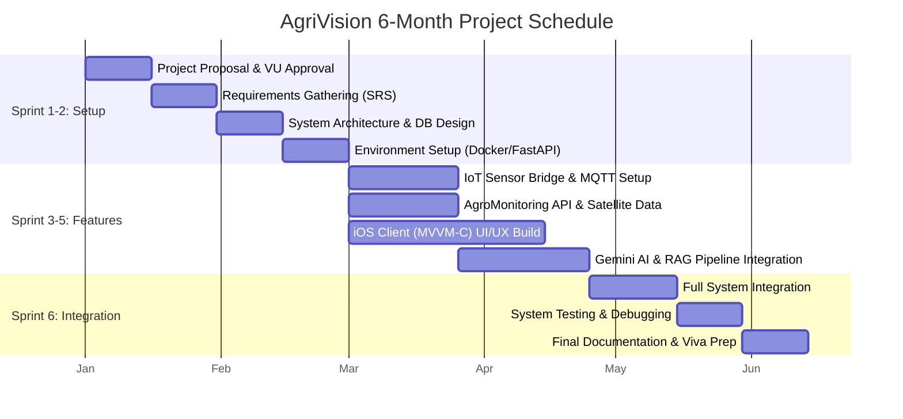

# 4. Adopted Methodology

## 4.1 Agile Scrum Framework
For the development of AgriVision, the **Agile Scrum** methodology was officially adopted. Given the complexity of integrating three highly distinct technology stacks—physical IoT hardware (ESP32), an AI-driven backend (FastAPI/Gemini), and a native mobile frontend (iOS/Swift)—a rigid, sequential Waterfall approach was deemed unviable. 

Agile Scrum allowed the development to occur iteratively and concurrently. 
*   **Iterative Development:** The project was divided into a series of time-boxed iterations called "Sprints", each resulting in a testable increment of the system.
*   **Parallel Tracks:** Agile enabled the hardware telemetry bridge to be developed in parallel with the iOS UI design and AI pipeline engineering, drastically reducing bottlenecks.
*   **Adaptability:** Frequent testing at the end of each sprint allowed the team to refine the multi-modal AI prompts and adjust sensor calibration without derailing the overall project timeline.

---

# 5. Work Plan (MS Project Schedule Breakdown)

The project was executed over a standard **6-Month** timeframe, structured into 6 primary Sprints.

## 5.1 Project Gantt Chart
*You can copy the code block below and paste it into any Mermaid.js viewer (like mermaid.live) to generate the visual Gantt chart for your documentation.*

## 5.2 Sprint Breakdown
*   **Sprint 1-2 (Setup & Architecture):** Focused entirely on securing project approval, documenting requirements, modeling the PostgreSQL database, and scaffolding the Dockerized FastAPI environment and iOS project structure.
*   **Sprint 3-5 (Core Feature Development):** The most intensive phase, executed in parallel tracks. The IoT bridge was established to read raw telemetry. Simultaneously, external API integrations (AgroMonitoring, Gemini) were coded, and the native iOS screens (Dashboard, AI Chat) were built.
*   **Sprint 6 (Final Integration & Testing):** Focused on tying the three data sources together, ensuring the AI model correctly ingested live sensor data and satellite polygons, followed by rigorous testing and final documentation preparation.
