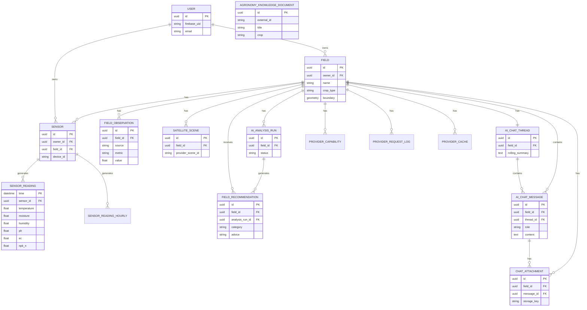

# 6. Entity Relationship Diagram (ERD) & Database Design

To maintain clarity for the capstone presentation, this ERD focuses strictly on the core business entities that drive the AgriVision platform, omitting lower-level telemetry logging tables.

## 6.1 Core Database ERD
*Copy the code block below into Mermaid Live (mermaid.live) to generate the database diagram.*



---

# 7. Architecture Design Diagram

To comprehensively demonstrate the system to the evaluation panel, the architecture is broken down into two perspectives: High-Level Logical Flow and Low-Level Deployment.

## 7.1 High-Level Logical Architecture
This diagram illustrates how data flows between the primary actors, the backend core, and the external AI/Satellite APIs.

```mermaid
flowchart TD
    %% Actors
    Farmer([Farmer / iOS App])
    Sensor([ESP32 IoT Sensors])
    
    %% AgriVision Backend
    subgraph AgriVision Platform
        API[FastAPI Backend Core]
        AI[AI Advisor Service]
        MQTT[Mosquitto MQTT Broker]
        DB[(PostgreSQL + TimescaleDB)]
        Scheduler[Background Scheduler]
    end
    
    %% External Services
    subgraph External Cloud Services
        AgroAPI[AgroMonitoring API\n(Satellite & Weather)]
        Gemini[Google Gemini API\n(Vision & Text)]
        Vertex[Vertex AI Search\n(Punjab Agronomy DB)]
        Firebase[Firebase Auth]
        GCS[(Google Cloud Storage\nMedia Backup)]
    end
    
    %% Connections
    Farmer -- HTTP / REST --> API
    Farmer -- Authenticates --> Firebase
    Sensor -- Serial / MQTT --> MQTT
    MQTT -- Ingests Telemetry --> API
    
    API -- Read / Write --> DB
    API -- Fetch Imagery --> AgroAPI
    API -- Delegates Logic --> AI
    API -- Uploads Chat Images --> GCS
    
    Scheduler -- Triggers Field Sync --> API
    Scheduler -- Polls Satellite Data --> AgroAPI
    Scheduler -- Generates Background Insights --> AI
    
    AI -- RAG Document Retrieval --> Vertex
    AI -- Generates Insights --> Gemini
```

## 7.2 Low-Level Deployment Architecture (v1.0 Capstone)
This diagram illustrates exactly how the software components are deployed and isolated on the local host machine for the final presentation.

```mermaid
flowchart LR
    subgraph Mac_Host [Local Host Machine (macOS)]
        direction TB
        
        subgraph Docker_Network [Docker Compose Bridge]
            App[FastAPI Container\nPort 8000]
            DB[(PostgreSQL Container\nPort 5432)]
            Broker[Mosquitto Container\nPort 1883]
            
            App --- DB
            App --- Broker
        end
        
        Simulator[Xcode iOS Simulator]
        SerialBridge[Python Serial-to-MQTT Bridge]
        LocalMedia[Local File System\n(PrivateMediaStorage)]
    end
    
    Hardware[Physical ESP32 Board]
    Cloud((External Internet APIs\nFirebase, GCS, AgroMonitoring))
    
    %% Connections
    Hardware -- USB-C / Serial Cable --> SerialBridge
    SerialBridge -- Publishes Data --> Broker
    Simulator -- Localhost REST API --> App
    App -- Read / Write Images --> LocalMedia
    App -- HTTPS Outbound --> Cloud
```
