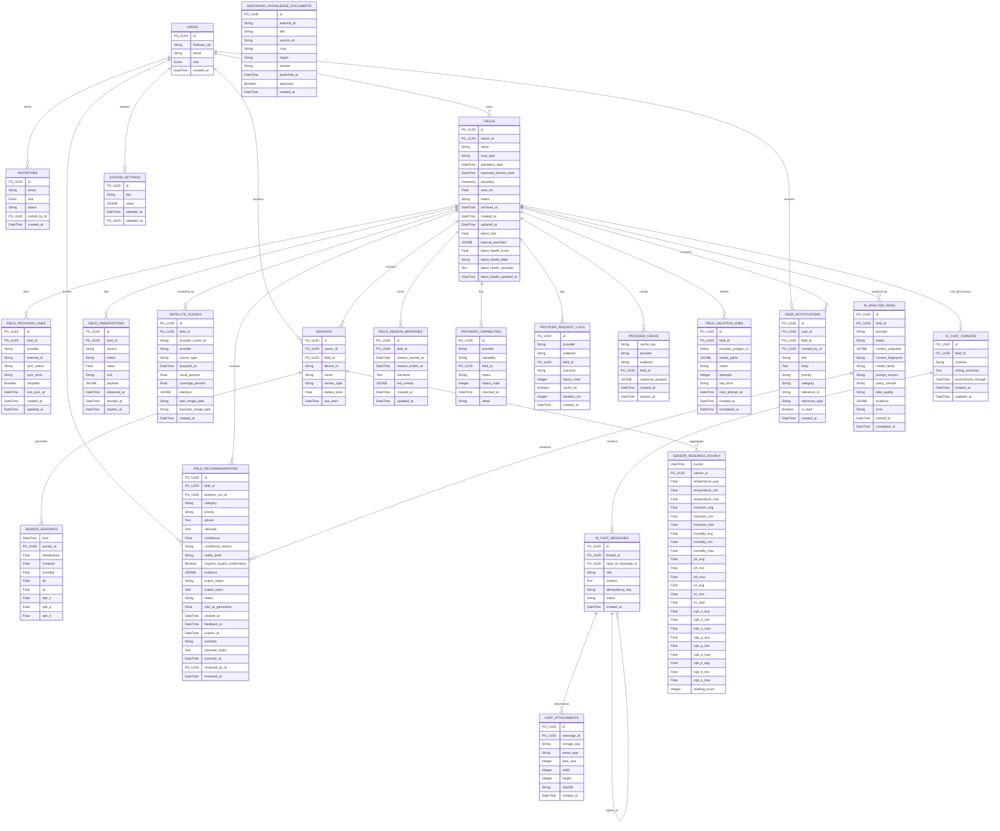
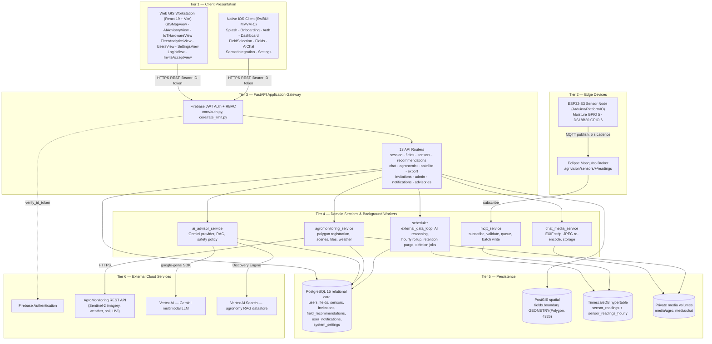
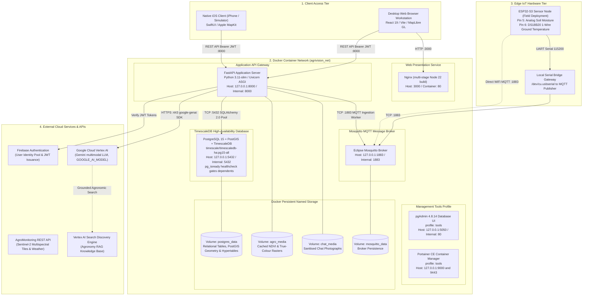

# 6. Entity Relationship Diagram (ERD)

## 6.1 Comprehensive 22-Entity Relational & Time-Series ERD
The AgriVision persistence layer is implemented on PostgreSQL 15 (`timescale/timescaledb-ha:pg15-all`) with the PostGIS spatial extension and the TimescaleDB time-series engine. The schema encompasses 22 distinct entities modeling users, fields, hardware sensors, satellite imagery, AI reasoning runs, and clinical expert validations.

## 6.2 Entity Relationships & Multiplicity Analysis
* **`users` -> `fields` (1 : N):** A farmer user owns zero or more field parcels. Enforced via foreign key `fields.owner_id -> users.id`.
* **`users` -> `invitations` (1 : N):** System administrators issue zero or more staff invitations to agronomists via `invitations.invited_by_id`.
* **`fields` -> `sensors` (1 : N):** A field contains zero or more stationed IoT hardware nodes via `sensors.field_id`.
* **`sensors` -> `sensor_readings` (1 : N):** A sensor transmits continuous time-series samples stored in TimescaleDB hypertable partitioned across 7-day chunks.
* **`sensors` -> `sensor_readings_hourly` (1 : N):** Hourly statistical buckets keyed by the composite primary key `(bucket, sensor_id)`, maintained by an idempotent application-level upsert worker rather than a TimescaleDB continuous aggregate.
* **`fields` -> `satellite_scenes` (1 : N):** A field accumulates periodic satellite acquisitions fetched from Sentinel-2 via AgroMonitoring.
* **`fields` -> `ai_analysis_runs` (1 : N):** Each autonomous reasoning cycle creates an analysis run recording context snapshots, fingerprints, and model versions.
* **`ai_analysis_runs` -> `field_recommendations` (1 : N):** An analysis run synthesizes zero or more actionable recommendations.
* **`fields` -> `field_season_memories` (1 : N, one active):** A rolling seasonal narrative accumulating milestone memory across the crop growth cycle. Closed seasons are retained as history; a partial unique index on `field_id WHERE season_ended_at IS NULL` guarantees at most one *open* season memory per field.
* **`fields` -> `ai_chat_threads` (1 : N, one per channel):** A `UNIQUE (field_id, channel)` constraint gives each field exactly one persistent thread per audience — a `farmer` channel and an `agronomist` channel — so staff discussion never leaks into the farmer's conversation.
* **`users` -> `sensors` (1 : N):** Every paired hardware node records the owner who claimed it via `sensors.owner_id`, which is what scopes fleet queries by tenant.
* **`users` -> `field_recommendations` (1 : N, as reviewer):** `reviewed_by_id` and `reviewed_at` form the clinical audit trail — any recommendation that can gate a chemical intervention carries a reviewer of record.
* **`fields` / `users` -> `user_notifications` (1 : N):** A notification names the field it concerns (`field_id`) and, when staff-authored, its sender (`created_by_id`), so advice that can gate an intervention is always attributable.
* **`fields` -> `field_deletion_jobs` (logical 1 : N):** Deletion jobs deliberately carry `field_id` **without** a foreign-key constraint, because the job must outlive the row it references in order to finish removing the external provider polygon and cached media.
* **`ai_chat_threads` -> `ai_chat_messages` (1 : N):** A chat thread contains ordered messages exchanged between user and assistant.
* **`ai_chat_messages` -> `chat_attachments` (1 : N):** User messages may include zero or more sanitized image attachments.

---

# 7. Architecture Design Diagram

## 7.1 High-Level Multi-Tier Layered Architecture Diagram
The platform architecture follows a decoupled, async-first pattern. Three long-running background tasks are started from the FastAPI lifespan hook — the MQTT ingestion writer, the external-data (satellite/weather/soil) sync worker, and the hourly aggregation worker — so that broker traffic, third-party provider latency and LLM reasoning never sit on a client request path.

## 7.2 Low-Level Deployment & Container Topology Diagram
The entire backend suite is containerized and orchestrated via Docker Compose on an isolated bridge network (`agrivision_net`), isolating sensitive database and MQTT traffic from public exposure.

## 7.3 Detailed Architectural Tier Breakdown

### 1. Client Presentation Tier
* **Native iOS Mobile App:** Built using Swift, SwiftUI, Combine and Apple MapKit on an MVVM-C architecture. Session persistence is handled by the Firebase iOS SDK; user preferences (saved email, dashboard refresh interval, onboarding state) are stored in `UserDefaults` behind injected service protocols.
* **Enterprise Web GIS Workstation:** Built using React 19, Vite, TypeScript, Tailwind CSS 4 and MapLibre GL, with TanStack Query for server state and Zustand for client state. Features interactive GIS inspection of the multi-spectral raster layers served for the active scene, hardware fleet pairing, analytics charts and the agronomist advisory review queue.

### 2. Edge Sensing & IoT Hardware Tier
* **ESP32-S3 Microcontroller:** Deployed in physical fields on an `esp32-s3-devkitc-1-n16r8` board, interfaced with an analog resistive soil-moisture probe (12-bit ADC on GPIO 5, averaged across samples with open-circuit and short-circuit fault thresholds) and a Dallas DS18B20 1-Wire temperature sensor on GPIO 6.
* **Non-Blocking Firmware Stack:** Programmed in C++ against the Arduino framework via PlatformIO. A single `loop()` drives millis-scheduled publishing every 5 seconds, a non-blocking WiFi and MQTT reconnect state machine, OTA firmware update, a NeoPixel status indicator, and telemetry suppression when no probe returns a valid reading.
* **Serial UART Bridge:** Supports a local serial bridge (`/dev/cu.usbserial` at 115200 baud) for tethered bench testing and development.

### 3. Ingestion & Message Broker Tier
* **Eclipse Mosquitto:** MQTT broker handling device telemetry on the topic pattern `agrivision/sensors/{device_id}/readings` (subscribed as `agrivision/sensors/+/readings`) on port 1883, with optional username/password authentication.
* **Async Ingestion Worker:** Long-running Paho-MQTT consumer running on a daemon thread that validates each payload (topic/`device_id` agreement, 5-minute clock-skew bound, per-device flood limit of 120 messages per 60 seconds), hands accepted samples to an `asyncio.Queue`, and drains that queue in batches of up to 50 rows written with `ON CONFLICT (time, sensor_id)` handling.
* **Hourly Rollup Engine:** In-process worker (started from the FastAPI lifespan) that upserts Min/Max/Avg/Count aggregates for the trailing 24 hours into `sensor_readings_hourly` every hour, and prunes raw readings once daily at 03:00 UTC beyond the retention window (14 days by default, per-field overridable).

### 4. Application Services & Business Logic Tier
* **FastAPI Gateway (:8000):** Uvicorn-hosted asynchronous ASGI application serving REST endpoints, protected by Firebase JWT authentication middleware.
* **Agromonitoring Satellite Service:** Handles external polygon registration, weather forecast caching, and dynamic multi-spectral raster tile streaming.
* **AI Advisor Service & Scheduler:** Executes the autonomous reasoning loop, computes holistic field health scores (0–100 with a categorical label and rationale, or `insufficient_data` rather than a fabricated number), applies the chemical/dosage safety policy, and maintains the pending expert-review queue.
* **Chat Media Sanitization Service:** Strips GPS/EXIF metadata from uploaded crop photographs, applies EXIF orientation, converts to RGB, downscales to a maximum edge of 2,048 px, re-encodes as progressive JPEG with no EXIF block, and stores the result on a private local volume or a GCS bucket behind a storage abstraction.

### 5. Persistence & Enterprise Storage Tier
* **PostgreSQL 15 + PostGIS:** Stores relational user profiles, fields, invitations, recommendations, notifications and settings, plus spatial vector geometries (`GEOMETRY(Polygon, 4326)`).
* **TimescaleDB Engine:** Powers the `sensor_readings` hypertable created at startup via `create_hypertable(..., if_not_exists => TRUE, migrate_data => TRUE)`, which partitions along `time` using TimescaleDB's default 7-day chunk interval.
* **Persistent Docker Volumes:** Named volumes (`postgres_data`, `agro_media`, `chat_media`, `mosquitto_data`, `portainer_data`) preserve state across container restarts and rebuilds.

### 6. External Cloud & Foundation AI Tier
* **Google Cloud Vertex AI (Gemini):** Multimodal foundation model performing crop-disease diagnosis and autonomous reasoning. The model is configuration-driven (`GOOGLE_AI_MODEL`, default `gemini-3.7-flash`) and can be re-pointed at runtime through the admin AI settings endpoint without redeployment.
* **Vertex AI Search (Discovery Engine):** Serves as the RAG knowledge store, indexing certified agronomy extension documents for grounded advice.
* **Firebase Authentication:** Handles user identity pools, password resets, and cryptographically signed JWT issuance.
