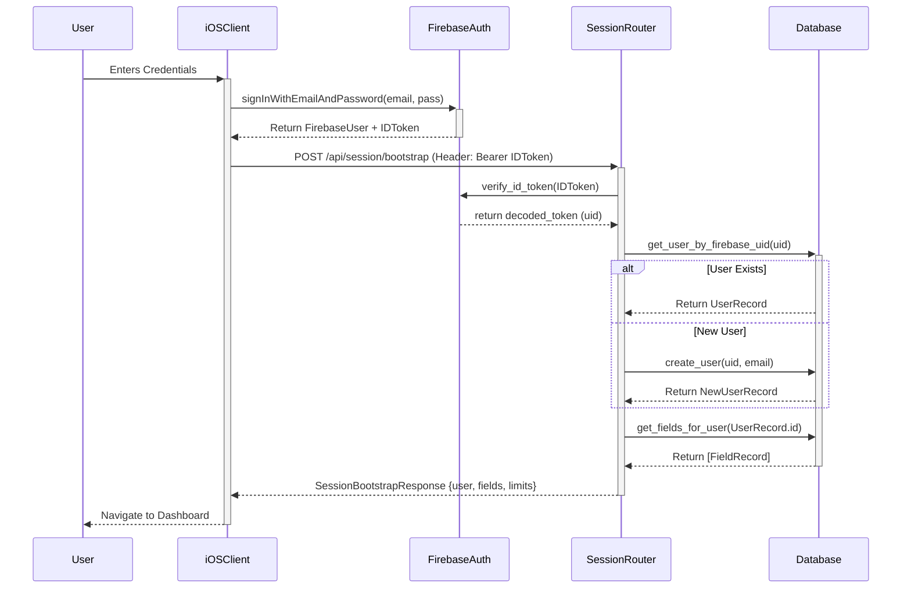
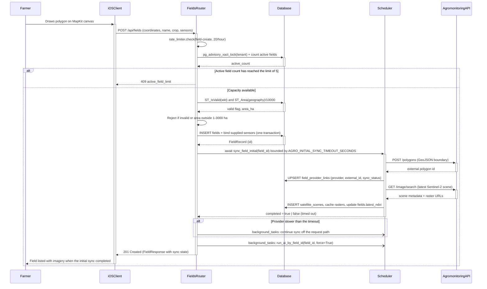
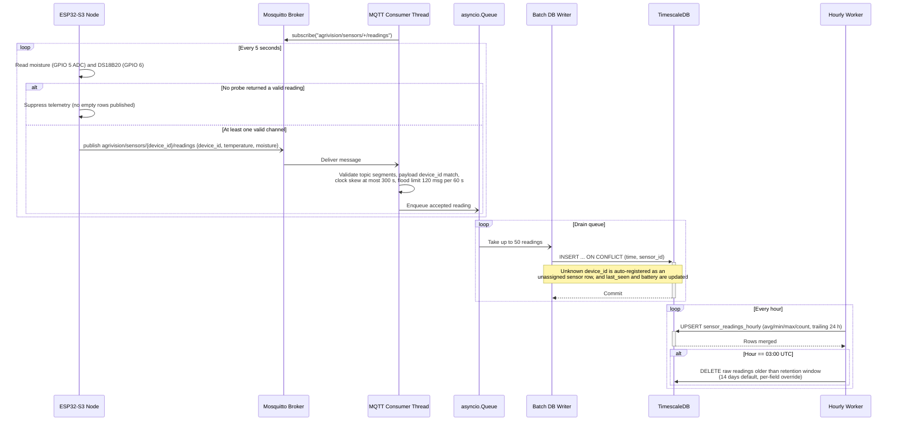
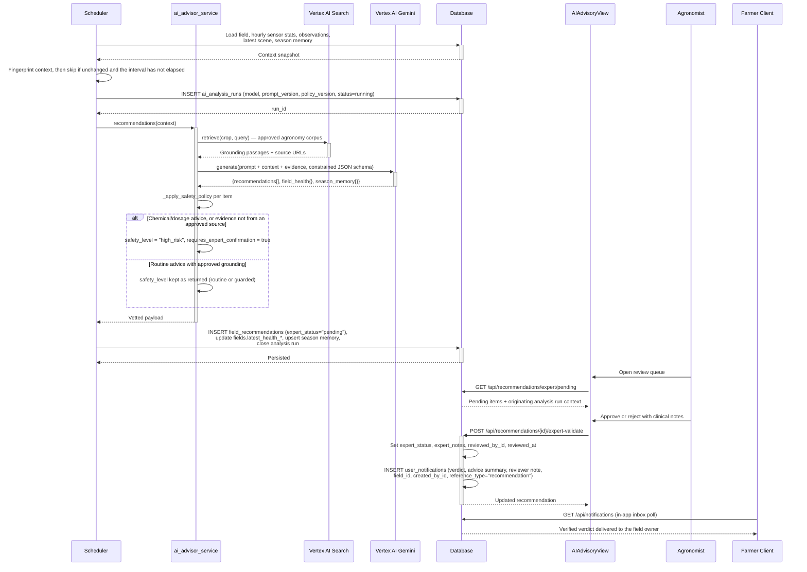
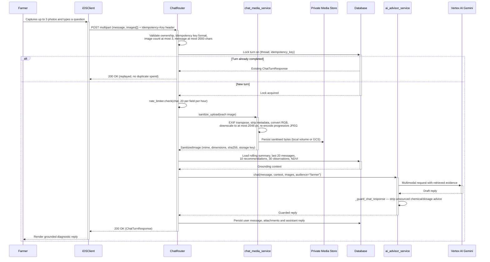
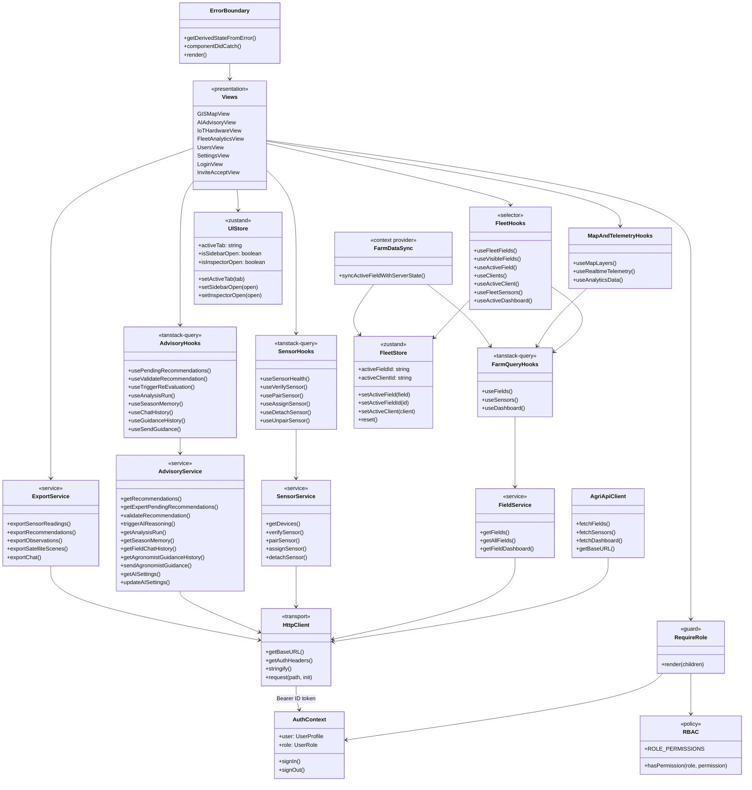

# 8. Sequence Diagrams OR Usage Scenarios

## 8.1 Sequence 1: Authentication, Token Verification & Session Bootstrap Flow
Illustrates how the mobile/web client authenticates with Firebase, exchanges the ID token with the FastAPI backend, creates or retrieves the internal user record, and bootstraps the user's active field portfolio.

## 8.2 Sequence 2: Field Boundary Creation & AgroMonitoring Satellite Sync Flow
Illustrates the flow when a farmer draws a polygon on the map: PostGIS geometry validation, geodetic acreage calculation, record insertion, a time-boxed synchronous provider registration that degrades to a background retry, and the queued AI reasoning run.

## 8.3 Sequence 3: IoT Hardware MQTT Telemetry Ingestion Loop & Hourly Rollup
Illustrates the telemetry loop: ESP32-S3 sensing with probe fault suppression, non-blocking MQTT transmission to Mosquitto, validated queue-and-batch ingestion into the TimescaleDB hypertable, and the hourly statistical rollup with daily retention pruning.

## 8.4 Sequence 4: AI Recommendation Generation, Safety Interception & Agronomist Approval
Illustrates the autonomous reasoning cycle: context assembly and fingerprinting, grounded Gemini generation, rule-based chemical/dosage interception, agronomist clinical validation through the web portal, and in-app notification delivery to the field owner.

## 8.5 Sequence 5: Farmer Multimodal AI Chat & Media Upload Flow with Grounding
Illustrates a farmer photographing a diseased leaf and submitting it with a question. Images are uploaded directly to the API as multipart form data and sanitised server-side — the client never writes to cloud storage, so an unsanitised original carrying GPS EXIF can never be persisted.

---

# 9. Class Diagram

## 9.1 Backend Domain Models & Persistence Entities (SQLAlchemy 2.0)
Models the 14 core database domain entities implemented in `app/models/db_models.py`, complete with their exact attributes, data types, and primary/foreign key constraints.

```mermaid
classDiagram
    class User {
        PG_UUID id
        String firebase_uid
        String email
        Enum role
        DateTime created_at
    }
    class Invitation {
        PG_UUID id
        String email
        Enum role
        String status
        PG_UUID invited_by_id
        DateTime created_at
    }
    class Field {
        PG_UUID id
        PG_UUID owner_id
        String name
        String crop_type
        DateTime plantation_date
        DateTime expected_harvest_date
        Geometry boundary
        Float area_ha
        String status
        DateTime archived_at
        DateTime created_at
        DateTime updated_at
        Float latest_ndvi
        JSONB interval_overrides
        Float latest_health_score
        String latest_health_label
        Text latest_health_rationale
        DateTime latest_health_updated_at
    }
    class FieldProviderLink {
        PG_UUID id
        PG_UUID field_id
        String provider
        String external_id
        String sync_status
        String sync_error
        Boolean retryable
        DateTime last_sync_at
        DateTime created_at
        DateTime updated_at
    }
    class Sensor {
        PG_UUID id
        PG_UUID owner_id
        PG_UUID field_id
        String device_id
        String name
        String sensor_type
        Float battery_level
        DateTime last_seen
    }
    class SensorReading {
        DateTime time
        PG_UUID sensor_id
        Float temperature
        Float moisture
        Float humidity
        Float ph
        Float ec
        Float npk_n
        Float npk_p
        Float npk_k
    }
    class FieldObservation {
        PG_UUID id
        PG_UUID field_id
        String source
        String metric
        Float value
        String unit
        JSONB payload
        DateTime observed_at
        DateTime fetched_at
        DateTime expires_at
    }
    class SatelliteScene {
        PG_UUID id
        PG_UUID field_id
        String provider_scene_id
        String provider
        String source_type
        DateTime acquired_at
        Float cloud_percent
        Float coverage_percent
        JSONB statistics
        String ndvi_image_path
        String truecolor_image_path
        DateTime created_at
    }
    class AIAnalysisRun {
        PG_UUID id
        PG_UUID field_id
        String provider
        String status
        JSONB context_snapshot
        String context_fingerprint
        String model_name
        String prompt_version
        String policy_version
        String data_quality
        JSONB evidence
        String error
        DateTime started_at
        DateTime completed_at
    }
    class FieldRecommendation {
        PG_UUID id
        PG_UUID field_id
        PG_UUID analysis_run_id
        String category
        String priority
        Text advice
        Text rationale
        Float confidence
        String confidence_reason
        String safety_level
        Boolean requires_expert_confirmation
        JSONB evidence
        String expert_status
        Text expert_notes
        String status
        Float ndvi_at_generation
        DateTime created_at
        DateTime feedback_at
        DateTime expires_at
        String outcome
        Text outcome_notes
        DateTime outcome_at
        PG_UUID reviewed_by_id
        DateTime reviewed_at
    }
    class AIChatThread {
        PG_UUID id
        PG_UUID field_id
        String channel
        Text rolling_summary
        DateTime summarized_through
        DateTime created_at
        DateTime updated_at
    }
    class FieldSeasonMemory {
        PG_UUID id
        PG_UUID field_id
        DateTime season_started_at
        DateTime season_ended_at
        Text narrative
        JSONB key_events
        DateTime created_at
        DateTime updated_at
    }
    class AIChatMessage {
        PG_UUID id
        PG_UUID thread_id
        PG_UUID reply_to_message_id
        String role
        Text content
        String idempotency_key
        String status
        DateTime created_at
    }
    class ChatAttachment {
        PG_UUID id
        PG_UUID message_id
        String storage_key
        String mime_type
        Integer byte_size
        Integer width
        Integer height
        String sha256
        DateTime created_at
    }
    class ProviderCapability {
        PG_UUID id
        String provider
        String capability
        PG_UUID field_id
        String status
        Integer status_code
        DateTime checked_at
        String detail
    }
    class ProviderRequestLog {
        PG_UUID id
        String provider
        String endpoint
        PG_UUID field_id
        String outcome
        Integer status_code
        Boolean cache_hit
        Integer duration_ms
        DateTime created_at
    }
    class ProviderCache {
        String cache_key
        String provider
        String endpoint
        PG_UUID field_id
        JSONB response_payload
        DateTime created_at
        DateTime expires_at
    }
    class FieldDeletionJob {
        PG_UUID id
        PG_UUID field_id
        String provider_polygon_id
        JSONB media_paths
        String status
        Integer attempts
        String last_error
        DateTime next_attempt_at
        DateTime created_at
        DateTime completed_at
    }
    class SensorReadingHourly {
        DateTime bucket
        PG_UUID sensor_id
        Float temperature_avg
        Float temperature_min
        Float temperature_max
        Float moisture_avg
        Float moisture_min
        Float moisture_max
        Float humidity_avg
        Float humidity_min
        Float humidity_max
        Float ph_avg
        Float ph_min
        Float ph_max
        Float ec_avg
        Float ec_min
        Float ec_max
        Float npk_n_avg
        Float npk_n_min
        Float npk_n_max
        Float npk_p_avg
        Float npk_p_min
        Float npk_p_max
        Float npk_k_avg
        Float npk_k_min
        Float npk_k_max
        Integer reading_count
    }
    class AgronomyKnowledgeDocument {
        PG_UUID id
        String external_id
        String title
        String source_url
        String crop
        String region
        String version
        DateTime published_at
        Boolean approved
        DateTime created_at
    }
    class UserNotification {
        PG_UUID id
        PG_UUID user_id
        PG_UUID field_id
        PG_UUID created_by_id
        String title
        Text body
        String priority
        String category
        String reference_id
        String reference_type
        Boolean is_read
        DateTime created_at
    }
    class SystemSettings {
        PG_UUID id
        String key
        JSONB value
        DateTime updated_at
        PG_UUID updated_by
    }
    User -- Field
    User -- Invitation
    Invitation -- User
    Field -- User
    Field -- FieldProviderLink
    Field -- Sensor
    Field -- FieldRecommendation
    Field -- FieldObservation
    Field -- SatelliteScene
    FieldProviderLink -- Field
    Sensor -- Field
    FieldObservation -- Field
    SatelliteScene -- Field
    FieldRecommendation -- Field
    UserNotification -- User
    SystemSettings -- User
```

## 9.2 Backend API Routers & Controllers
Models the FastAPI API router hierarchy implemented in `app/api/`, defining endpoint handler signatures, dependency injections (database session and authenticated user), and request/response lifecycles.

```mermaid
classDiagram
    class FieldsRouter {
        +create_field(field_data, background_tasks, db)
        +get_fields(include_archived, admin_view, db)
        +get_field(field_id, db, current_user)
        +assign_sensor(field_id, sensor_data, db)
        +get_field_sensors(field_id, db, current_user)
        +update_field(field_id, update, db)
        +harvest_field_removed(field_id, db, current_user)
        +delete_field(field_id, background_tasks, db)
        +refresh_field_data(field_id, background_tasks, db)
        +get_dashboard(field_id, db, current_user)
        +weather_soil_compat(field_id, db, current_user)
    }
    class SensorsRouter {
        +get_sensors(db, current_user)
        +get_field_readings(field_id, granularity, limit)
        +verify_sensor_connection(device_id, db, current_user)
        +pair_sensor(request, db, current_user)
    }
    class SatelliteRouter {
        +latest(field_id, db, current_user)
        +ndvi_image(field_id, db, current_user)
        +truecolor_image(field_id, db, current_user)
        +fetch_tile(field_id, layer_type, z)
    }
    class RecommendationsRouter {
        +get_recommendations(field_id, limit, db)
        +get_season_memory(field_id, db, current_user)
        +update_feedback(recommendation_id, feedback, db)
        +update_feedback_compat(field_id, recommendation_id, feedback)
        +get_expert_pending_recommendations(limit, db, current_user)
        +expert_validate(recommendation_id, validation, db)
        +record_outcome(recommendation_id, outcome, db)
        +trigger_refresh(field_id, background_tasks, db)
    }
    class SessionRouter {
        +bootstrap(db, current_user)
    }
    class ExportRouter {
        +export_sensor_readings(field_id, granularity, hours)
        +export_recommendations(field_id, limit, db)
        +export_observations(field_id, limit, db)
        +export_satellite_scenes(field_id, limit, db)
        +export_chat(field_id, limit, db)
    }
    class ChatRouter {
        +get_history(field_id, limit, before)
        +get_attachment(field_id, attachment_id, db)
        +post_message(field_id, message, images)
    }
    class AdminRouter {
        +get_all_users(db)
        +delete_user(user_id, background_tasks, db)
        +transfer_field(field_id, req, db)
        +get_ai_settings(db)
        +update_ai_settings(settings, db, current_user)
    }
    class AgronomistRouter {
        +get_agronomist_history(field_id, limit, before)
        +post_agronomist_message(field_id, body, idempotency_key)
    }
    class NotificationsRouter {
        +get_notifications(limit, db, current_user)
        +mark_notification_read(notification_id, db, current_user)
    }
    class InvitationsRouter {
        +create_invitation(invite_data, db, current_user)
        +get_invitations(db, current_user)
    }
    class KnowledgeProvider {
        +retrieve(crop, query)
    }
    class CuratedKnowledgeProvider {
        +retrieve(crop, query)
    }
    class VertexSearchKnowledgeProvider {
        +retrieve(crop, query)
    }
    class AIProvider {
        +name
        +model_name
        +recommendations(context)
        +chat(message, context, images)
        +summarize_season(existing_narrative, new_recommendations, recommendation_history)
    }
    class UnavailableAIProvider {
        +recommendations(context)
        +summarize_season(existing_narrative, new_recommendations, recommendation_history)
        +chat(message, context, images)
    }
    class GeminiAIProvider {
        +recommendations(context)
        +summarize_season(existing_narrative, new_recommendations, recommendation_history)
        +chat(message, context, images)
    }
```

## 9.3 Backend Core Services & Utilities
Models the core business logic services implemented in `app/services/`, including satellite remote sensing integration, autonomous AI reasoning, image sanitization, and MQTT ingestion.

```mermaid
classDiagram
    class SanitizedImage {
        +data
        +mime_type
        +width
        +height
        +sha256
    }
    class PrivateMediaStorage {
    }
    class LocalPrivateMediaStorage {
    }
    class GCSPrivateMediaStorage {
    }
    class AgroAPIError {
    }
    class AgroEntitlementError {
    }
    class StrictModel {
    }
    class PointCoordinates {
        +longitude
        +latitude
    }
    class SensorCreate {
        +device_id
        +name
        +sensor_type
    }
    class SensorResponse {
        +id
        +field_id
        +device_id
        +name
        +sensor_type
        +battery_level
        +last_seen
    }
    class SensorPairRequest {
        +device_id
    }
    class SensorPairResponse {
        +is_paired
        +message
        +sensor
    }
    class FieldCreate {
        +name
        +coordinates
        +area_ha
        +crop_type
        +plantation_date
        +expected_harvest_date
    }
    class FieldWithSensorsCreate {
        +sensors
    }
    class FieldIntervalOverrides {
        +weather_hours
        +soil_hours
        +uvi_hours
        +satellite_hours
        +ai_hours
        +retention_days
    }
    class FieldUpdate {
        +name
        +crop_type
        +expected_harvest_date
        +interval_overrides
    }
    class FieldResponse {
        +id
        +owner_id
        +name
        +coordinates
        +area_ha
        +status
        +archived_at
        +created_at
        +updated_at
        +crop_type
    }
    class SensorReadingDB {
        +time
        +sensor_id
        +temperature
        +moisture
        +humidity
        +ph
        +ec
        +npk_n
        +npk_p
        +npk_k
    }
    class SensorReadingHourlyDB {
        +bucket
        +sensor_id
        +temperature_avg
        +temperature_min
        +temperature_max
        +moisture_avg
        +moisture_min
        +moisture_max
        +humidity_avg
        +humidity_min
    }
    class RecommendationResponse {
        +id
        +field_id
        +category
        +priority
        +advice
        +rationale
        +confidence
        +confidence_reason
        +evidence
        +safety_level
    }
    class SeasonMemoryResponse {
        +field_id
        +season_started_at
        +narrative
        +key_events
    }
    class RecommendationExpertValidation {
        +status
        +notes
    }
    class RecommendationFeedback {
        +status
    }
    class RecommendationOutcome {
        +outcome
        +notes
    }
    class ChatMessageRequest {
        +message
    }
    class ChatAttachmentResponse {
        +id
        +mime_type
        +byte_size
        +width
        +height
        +url
    }
    class ChatMessageResponse {
        +id
        +role
        +content
        +status
        +attachments
        +created_at
    }
    class ChatTurnResponse {
        +user_message
        +assistant_message
    }
    class UserSchema {
        +id
        +firebase_uid
        +email
        +role
        +created_at
    }
    class SessionBootstrapResponse {
        +user
        +fields
        +active_field_limit
        +active_field_count
    }
    class ErrorBody {
        +code
        +message
        +details
        +retryable
        +request_id
    }
    class ErrorEnvelope {
        +error
    }
    class InvitationCreate {
        +email
        +role
    }
    class InvitationResponse {
        +id
        +email
        +role
        +status
        +created_at
    }
    class AISettingsUpdate {
        +mode
        +model
    }
    class AISettingsResponse {
        +mode
        +model
    }
```

## 9.4 Web Application Architecture & State Stores (React 19 / TypeScript)
Models the client-side architecture of the enterprise web portal (`AgriVision-Web`): the HTTP transport layer, the domain service wrappers that own endpoint knowledge, the TanStack Query hooks that own server state, the Zustand stores that own client state, and the role-based access control layer that gates every privileged view.

## 9.5 Native iOS Client MVVM Architecture (Swift / SwiftUI)
Models the object-oriented architecture of the native iOS mobile application, detailing ViewModels, Services, Coordinators, and User Preference managers.

```mermaid
classDiagram
    class SettingsViewModel {
        +accountName: String
        +appVersion: String
        +preferencesService: PreferencesService
        +currentFieldName: String
        +isGoogleLinked: Bool
        +successMessage: String
        +profileName: String
        +authService: AuthService
        +accountEmail: String
        +sensorSummary: String
        +errorMessage: String
        +satelliteSummary: String
        +sensors: List~FieldSensor~
        +fieldSessionStore: FieldSessionStore
        +activeFieldId: UUID
        +deleteField()
        +presentError()
        +refreshIntegrationStatus()
        +presentSuccess()
        +setRefreshInterval()
        +pairAndAssignSensor()
        +selectField()
        +signOut()
        +linkGoogleAccount()
        +refreshAll()
    }
    class LoginViewModel {
        +authService: AuthService
        +password: String
        +rememberMe: Bool
        +errorMessage: String
        +preferencesService: PreferencesService
        +isLoading: Bool
        +email: String
        +continueWithGoogle()
        +forgotPassword()
        +login()
    }
    class SignupViewModel {
        +lastNameError: String
        +authService: AuthService
        +password: String
        +lastName: String
        +confirmPasswordError: String
        +errorMessage: String
        +confirmPassword: String
        +isLoading: Bool
        +firstName: String
        +passwordError: String
        +userProfileService: UserProfileService
        +firstNameError: String
        +email: String
        +emailError: String
        +continueWithGoogle()
        +validateField()
        +register()
    }
    class AuthViewModel {
        +selectedTab: AuthTab
        +switchToSignup()
        +authCompleted()
        +switchToLogin()
    }
    class ForgotPasswordViewModel {
        +authService: AuthService
        +errorMessage: String
        +isLoading: Bool
        +email: String
        +successMessage: String
        +sendResetLink()
        +back()
    }
    class VerifyEmailViewModel {
        +isLoading: Bool
        +message: String
        +isVerified: Bool
        +authService: AuthService
        +checkVerificationStatus()
        +resendVerificationEmail()
    }
    class DashboardViewModel {
        +fullDashboardRefreshInterval: TimeInterval
        +ndviData: Data
        +advisorMessage: String
        +preferencesService: PreferencesService
        +currentCropType: String
        +values: List~Double~
        +sensorFleet: List~SensorFleetEntry~
        +recommendations: List~FieldRecommendation~
        +satelliteImageData: Data
        +fieldSessionStore: FieldSessionStore
        +truecolorImageData: Data
        +authService: AuthService
        +weatherSoil: FieldWeatherSoil
        +uvi: SourceState
        +errorMessage: String
        +availabilityItems()
        +refreshRecommendations()
        +refreshNotifications()
        +signOut()
        +loadSatelliteImages()
        +pollUntilCancelled()
        +requestDataRefresh()
        +presentError()
        +clearFieldData()
        +openChat()
        +refreshSensorReadingsOnly()
        +markNotificationRead()
        +openSettings()
        +updateFeedback()
        +recordOutcome()
    }
    class AIChatViewModel {
        +messages: List~ChatMessage~
        +errorMessage: String
        +fieldId: UUID
        +canSend: Bool
        +attachmentData: List~UUID~
        +pendingIdempotencyKey: String
        +dataService: AgriDataService
        +selectedImages: List~ChatImageUpload~
        +imageData()
        +addImage()
        +sendMessage()
        +presentError()
        +removeImage()
        +loadMissingAttachments()
        +fetchHistory()
        +dismiss()
    }
    class AddFieldIntroViewModel {
        +profileInitial: String
        +authService: AuthService
        +userName: String
        +profileImageURL: URL
        +addFieldAction()
        +loadUserData()
        +signOut()
    }
    class FieldDetailsViewModel {
        +selectedCrop: String
        +dataService: AgriDataService
        +authService: AuthService
        +profileInitial: String
        +profileImageURL: URL
        +errorMessage: String
        +coordinates: List~CLLocationCoordinate2D~
        +isLoading: Bool
        +name: String
        +defaultHarvestInterval: TimeInterval
        +monitorWithIoT: Bool
        +calculatedAreaHa: Double
        +plantationDate: Date
        +letSystemDecideHarvestDate: Bool
        +harvestDate: Date
        +performSave()
        +loadUserData()
        +goBack()
        +signOut()
        +saveField()
    }
    class FieldSelectionViewModel {
        +dataService: AgriDataService
        +searchResults: List~MKLocalSearchCompletion~
        +authService: AuthService
        +locationName: String
        +fieldCoordinates: List~CLLocationCoordinate2D~
        +profileImageURL: URL
        +errorMessage: String
        +searchQuery: String
        +profileInitial: String
        +successMessage: String
        +isSearching: Bool
        +movePoint()
        +completerDidUpdateResults()
        +completer()
        +clearPoints()
        +zoomIn()
        +signOut()
        +calculatedAreaHa()
        +selectSearchResult()
        +addPoint()
        +cancelSelection()
        +showMessage()
        +moveToLocation()
        +undoLastPoint()
        +setupProfile()
        +confirmField()
    }
    class OnboardingViewModel {
        +scrollOffset: CGFloat
        +pages: List~OnboardingPage~
        +containerWidth: CGFloat
        +handlePreferenceChange()
        +handleNextAction()
    }
    class SensorIntegrationViewModel {
        +dataService: AgriDataService
        +authService: AuthService
        +createdFieldID: UUID
        +verificationMessage: String
        +isVerifying: Bool
        +fieldData: FieldSelectionData
        +errorMessage: String
        +profileImageURL: URL
        +fieldID: UUID
        +selectedSensorType: String
        +isLoading: Bool
        +profileInitial: String
        +sensorName: String
        +isVerified: Bool
        +pairingCode: String
        +verifyHardware()
        +loadUserData()
        +goBack()
        +completeSetup()
        +signOut()
    }
    class MockAuthService {
        +currentUserID: String
        +currentUserDisplayName: String
        +isLoggedInStub: Bool
        +currentUserEmail: String
        +currentUserPhotoURL: URL
        +isEmailVerified: Bool
        +displayName: String
        +shouldFail: Bool
        +isGoogleProviderLinked: Bool
        +isUserLoggedIn: Bool
        +reloadUser()
        +resetPassword()
        +signOut()
        +signInWithGoogle()
        +sendEmailVerification()
        +linkGoogleAccount()
        +getIDToken()
        +updateDisplayName()
        +signUp()
        +signIn()
    }
    class FirebaseUserProfileService {
        +updateDisplayName()
    }
    class MockPreferencesService {
        +activeFieldId: UUID
        +savedEmail: String
        +dashboardRefreshInterval: TimeInterval
    }
    class FirebaseAuthService {
        +currentUserID: String
        +currentUserDisplayName: String
        +currentUserEmail: String
        +currentUserPhotoURL: URL
        +isEmailVerified: Bool
        +isGoogleProviderLinked: Bool
        +isUserLoggedIn: Bool
        +reloadUser()
        +resetPassword()
        +getTopViewController()
        +signOut()
        +signInWithGoogle()
        +sendEmailVerification()
        +linkGoogleAccount()
        +getIDToken()
        +updateDisplayName()
        +signUp()
        +signIn()
    }
    class UserDefaultsPreferencesService {
        +activeFieldId: UUID
        +savedEmail: String
        +dashboardRefreshInterval: TimeInterval
        +getSavedEmail()
    }
    class UserDefaultsOnboardingStateService {
        +hasSeenOnboarding: Bool
        +defaults: UserDefaults
        +markOnboardingComplete()
    }
    class MockUserProfileService {
        +lastDisplayName: String
        +shouldFail: Bool
        +updateDisplayName()
    }
    class OnboardingStateService {
        +hasSeenOnboarding: Bool
        +markOnboardingComplete()
    }
    class UserProfileService {
        +updateDisplayName()
    }
    class AgriDataService {
        +sendChatMessage()
        +deleteField()
        +refreshRecommendations()
        +saveField()
        +fetchChatHistory()
        +fetchWeatherSoil()
        +fetchFields()
        +fetchSensors()
        +pairSensor()
        +fetchSensorReadings()
        +fetchSatelliteImage()
        +bootstrapSession()
        +refreshFieldData()
        +fetchDashboard()
        +fetchSeasonMemory()
    }
    class AuthService {
        +currentUserID: String
        +currentUserDisplayName: String
        +currentUserEmail: String
        +currentUserPhotoURL: URL
        +isEmailVerified: Bool
        +errorDescription: String
        +isGoogleProviderLinked: Bool
        +isUserLoggedIn: Bool
        +reloadUser()
        +resetPassword()
        +signOut()
        +signInWithGoogle()
        +sendEmailVerification()
        +linkGoogleAccount()
        +getIDToken()
        +updateDisplayName()
        +signUp()
        +signIn()
    }
    class PreferencesService {
        +activeFieldId: UUID
        +savedEmail: String
        +dashboardRefreshInterval: TimeInterval
    }
```

