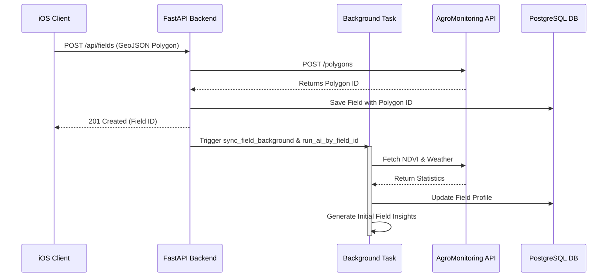
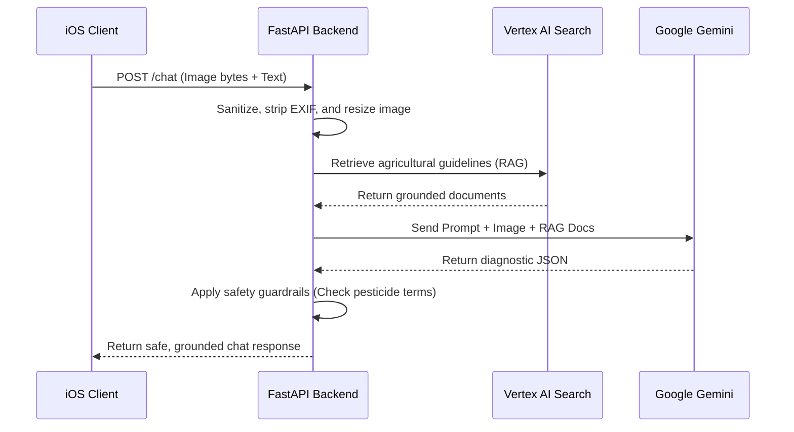
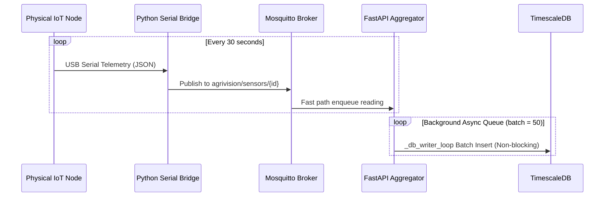
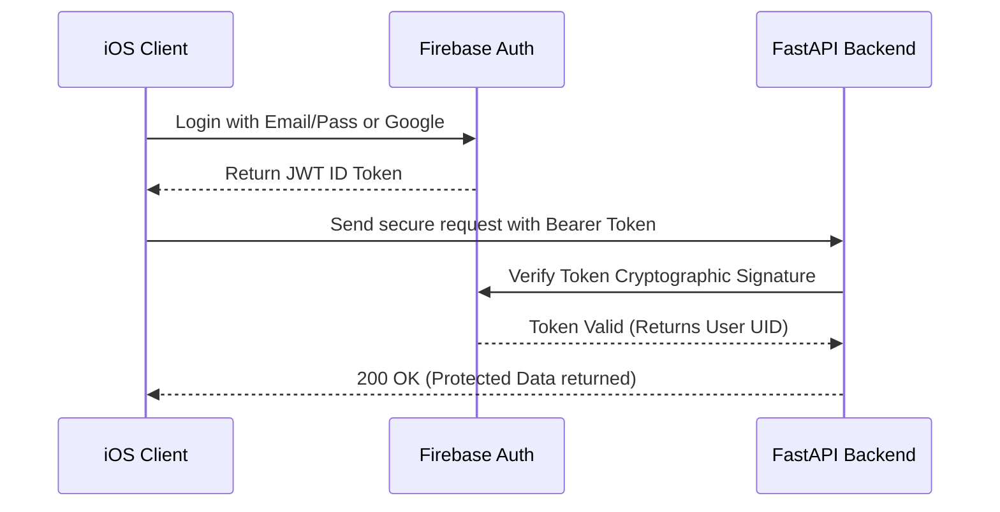
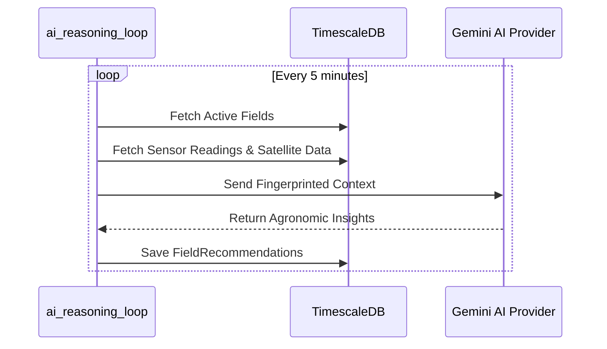
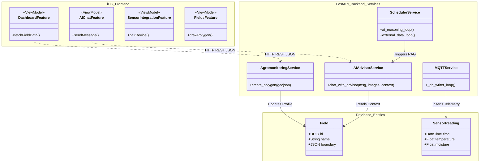

# 8. Sequence Diagrams

To demonstrate the dynamic interactions between the components of the AgriVision system, the four most critical processes are modeled below.

*You can copy the code blocks below and paste them into Mermaid Live (mermaid.live) to generate the visual sequence diagrams.*

## 8.1 Field Creation & Satellite Sync
This flow demonstrates how a user establishes a field boundary and how the backend asynchronously pulls initial satellite data to prevent UI blocking.

## 8.2 AI Image Upload & Diagnosis
This flow demonstrates the multi-modal AI capabilities, highlighting the Retrieval-Augmented Generation (RAG) and the strict safety guardrails.

## 8.3 IoT Sensor Telemetry Ingestion
This flow shows how continuous physical ground data makes its way into the backend database.

## 8.4 User Registration & Authentication
This flow outlines the secure, token-based authentication mechanism using Firebase.

## 8.5 Automated AI Reasoning Loop
This flow demonstrates the background scheduler that wakes up periodically to run AI evaluations across all fields.

---

# 9. Class Diagram

This hybrid class diagram bridges the gap between the iOS client architecture (MVVM-C) and the Python backend structure. It highlights how frontend `ViewModels` map to backend `Services` and database `Entities`.

