# AgriVision Software Requirements Specification (SRS)

* **Project:** AgriVision — Precision Agriculture & Agronomic Intelligence Platform
* **Document Version:** 2.0 (codebase-verified revision)
* **Date:** 7 September 2026
* **Author & Sole Developer:** Muhammad Ahmad
* **Repository Scope:** `AgriVision/` (iOS client) · `AgriVision-Backend/` (FastAPI, GIS & AI services) · `AgriVision-Web/` (React 19 portal) · `esp/` (ESP32-S3 firmware)

> **Verification basis.** Every requirement, diagram, schema and figure in this document was reconciled against the implementation as it stands at commit `1b3e427` (7 September 2026). Where a capability is specified but not yet built, the text says so explicitly rather than implying it exists.

---

# 1. Scope of the Project

## 1.1 Project Overview & Mission
**AgriVision** is an enterprise-grade, multi-tenant precision agriculture and agronomic intelligence platform. The core objective of the system is to continuously monitor, evaluate, and optimize crop health across the entire farming lifecycle. AgriVision achieves this by synthesizing tri-source environmental telemetry—macro-level multi-spectral satellite imagery, micro-level physical IoT ground sensors, and user-submitted multi-modal visual observations—coupled with advanced generative AI reasoning and Human-in-the-Loop (HITL) agronomist validation.

By bridging complex geospatial remote sensing, low-power edge computing, and conversational artificial intelligence, AgriVision translates raw agronomic indicators into actionable, safety-guarded guidance. This empowers farmers to maximize crop yields, conserve water and soil nutrients, and mitigate biological and climatological risks with scientific precision.

## 1.2 Target Audience & Stakeholders
The platform strictly implements access control across three authenticated roles and key agricultural stakeholders:
1. **Farmers (`mobile_user`):** Field owners and agricultural workers who utilize the native iOS mobile application to map field boundaries, inspect live sensor telemetry, track satellite vegetative health, receive verified recommendations, and converse directly with the AI Agronomist for immediate crop diagnostics.
2. **Agronomists & Crop Specialists (`agronomist`):** Certified agricultural scientists who utilize the Web Application portal to monitor regional field portfolios, review and approve high-risk AI-generated recommendations (pesticide/chemical dosages), inject authoritative guidance to steer AI conversational responses, and analyze multi-spectral satellite rasters.
3. **System Administrators (`admin`):** Platform managers who oversee system health, configure dynamic AI model hyperparameters and reasoning prompts, manage hardware sensor provisioning, monitor ingestion pipelines, and administer multi-tenant staff invitations and access policies.
4. **Agricultural Enterprises & Extension Services:** Cooperatives seeking centralized visibility over distributed farm acreage, sensor fleet telemetry, and automated compliance audits.

## 1.3 In-Scope System Subsystems
The platform encompasses five core subsystems implemented across the codebase:

### 1. Multi-Spectral Satellite Remote Sensing & GIS Engine
* **Vector Boundary Georeferencing:** Interactive drawing and validation of field boundaries using PostGIS polygons, enforcing vertex topological integrity and surface area limits.
* **Automated Satellite Ingestion:** Automated synchronization with AgroMonitoring and Sentinel-2 satellite constellations to retrieve cloud-masked surface imagery, NDVI vegetation indices, soil moisture profiles, UV indices, and 5-day weather forecasts.
* **Multi-Layer Spectral Tile Rendering:** An authenticated tile proxy that streams provider rasters through the backend for eight spectral index types — NDVI (vegetation health), NDWI (water stress), EVI (enhanced vegetation), Truecolor (RGB), Falsecolor (infrared), EVI2 (two-band enhanced), NRI (nitrogen reflectance) and DSWI (disease-water stress). The web GIS toolbar currently exposes the four the provider serves reliably for these polygons (NDVI, NDWI, EVI, Truecolor); the remaining four are accepted by the endpoint and become selectable as soon as the provider returns them.

### 2. Physical IoT Sensor Array & Telemetry Ingestion Pipeline
* **ESP32-S3 Edge Sensor Nodes:** Physical microcontrollers deployed in fields. The node built and validated to date measures volumetric soil moisture (calibrated 12-bit ADC on GPIO 5, with open-circuit and short-circuit probe fault detection) and soil temperature (Dallas DS18B20 1-Wire bus on GPIO 6). The telemetry contract, ingestion pipeline and `sensor_readings` hypertable additionally carry humidity, pH, electrical conductivity (EC) and nitrogen-phosphorus-potassium (NPK) channels, so probes for those metrics can be added to the node without any schema or API change.
* **Resilient Non-Blocking Edge Firmware:** Arduino-framework C++ firmware built with PlatformIO for the `esp32-s3-devkitc-1-n16r8` board. It runs a non-blocking `loop()` state machine (millis-based scheduling, never `delay()`-blocked on the network) covering WiFi and MQTT reconnection, OTA firmware update, a NeoPixel status indicator, probe fault detection that suppresses NaN and disconnected readings rather than publishing zeros, and authenticated MQTT publication on a 5-second cadence.
* **High-Throughput Time-Series Ingestion:** Eclipse Mosquitto MQTT broker integrated with an asynchronous FastAPI consumer that subscribes to `agrivision/sensors/+/readings`, applies a per-device flood limit (120 messages per 60 seconds) and a 5-minute clock-skew guard, queues accepted samples, and batch-writes up to 50 rows at a time into a PostgreSQL / TimescaleDB hypertable with primary-key conflict handling on `(time, sensor_id)`.
* **Automated Time-Series Rollup:** An in-process hourly worker that aggregates raw readings into statistical buckets (`sensor_readings_hourly`: Min, Max, Avg, Count over a rolling 24-hour window) to power responsive analytics dashboards, and prunes raw samples once per day at 03:00 UTC beyond the retention window (14 days by default, overridable per field).

### 3. Generative AI Advisory Engine & Multi-Modal Diagnostics
* **Multi-Modal Crop Disease Diagnostics:** Native camera integration allowing farmers to submit up to three crop photos per turn. The backend enforces privacy-preserving EXIF stripping, re-encoding to JPEG and downscaling to a maximum edge of 2,048 px, then performs multi-modal visual inspection via Google Gemini on Vertex AI (model configurable through `GOOGLE_AI_MODEL`; `gemini-3.7-flash` by default).
* **Retrieval-Augmented Generation (RAG):** Contextual grounding of AI queries against localized agricultural knowledge repositories (Punjab Agricultural Extension, disease pathology databases, and crop-specific management guides).
* **Autonomous AI Reasoning Loop (`ai_reasoning_loop`):** Background scheduler that continuously evaluates multi-source field context (sensor trends, weather forecasts, satellite anomalies) against agronomic rule matrices to synthesize field-specific recommendations without requiring manual user initiation.
* **Season Memory Narrative:** Rolling 1,200-character crop season memory (`field_season_memory`) that continuously summarizes key lifecycle milestones, applied treatments, and sensor stresses to maintain persistent multi-month LLM reasoning context without token exhaustion.

### 4. Human-in-the-Loop (HITL) Safety Guardrails & Expert Steering
* **Pesticide & Chemical Dosage Interception:** Rule-based safety guardrails in `_apply_safety_policy` that detect chemical, dosage and other high-risk interventions, force `safety_level = "high_risk"` and `requires_expert_confirmation = True`, and hold the recommendation at `expert_status = "pending"` until a certified agronomist rules on it.
* **Clinical Review Queue:** Dedicated desktop web portal (`AIAdvisoryView`) enabling agronomists to approve, reject, or modify intercepted recommendations before they reach the farmer.
* **Authoritative AI Guidance Injection:** Private Agronomist steering drawer that injects clinical directives directly into the field's LLM context memory, steering all subsequent AI responses for that farm.

### 5. Dual Client Presentation Applications
* **Native iOS Mobile App (SwiftUI & UIKit):** Built with Swift, SwiftUI, Combine and Apple MapKit on an MVVM-C (Model-View-ViewModel-Coordinator) architecture. Provides farmers with Firebase email/password and Google federated sign-in, interactive polygon drawing, live sensor gauge cards, an in-app notification centre, and multi-modal camera chat with the AI agronomist.
* **Enterprise Web GIS Portal (React 19 & TypeScript):** Built with React 19, Vite, TypeScript, Tailwind CSS 4 and MapLibre GL, with TanStack Query for server state, Zustand for client state and Recharts for time-series visualisation. Provides desktop workstations with interactive multi-spectral raster GIS inspection, IoT hardware fleet pairing, analytics charts and team invitation management.

## 1.4 Out-of-Scope System Boundaries
To maintain rigorous engineering focus, the following elements are explicitly defined as out-of-scope:
* Autonomous tractor steering, drone autopilot navigation, or CAN bus physical actuator robotics.
* Direct in-app eCommerce checkout, chemical payment processing, or agricultural supply inventory logistics.
* Custom silicon ASIC design or physical hardware injection-molding manufacturing.
* Proprietary orbital satellite constellation deployment (the platform leverages Sentinel-2 via AgroMonitoring APIs).

---

# 2. Functional Requirements & Non Functional requirements

## 2.1 Functional Requirements (FR)

### Module 1: Field GIS & Geospatial Remote Sensing
* **FR-1 (Field Boundary Creation):** The system shall allow authenticated farmers to draw, edit, and delete closed field boundaries using PostGIS polygons with a minimum of 3 vertices, enforcing topological validity (`ST_IsValid`) and surface area calculation (`area_ha`).
* **FR-2 (Crop & Lifecycle Tracking):** The system shall associate each field with a crop type (e.g., Wheat, Cotton, Rice), plantation date, expected harvest date, and seasonal status (`active`, `archived`).
* **FR-3 (Satellite Constellation Synchronization):** Upon field boundary creation, the system shall automatically synchronize with AgroMonitoring to register the polygon and fetch Sentinel-2 imagery, cloud-masked NDVI vegetation rasters, and 5-day weather forecasts.
* **FR-4 (Multi-Spectral Raster Delivery):** The tile endpoint `GET /api/fields/{id}/satellite/latest/tile/{layer}/{z}/{x}/{y}` shall accept eight spectral layer types (NDVI, NDWI, EVI, Truecolor, Falsecolor, EVI2, NRI, DSWI), reject any other layer name with `400 invalid_layer`, and require a valid bearer token on every tile request. The Web GIS portal shall present the layers verified as available for the active scene with an adjustable opacity control.

### Module 2: IoT Sensor Hardware Telemetry & Ingestion
* **FR-5 (Sensor Provisioning & Pairing):** System administrators and farmers shall be able to register physical ESP32 hardware devices via unique `device_id` strings and bind them to specific fields.
* **FR-6 (MQTT Telemetry Stream Ingestion):** The platform shall ingest MQTT telemetry packets published to topic `agrivision/sensors/{device_id}/readings`. The payload contract accepts soil moisture (ADC GPIO 5), ground temperature (DS18B20 GPIO 6), humidity, pH, EC, NPK and battery level; the currently deployed node populates temperature and moisture, and the ingestion worker accepts partial payloads so additional channels require no code change.
* **FR-7 (Time-Series Deduplication & Upsert):** The ingestion worker shall write incoming sensor samples to a TimescaleDB hypertable utilizing `ON CONFLICT (time, sensor_id) DO UPDATE` to eliminate duplicate readings during network re-transmissions.
* **FR-8 (Hourly Statistical Rollup & Pruning):** An automated in-process background worker shall aggregate raw readings every hour into statistical buckets (`sensor_readings_hourly`: Min, Max, Avg, Count) via an idempotent upsert, and shall prune raw samples beyond the retention window once daily to preserve database performance (14 days by default, overridable per field through `fields.interval_overrides.retention_days`).

### Module 3: Generative AI Advisory & Multi-Modal Diagnostics
* **FR-9 (Multi-Modal Disease Pathology Chat):** Farmers shall be able to submit up to three crop images and a textual query (maximum 2,000 characters) per turn through the mobile app, receiving grounded diagnostic feedback powered by Google Gemini on Vertex AI. Each turn is idempotent under a client-supplied `Idempotency-Key` header and is rate-limited to 20 turns per field per hour.
* **FR-10 (Autonomous Reasoning Engine):** An asynchronous background scheduler (`ai_reasoning_loop`) shall periodically evaluate field context (sensor thresholds, satellite NDVI dips, weather forecasts) against agronomic rule matrices to generate proactive advice without user prompting.
* **FR-11 (Season Memory Narrative Compression):** The system shall summarize field events, chemical applications, and stress alerts into a rolling 1,200-character narrative (`field_season_memory`) to maintain long-term context across multi-month farming seasons.
* **FR-12 (Contextual RAG Retrieval):** The AI advisor shall ground its responses using Vertex AI Search indexed against official Punjab Agricultural Extension guides, disease pathology manuals, and approved fertilizer tables.

### Module 4: Human-in-the-Loop Clinical Validation & Agronomist Queue
* **FR-13 (Chemical Dosage Interception):** The system shall intercept any AI-generated recommendation containing pesticide, fungicide, herbicide or chemical dosage indicators, setting `safety_level="high_risk"`, `requires_expert_confirmation=True` and holding `expert_status="pending"` until an agronomist rules on it.
* **FR-14 (Clinical Validation Portal):** Agronomists shall be provided with a dedicated web interface (`AIAdvisoryView`) to inspect pending recommendations, review the field's sensor/satellite context, and approve, reject, or edit the advice.
* **FR-15 (Authoritative Agronomic Steering):** Agronomists shall have the capability to inject private guidance notes directly into a field's AI memory, constraining subsequent LLM conversational behavior for that specific field.
* **FR-16 (Verified Review Notification):** Once an agronomist approves or rejects a recommendation, the system shall create a `user_notifications` record addressed to the field owner, carrying the verdict, the advice summary, the reviewer's clinical note, the originating field and a `recommendation` reference, delivered to the clients through `GET /api/notifications`. (Remote APNs/FCM push delivery is a planned enhancement and is not implemented in the current build.)

### Module 5: User Management, Invitations & Multi-Tenant Security
* **FR-17 (Firebase Authentication & Session Bootstrap):** The system shall verify Firebase ID tokens on every request, mapping the authenticated identity to the internal PostgreSQL `users` table via `firebase_uid`.
* **FR-18 (Role-Based Access Control):** The platform shall enforce strict role segregation between `mobile_user` (Farmer), `agronomist` (Specialist), and `admin` (System Owner) across all REST endpoints.
* **FR-19 (Staff Invitations & Role Elevation):** Administrators shall be able to invite agronomists and staff by email address with a pre-assigned role. The API persists the invitation in `invitations` with status `pending`, and the web portal dispatches a Firebase passwordless sign-in link (`sendSignInLinkToEmail`) to that address, which `InviteAcceptView` completes via `signInWithEmailLink`. On the invitee's first `POST /api/session/bootstrap`, a pending invitation matching their authenticated email elevates their role and is marked `accepted`.
* **FR-20 (Dynamic AI Configuration Management):** Administrators shall have the capability to tune AI temperature, reasoning thresholds, safety guardrail triggers, and polling intervals dynamically via `system_settings` without redeploying code.

## 2.2 Non-Functional Requirements (NFR)

| NFR Code | Requirement Category | Metric / Specification | Architectural Implementation |
| :--- | :--- | :--- | :--- |
| **NFR-1** | **API Response Latency** | p95 < 200ms for REST endpoints; p95 < 3.5s for AI inference | Async FastAPI async/await handlers, connection pooling, and cached tile proxies |
| **NFR-2** | **Telemetry Throughput & Flood Control** | Sustains the deployed fleet at a 5-second per-node publish cadence; per-device ingress capped at 120 messages / 60 s | Eclipse Mosquitto broker, Paho-MQTT consumer with an async queue and 50-row batch writer, per-device token window |
| **NFR-3** | **Data Retention & Aggregation** | 14-day raw sensor retention (per-field override); hourly aggregates retained indefinitely | TimescaleDB hypertable plus an application-level hourly upsert rollup worker and a daily 03:00 UTC pruning pass |
| **NFR-4** | **Service Availability & Recovery** | All core containers self-restart after failure or host reboot | Docker Compose orchestration with `restart: always` and a `pg_isready` healthcheck gating dependent services |
| **NFR-5** | **Spatial Query Performance** | Polygon containment & area queries resolve in < 50ms | PostGIS GiST spatial indexing on all `fields.boundary` geometries (SRID 4326) |
| **NFR-6** | **Security & Privacy** | Zero credential storage in the application tier; zero EXIF leakage in uploads | Firebase-issued JWT verification (credentials never reach the backend), server-side EXIF scrubbing and JPEG re-encoding via Pillow, per-user rate limiting, request body size caps and `no-store` / `nosniff` response headers |
| **NFR-7** | **Firmware Fault Tolerance** | Node recovers unattended from WiFi and broker dropouts; faulty probes never emit fabricated values | Non-blocking millis-scheduled Arduino `loop()` reconnect state machine, open/short-circuit probe thresholds, and telemetry suppression when no channel is valid |
| **NFR-8** | **Client Cross-Platform Fidelity** | Consistent data presentation across iOS and Web | Shared REST/JSON API schemas validated via Pydantic 2.0 and TypeScript strict types |

---

# 3. Use Case Diagram

## 3.1 Overview of Platform Use Cases
The AgriVision platform provides structured interactions tailored to each user role and edge hardware node. The use case model illustrates the boundaries between platform actors, internal subsystems, and external cloud services.

## 3.2 UML Use Case Diagram

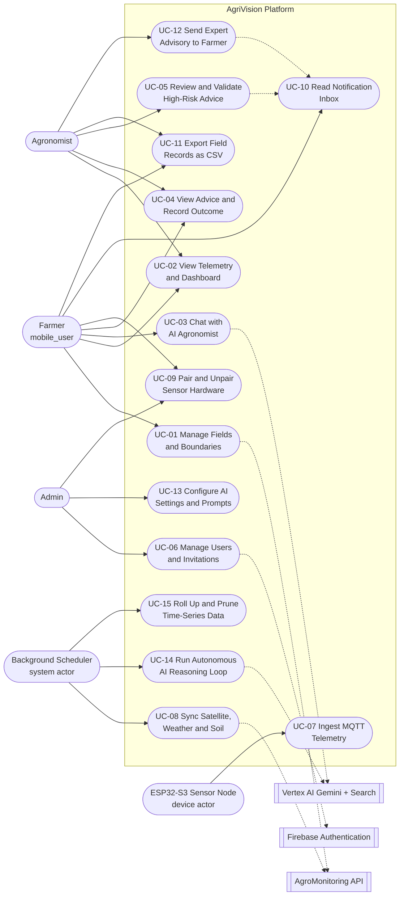

## 3.3 Complete Use Case Inventory & Actor Association

| UC ID | Use Case Name | Primary Actor | Secondary Actors | Pre-Conditions | Post-Conditions |
| :--- | :--- | :--- | :--- | :--- | :--- |
| **UC-01** | Manage Fields & Polygons | Farmer | AgroMonitoring API | Authenticated as `mobile_user`; fewer than 5 active fields | Polygon validated by `ST_IsValid`, area computed in hectares, provider link created |
| **UC-02** | View Telemetry, Dashboard & Satellite Layers | Farmer, Agronomist | Database | Field readable by the caller | Aggregated dashboard snapshot rendered from sensors, observations and the latest scene |
| **UC-03** | Chat with AI Agronomist | Farmer | Vertex AI Gemini | Field active; `Idempotency-Key` supplied | Grounded reply persisted to the field's `farmer` chat thread with sanitised attachments |
| **UC-04** | View Advice & Record Outcome | Farmer | Database | Field has generated recommendations | Advice displayed; farmer feedback and applied/not-applied outcome recorded |
| **UC-05** | Review & Validate High-Risk Advice | Agronomist | Notification subsystem | Recommendation held at `expert_status="pending"` | Verdict, reviewer identity and timestamp recorded; owner notified |
| **UC-06** | Manage Users & Invitations | Admin | Firebase Auth | Authenticated as `admin` | Invitation stored as `pending` and a Firebase sign-in link emailed; role elevated at the invitee's next session bootstrap |
| **UC-07** | Ingest MQTT Telemetry | ESP32-S3 Node | Mosquitto Broker | Node connected to WiFi; device flood limit not exceeded | Reading upserted into the TimescaleDB hypertable on `(time, sensor_id)` |
| **UC-08** | Synchronise Satellite, Weather & Soil | Background Scheduler | AgroMonitoring API | Field has a registered provider polygon | Scene, NDVI/true-colour rasters, weather, soil and UVI observations cached |
| **UC-09** | Pair & Unpair Sensor Hardware | Farmer, Admin | Database | `device_id` verified and unclaimed | Sensor bound to field and owner, or released |
| **UC-10** | Read Notification Inbox | Farmer | Database | Authenticated session | Notifications listed; individual or bulk read state persisted |
| **UC-11** | Export Field Records as CSV | Farmer, Agronomist | Database | Field readable by the caller | Streaming CSV of readings, recommendations, observations, scenes or chat |
| **UC-12** | Send Expert Advisory to Farmer | Agronomist, Admin | Notification subsystem | Field readable by staff; under 30 advisories/hour | Free-text advisory delivered to the owner's inbox, optionally linked to a recommendation |
| **UC-13** | Configure AI Settings & Prompts | Admin | `system_settings` | Authenticated as `admin` | Model, prompt and interval configuration updated without redeployment |
| **UC-14** | Run Autonomous AI Reasoning Loop | Background Scheduler | Vertex AI Gemini + Search | Field context available and reasoning interval elapsed | Analysis run, recommendations, field health and season memory persisted |
| **UC-15** | Roll Up & Prune Time-Series Data | Background Scheduler | TimescaleDB | Hourly worker tick | Hourly buckets upserted; raw rows beyond the retention window deleted |

## 3.4 Detailed Usage Scenarios

### Scenario 1: Field Creation & Satellite Polygon Synchronization
* **Actor:** Farmer (`mobile_user`)
* **Trigger:** Farmer completes drawing the field perimeter on the MapKit canvas and taps "Save Field".
* **Pre-conditions:** Mobile client authenticated via Firebase; fewer than five active fields; device online.
* **Main Success Scenario:**
  1. Mobile app transmits `POST /api/fields` with the polygon coordinate ring, name, crop type and optional sensor pairings.
  2. Backend takes a per-tenant advisory lock, enforces the five-active-field limit and the 20-creations-per-hour rate limit.
  3. Backend validates ring topology via PostGIS `ST_IsValid` and computes acreage via `ST_Area(geography)/10000`, rejecting anything outside 1–3,000 ha.
  4. Row inserted into `fields`; any supplied sensors are bound to the new field in the same transaction.
  5. Backend awaits an initial AgroMonitoring sync bounded by `AGRO_INITIAL_SYNC_TIMEOUT_SECONDS` (15 s default) so the field can return with imagery already attached; if the provider is slower, the sync is handed to a background task instead.
  6. The provider polygon identifier is written to `field_provider_links` (`provider="agromonitoring"`, `external_id`, `sync_status`), not to the `fields` row.
  7. An AI reasoning run for the new field is queued as a background task, and the API responds `201 Created` with the field entity.
* **Post-conditions:** Field visible on the mobile dashboard with its provider sync state; NDVI available as soon as the first scene lands.

### Scenario 2: IoT Telemetry Ingestion & Hourly Rollup
* **Actor:** Physical ESP32-S3 Hardware Node
* **Trigger:** The firmware's non-blocking publish timer elapses every 5 seconds.
* **Pre-conditions:** Node's `DEVICE_ID` matches a paired `sensors` row; WiFi credentials valid; broker reachable.
* **Main Success Scenario:**
  1. Firmware averages the analog soil-moisture reading on GPIO 5 and reads the DS18B20 1-Wire probe on GPIO 6.
  2. Probe fault detection discards open-circuit and short-circuit readings; if no probe returned valid data the turn is suppressed entirely rather than publishing zeros.
  3. Firmware serialises the surviving fields into JSON and publishes to `agrivision/sensors/{device_id}/readings` (PubSubClient, QoS 0).
  4. The FastAPI consumer validates that the payload's `device_id` matches the topic segment, applies the per-device flood limit (120 messages / 60 s) and the 5-minute clock-skew guard, then enqueues the sample.
  5. The async writer drains the queue in batches of up to 50 and upserts with `ON CONFLICT (time, sensor_id)`, auto-registering an unknown `device_id` as a new unassigned sensor.
  6. The hourly worker rolls the trailing 24 hours into `sensor_readings_hourly`; once daily at 03:00 UTC it prunes raw rows past the retention window.
* **Post-conditions:** Telemetry available to the fleet analytics dashboards; raw rows queued for retention pruning.

### Scenario 3: AI Advisory Interception & Agronomist Clinical Approval
* **Actor:** Agronomist (`agronomist`) and the autonomous AI reasoning scheduler
* **Trigger:** The reasoning loop finds the field's context fingerprint has changed and its reasoning interval has elapsed.
* **Pre-conditions:** Field has recent telemetry, observations or a satellite scene.
* **Main Success Scenario:**
  1. Scheduler assembles the context snapshot (sensor trends, weather, soil, UVI, NDVI, season memory) and opens an `ai_analysis_runs` row recording model, prompt version and policy version.
  2. Gemini returns structured recommendations, a field-health payload and a season-memory update against a constrained response schema.
  3. `_apply_safety_policy` inspects each item: chemical or dosage advice, or advice whose cited evidence is not an approved source, is forced to `safety_level="high_risk"` with `requires_expert_confirmation=True`.
  4. The recommendation is inserted into `field_recommendations` with `expert_status="pending"`, so the farmer sees it flagged as awaiting expert confirmation rather than as actionable advice.
  5. The agronomist opens `AIAdvisoryView`, which lists the queue from `GET /api/recommendations/expert/pending` alongside the originating analysis run and its context snapshot.
  6. The agronomist records a verdict through `POST /api/recommendations/{id}/expert-validate`, attaching clinical notes.
  7. The backend writes `expert_status`, `reviewed_by_id` and `reviewed_at` as an audit trail, and creates a `user_notifications` record for the field owner carrying the verdict, the advice summary and the reviewer's note.
* **Post-conditions:** Farmer sees the verified verdict in the in-app notification inbox; a reviewer of record is permanently attached to the recommendation.

---

# 4. Adopted Methodology

## 4.1 Development Context & Resourcing Constraint
AgriVision is engineered and maintained by a **single solo developer** who performs every role on the project: systems analyst, database architect, backend engineer, embedded firmware engineer, AI engineer, iOS developer, web developer, QA engineer, and DevOps operator. There is no team, no pairing partner, no dedicated tester, and no separate reviewer.

This constraint is not incidental — it *determines* the methodology. Any process that depends on multiple concurrent contributors (Scrum ceremonies, daily standups, pair programming, cross-team integration meetings, a separate QA function, or parallel feature tracks staffed by different engineers) is structurally unavailable. The methodology described below is therefore the process actually followed, and it is corroborated by the project's version control history rather than asserted retrospectively.

**Verification basis.** Every claim in Sections 4 and 5 is derived from the project Git repository: 119 commits between **19 January 2026** and **7 September 2026**, authored by a single human contributor (98 commits) supplemented by automated agent commits raised through pull requests (20 commits from the GitHub Copilot coding agent, 1 from an image-optimization bot).

## 4.2 Adopted Process: Solo Iterative & Incremental Development with AI-Assisted Engineering
The project follows a **solo iterative and incremental process organised as a single-lane Kanban with a work-in-progress limit of one subsystem at a time**, augmented by **AI-assisted pair programming** and **automated pull-request review** as substitutes for the human collaboration practices a team would otherwise provide.

The defining characteristics are:

* **Vertical-slice increments.** Each increment delivers one user-visible capability end-to-end across every tier it touches (firmware → broker → API → database → client UI) rather than completing a horizontal layer in isolation. Example: the field-creation increment of July 2026 spanned the iOS MapKit drawing canvas, the `POST /api/fields` handler, PostGIS validation, the AgroMonitoring polygon registration call, and the NDVI sync — committed together as one working slice.
* **WIP limit of one.** With a single developer, concurrency is a liability rather than a throughput gain. The repository history shows subsystems being developed in sequence, not in parallel: the native iOS client (Jan–Mar), the edge firmware and cloud backend (Apr–May), integration and the satellite pipeline (Jul), the AI engine and design system (Aug), and finally the web portal and notification layer (late Aug–Sep).
* **AI-assisted pair programming.** Claude Code and the GitHub Copilot coding agent stand in for the second pair of eyes a solo developer does not have. Their contributions enter the codebase through the same pull-request gate as hand-written work — visible in the merged reviews of PRs #1–#4, and in dedicated agent branches such as `copilot/audit-firebase-auth-implementation` and `copilot/audit-codebase-architecture`.
* **Automated review as the quality gate.** Because no human reviewer exists, correctness is enforced by an automated regression suite (**179 Pytest test functions** across 25 backend test modules and **213 XCTest test methods** across 11 iOS test suites), static analysis (`oxlint` and a strict TypeScript `tsc -b` build gate on the web client; typed Pydantic contracts and the test suite itself on the backend, which carries no separate linter configuration), and reproducible container builds via Docker Compose.
* **Refactor-on-evidence.** Rather than pre-designing for architectural purity, the process admits deliberate, dated refactor passes once a design pressure is proven by working code. The history records several: the MVVM-C and SOLID enforcement pass (5 March 2026), the auth-layer deduplication and hardening pass (18 March 2026), the global design-system standardisation pass (17 August 2026), and the Redis removal that eliminated an unused dependency (1 September 2026).
* **Honest cadence, not a fictional one.** Commit density is uneven by design: 44 commits in March 2026, 4 in April, 3 in May, **none in June 2026** (an academic hold), then 10 in July. A solo project does not sustain a fixed two-week sprint rhythm alongside competing obligations, and the plan in Section 5 reflects the real calendar rather than an idealised one.

## 4.3 Solo Iterative Development Workflow

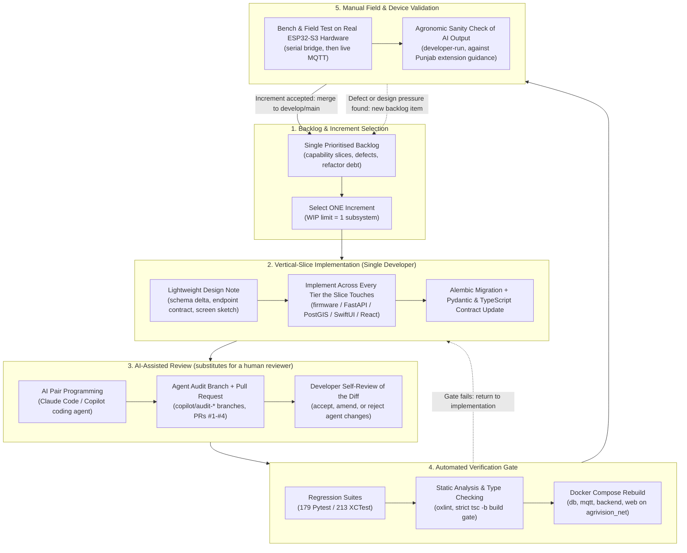

## 4.4 Sequential Subsystem Order (Evidenced by Version Control)
Because only one developer is available, subsystems were built in sequence. The order below is taken directly from the first and last commit touching each part of the repository.

| Order | Subsystem | Repository Path | First Commit | Most Recent Commit | Commits |
| :--- | :--- | :--- | :--- | :--- | :--- |
| 1 | Native iOS Client (SwiftUI, MVVM-C) | `AgriVision/` | 2026-01-19 | 2026-09-07 | 66 |
| 2 | Embedded Edge Firmware (ESP32-S3) | `esp/` | 2026-04-04 | 2026-09-07 | 9 |
| 3 | Cloud Backend, GIS & AI Services | `AgriVision-Backend/` | 2026-04-05 | 2026-09-07 | 22 |
| 4 | Engineering Documentation & SRS | `Docs/` | 2026-05-13 | 2026-09-07 | 6 |
| 5 | Automated iOS Test Suite | `AgriVisionTests/` | 2026-08-05 | 2026-08-05 | 1 |
| 6 | Enterprise Web GIS Portal (React 19) | `AgriVision-Web/` | 2026-08-25 | 2026-09-07 | 5 |

The iOS client was started first and remains the longest-lived subsystem because it defined the product's data requirements; the backend was only begun once those requirements were stable, which is precisely the ordering a solo developer must adopt to avoid building a server for a client that does not yet exist.

## 4.5 Engineering Practices Actually Applied
1. **Trunk-with-feature-branches version control.** Work is developed on named branches (`onboarding-screens`, `auth`, `develop`, `copilot/audit-*`, `agent-building`) and merged into the mainline through pull requests, giving a solo developer an explicit review checkpoint that direct commits to `main` would not provide.
2. **Automated regression testing.** 179 backend Pytest test functions cover multi-tenancy isolation, MQTT ingestion, satellite sync, AI safety policy, rate limiting, export, and full end-to-end lifecycle; 213 iOS XCTest cases cover every ViewModel, the API client, and validation/error handling.
3. **Schema evolution through migrations.** All 16 Alembic revisions are versioned and reversible, so the database can be rebuilt deterministically without a DBA on hand.
4. **Contract-first cross-tier consistency.** Pydantic response models on the backend and TypeScript interfaces on the web client are updated in the same increment, so the two clients cannot drift apart — the discipline that a cross-team integration meeting would otherwise enforce.
5. **Containerised reproducibility.** A single `docker-compose.yml` brings up the database, broker, API, and web portal on an isolated bridge network, removing the "works on my machine" class of defect that a solo developer has no colleague to diagnose.
6. **Physical hardware validation.** Firmware is validated first over a tethered serial bridge and then over live WiFi MQTT against the containerised broker, because no hardware lab or separate test rig exists.

## 4.6 Methodology Comparison & Rationale

| Evaluation Dimension | Waterfall | Scrum (team-based) | Spiral / RUP | Solo Iterative + AI-Assisted (Adopted) | Justification for AgriVision |
| :--- | :--- | :--- | :--- | :--- | :--- |
| **Fit to a one-person team** | Workable but front-loads all risk | **Not viable** — ceremonies, roles and velocity metrics presuppose a team | Heavy ceremony and documentation overhead for one person | **Optimal** — no coordination cost, WIP limit of one | A single developer cannot hold a standup, run a retrospective with themselves, or pair-program. |
| **Absorbing requirement change** | High rework cost late in the cycle | Good | Good | **Good** — each increment is a small, discardable vertical slice | Field-health scoring, season memory and the notification centre were all added after the core schema shipped. |
| **Hardware/firmware risk** | Defects surface only at integration | Reduced by sprint demos | Reduced by prototyping cycles | **Reduced** — firmware slice validated on real ESP32-S3 before dependent work starts | The moisture-probe fault thresholds could only be established against physical soil, not from a specification. |
| **AI prompt & safety tuning** | Infeasible to specify prompts up front | Feasible with a review cadence | Slow feedback loop | **Feasible** — prompt, policy and guardrail versions are data (`AI_PROMPT_VERSION`, `AI_POLICY_VERSION`) tuned per increment | Guardrail thresholds required repeated empirical adjustment against real model output. |
| **Quality assurance without a reviewer** | Relies on a separate QA phase | Relies on a QA team member | Relies on formal review boards | **Automated gate** — 392 automated tests, static analysis, agent-raised audit PRs | Machine review is the only reviewer available; it is therefore made mandatory rather than optional. |
| **Sustainable cadence** | Assumes continuous staffing | Assumes a fixed sprint rhythm | Assumes continuous staffing | **Tolerates variable availability**, including a full development hold in June 2026 | A solo developer with competing obligations cannot guarantee a fixed velocity; the process must not break when work pauses. |

## 4.7 Solo-Development Risks & Mitigations

| Risk | Consequence | Mitigation Applied |
| :--- | :--- | :--- |
| **Single point of failure (bus factor = 1)** | All project knowledge resides with one person | Inline architectural commentary in source, 16 versioned migrations, and this SRS as the durable design record |
| **No independent code review** | Defects and security gaps go unchallenged | Mandatory pull-request gate with AI agent review; dedicated audit branches for auth and architecture |
| **No dedicated QA function** | Regressions reach the working build unnoticed | 392 automated test cases run before merge; end-to-end lifecycle test exercises the full stack |
| **Context switching across five technology stacks** | Shallow work and half-finished subsystems | WIP limit of one subsystem; sequential ordering evidenced in Section 4.4 |
| **Uneven availability** | Schedule slippage against a fixed plan | Increment-sized work items that can be completed or abandoned atomically; the plan in Section 5 records real, not idealised, dates |
| **No agronomy domain expert on the team** | Unsafe agricultural advice reaching farmers | Safety guardrails force chemical and dosage advice into a `requires_expert_confirmation` review queue rather than delivering it directly, and RAG grounding restricts advice to approved extension sources |

---

# 5. Work Plan (Use MS Project to create Schedule/Work Plan)

## 5.1 Scheduling Basis
The work plan below is a **single-resource schedule**: every task is assigned to the same person, so no two tasks may overlap except where one is a background/waiting activity. Task dates are reconstructed from the repository's commit record between 19 January 2026 and 7 September 2026 rather than from an aspirational plan, and the June 2026 development hold is shown explicitly because concealing it would misrepresent the schedule.

**Resource:** 1 × Solo Developer (wearing, by phase, the systems-analyst, database-architect, backend-engineer, embedded-engineer, AI-engineer, iOS-developer, web-developer, QA and DevOps hats). **Assisting tools:** Claude Code and the GitHub Copilot coding agent, used as review and implementation assistants under the developer's control.

## 5.2 Project Schedule & Gantt Chart

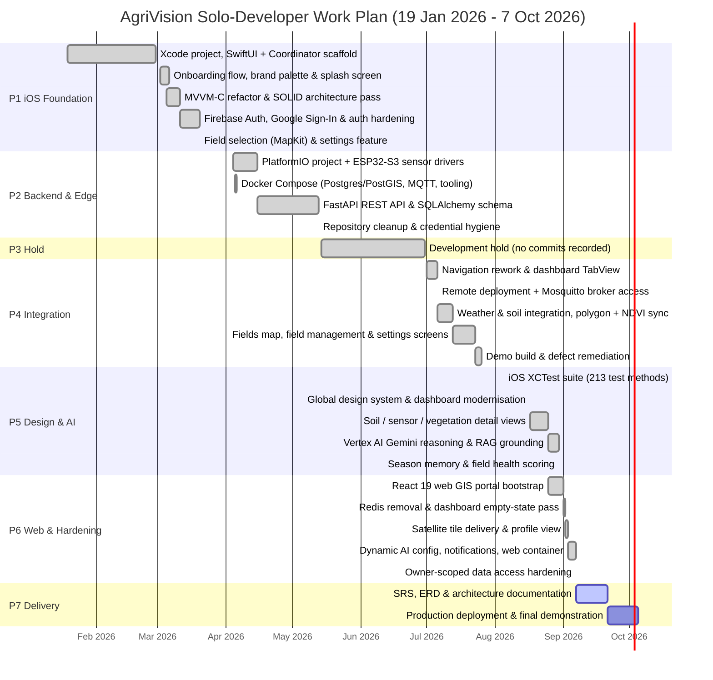

## 5.3 Work Breakdown Structure (WBS) & Task Schedule
All tasks are assigned to the single available resource. The "Role Hat" column records which discipline the developer was operating in, not a separate person.

| WBS | Task Name | Predecessor | Start | Finish | Duration | Role Hat (Solo Developer) | Deliverable / Evidence |
| :--- | :--- | :--- | :--- | :--- | :--- | :--- | :--- |
| **1.0** | **iOS Client Foundation** | — | 2026-01-19 | 2026-03-20 | 61 d | Mobile / Architecture | Authenticated SwiftUI application shell |
| 1.1 | Xcode project, SwiftUI migration & Coordinator scaffold | — | 2026-01-19 | 2026-02-28 | 41 d | iOS Developer | Programmatic UI, `AppCoordinator`, Dashboard stub |
| 1.2 | Onboarding flow, brand palette & splash screen | 1.1 | 2026-03-02 | 2026-03-06 | 5 d | iOS Developer / Designer | Animated onboarding, brand colour tokens |
| 1.3 | MVVM-C and SOLID architecture refactor | 1.2 | 2026-03-05 | 2026-03-11 | 7 d | Software Architect | DRY/OCP/SRP/DIP debt cleared (PRs #1–#3) |
| 1.4 | Firebase Authentication, Google Sign-In & error hardening | 1.3 | 2026-03-11 | 2026-03-20 | 10 d | iOS / Security | Login, signup, reset; `AgriVisionError` mapping |
| 1.5 | Field selection (MapKit) & settings feature | 1.4 | 2026-03-20 | 2026-03-20 | 1 d | iOS Developer | Polygon drawing screen, settings coordinator |
| **2.0** | **Edge Hardware & Cloud Backend** | 1.0 | 2026-04-04 | 2026-05-13 | 40 d | Embedded / Backend / DevOps | Running API and telemetry-capable node |
| 2.1 | PlatformIO project & ESP32-S3 sensor drivers | 1.5 | 2026-04-04 | 2026-04-15 | 12 d | Embedded Engineer | Moisture (ADC pin 5) + DS18B20 (pin 6) reads |
| 2.2 | Docker Compose: PostGIS/TimescaleDB, Mosquitto, pgAdmin | 2.1 | 2026-04-05 | 2026-04-06 | 2 d | DevOps Engineer | `agrivision_net` container network |
| 2.3 | FastAPI REST API, SQLAlchemy models & Alembic baseline | 2.2 | 2026-04-15 | 2026-05-13 | 29 d | Backend / DB Architect | 13 routers, 22-entity schema, migrations |
| 2.4 | Repository cleanup & credential hygiene | 2.3 | 2026-05-13 | 2026-05-13 | 1 d | DevOps / Security | Secrets removed from version control |
| **3.0** | **Scheduled Development Hold** | 2.0 | 2026-05-14 | 2026-06-30 | 48 d | — | No commits recorded (competing obligations) |
| **4.0** | **Client–Backend Integration & Satellite Pipeline** | 3.0 | 2026-07-01 | 2026-07-26 | 26 d | iOS / Backend | Live data flowing into the mobile client |
| 4.1 | Navigation rework & dashboard TabView with bottom sheet | 3.0 | 2026-07-01 | 2026-07-06 | 6 d | iOS Developer | Injected `authService`, dynamic profile |
| 4.2 | Remote server deployment & Mosquitto broker exposure | 4.1 | 2026-07-06 | 2026-07-06 | 1 d | DevOps Engineer | Device-reachable broker endpoint |
| 4.3 | Weather/soil integration, polygon registration & NDVI sync | 4.2 | 2026-07-06 | 2026-07-13 | 8 d | Backend / GIS | `field_provider_links`, instant NDVI on create |
| 4.4 | Fields map, field management & settings screens | 4.3 | 2026-07-13 | 2026-07-23 | 11 d | iOS Developer | Field CRUD from the mobile client |
| 4.5 | Demo build & defect remediation | 4.4 | 2026-07-23 | 2026-07-26 | 4 d | QA / Developer | Demonstrable end-to-end build |
| **5.0** | **Design System, Testing & AI Reasoning Engine** | 4.0 | 2026-08-05 | 2026-08-30 | 26 d | Design / QA / AI | Autonomous advisory engine online |
| 5.1 | iOS regression suite (213 XCTest test methods) | 4.5 | 2026-08-05 | 2026-08-05 | 1 d | QA Engineer | ViewModel, API-client and validation coverage |
| 5.2 | Global design system & dashboard modernisation | 5.1 | 2026-08-17 | 2026-08-17 | 1 d | Design Systems | Shared brand tokens across iOS and web |
| 5.3 | Soil, sensor & vegetation detail views | 5.2 | 2026-08-17 | 2026-08-25 | 9 d | iOS Developer | Metric drill-down screens |
| 5.4 | Vertex AI Gemini reasoning loop & RAG grounding | 5.3 | 2026-08-25 | 2026-08-30 | 6 d | AI Engineer | `ai_advisor_service`, safety policy, evidence |
| 5.5 | Season memory & field health scoring | 5.4 | 2026-08-30 | 2026-08-30 | 1 d | AI / Backend | `field_season_memories`, health score columns |
| **6.0** | **Web Portal & Production Hardening** | 5.0 | 2026-08-25 | 2026-09-07 | 14 d | Web / Backend | Agronomist and admin workstation |
| 6.1 | React 19 web GIS portal bootstrap (MapLibre GL, Zustand) | 5.4 | 2026-08-25 | 2026-09-01 | 8 d | Web Developer | GIS, advisory, fleet, users views |
| 6.2 | Redis removal & dashboard empty-state pass | 6.1 | 2026-09-01 | 2026-09-02 | 2 d | Backend / Web | Unused dependency eliminated |
| 6.3 | Satellite tile delivery & profile view | 6.2 | 2026-09-02 | 2026-09-03 | 2 d | Backend / Web | Authenticated 8-layer tile proxy endpoint |
| 6.4 | Dynamic AI config, notification centre & web containerisation | 6.3 | 2026-09-03 | 2026-09-07 | 5 d | Full-stack / DevOps | `system_settings`, `user_notifications`, Nginx image |
| 6.5 | Owner-scoped data access hardening | 6.4 | 2026-09-07 | 2026-09-07 | 1 d | Security Engineer | Sensor queries scoped by field owner |
| **7.0** | **Documentation & Final Delivery** | 6.0 | 2026-09-07 | 2026-10-05 | 28 d | Technical Author / DevOps | Project sign-off |
| 7.1 | SRS, ERD, architecture and interface documentation | 6.5 | 2026-09-07 | 2026-09-21 | 14 d | Systems Analyst | This document and its rendered HTML |
| 7.2 | Production deployment & final demonstration | 7.1 | 2026-09-21 | 2026-10-05 | 14 d | DevOps / Presenter | Live system demonstration |

## 5.4 Critical Path & Schedule Observations
* **The critical path is the whole project.** With a single resource and a WIP limit of one, no task can be parallelised away from the critical path; total duration equals the sum of active task durations plus the hold.
* **Longest single task:** WBS 2.3 (FastAPI REST API, SQLAlchemy models and Alembic baseline, 29 days) — the schema is the dependency root for every downstream client feature.
* **Highest-risk dependency:** WBS 4.3, which couples field creation to a third-party satellite provider. It is mitigated in code by an initial synchronous sync bounded by `AGRO_INITIAL_SYNC_TIMEOUT_SECONDS` that degrades to a background retry, so provider latency cannot block field creation.
* **Schedule realism:** the 48-day hold in WBS 3.0 accounts for 20% of the elapsed calendar and is the single largest deviation from a continuously staffed plan. It is reported rather than smoothed away.

---

# 6. Entity Relationship Diagram (ERD)

## 6.1 Comprehensive 22-Entity Relational & Time-Series ERD
The AgriVision persistence layer is implemented on PostgreSQL 15 (`timescale/timescaledb-ha:pg15-all`) with the PostGIS spatial extension and the TimescaleDB time-series engine. The schema encompasses 22 distinct entities modeling users, fields, hardware sensors, satellite imagery, AI reasoning runs, and clinical expert validations.

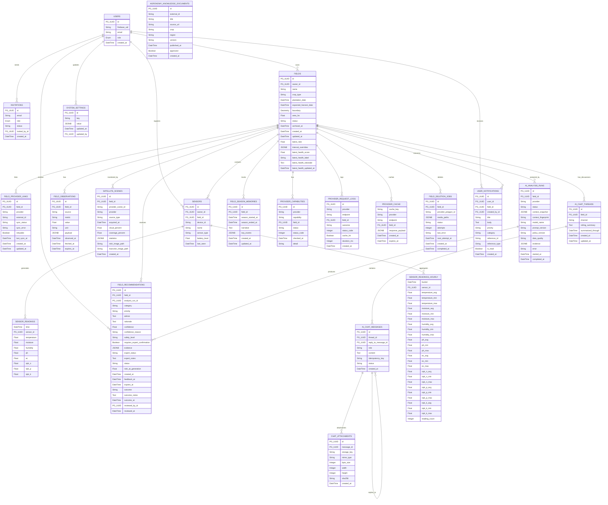

## 6.2 Entity Relationships & Multiplicity Analysis
* **`users` -> `fields` (1 : N):** A farmer user owns zero or more field parcels. Enforced via foreign key `fields.owner_id -> users.id`.
* **`users` -> `invitations` (1 : N):** System administrators issue zero or more staff invitations to agronomists via `invitations.invited_by_id`.
* **`fields` -> `sensors` (1 : N):** A field contains zero or more stationed IoT hardware nodes via `sensors.field_id`.
* **`sensors` -> `sensor_readings` (1 : N):** A sensor transmits continuous time-series samples stored in TimescaleDB hypertable partitioned across 7-day chunks.
* **`sensors` -> `sensor_readings_hourly` (1 : N):** Hourly statistical buckets keyed by the composite primary key `(bucket, sensor_id)`, maintained by an idempotent application-level upsert worker rather than a TimescaleDB continuous aggregate.
* **`fields` -> `satellite_scenes` (1 : N):** A field accumulates periodic satellite acquisitions fetched from Sentinel-2 via AgroMonitoring.
* **`fields` -> `ai_analysis_runs` (1 : N):** Each autonomous reasoning cycle creates an analysis run recording context snapshots, fingerprints, and model versions.
* **`ai_analysis_runs` -> `field_recommendations` (1 : N):** An analysis run synthesizes zero or more actionable recommendations.
* **`fields` -> `field_season_memories` (1 : N, one active):** A rolling seasonal narrative accumulating milestone memory across the crop growth cycle. Closed seasons are retained as history; a partial unique index on `field_id WHERE season_ended_at IS NULL` guarantees at most one *open* season memory per field.
* **`fields` -> `ai_chat_threads` (1 : N, one per channel):** A `UNIQUE (field_id, channel)` constraint gives each field exactly one persistent thread per audience — a `farmer` channel and an `agronomist` channel — so staff discussion never leaks into the farmer's conversation.
* **`users` -> `sensors` (1 : N):** Every paired hardware node records the owner who claimed it via `sensors.owner_id`, which is what scopes fleet queries by tenant.
* **`users` -> `field_recommendations` (1 : N, as reviewer):** `reviewed_by_id` and `reviewed_at` form the clinical audit trail — any recommendation that can gate a chemical intervention carries a reviewer of record.
* **`fields` / `users` -> `user_notifications` (1 : N):** A notification names the field it concerns (`field_id`) and, when staff-authored, its sender (`created_by_id`), so advice that can gate an intervention is always attributable.
* **`fields` -> `field_deletion_jobs` (logical 1 : N):** Deletion jobs deliberately carry `field_id` **without** a foreign-key constraint, because the job must outlive the row it references in order to finish removing the external provider polygon and cached media.
* **`ai_chat_threads` -> `ai_chat_messages` (1 : N):** A chat thread contains ordered messages exchanged between user and assistant.
* **`ai_chat_messages` -> `chat_attachments` (1 : N):** User messages may include zero or more sanitized image attachments.

---

# 7. Architecture Design Diagram

## 7.1 High-Level Multi-Tier Layered Architecture Diagram
The platform architecture follows a decoupled, async-first pattern. Three long-running background tasks are started from the FastAPI lifespan hook — the MQTT ingestion writer, the external-data (satellite/weather/soil) sync worker, and the hourly aggregation worker — so that broker traffic, third-party provider latency and LLM reasoning never sit on a client request path.

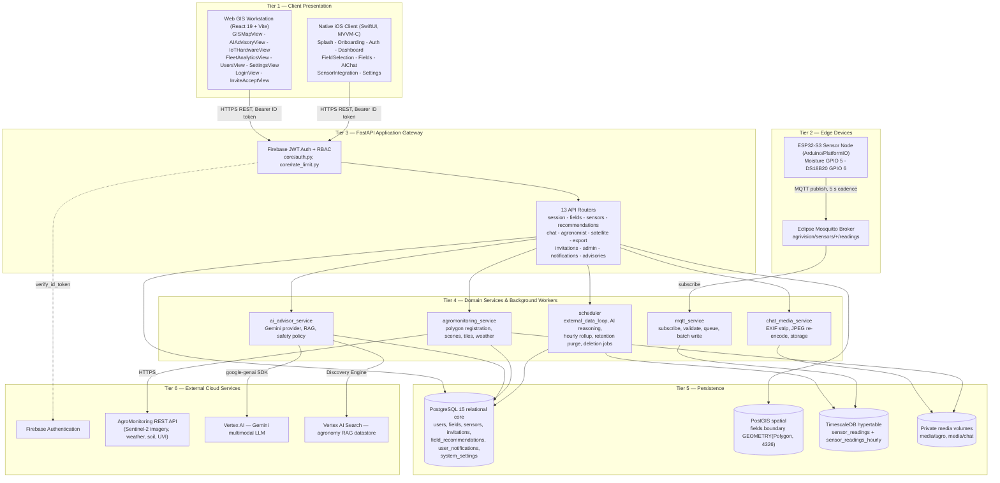

## 7.2 Low-Level Deployment & Container Topology Diagram
The entire backend suite is containerized and orchestrated via Docker Compose on an isolated bridge network (`agrivision_net`), isolating sensitive database and MQTT traffic from public exposure.

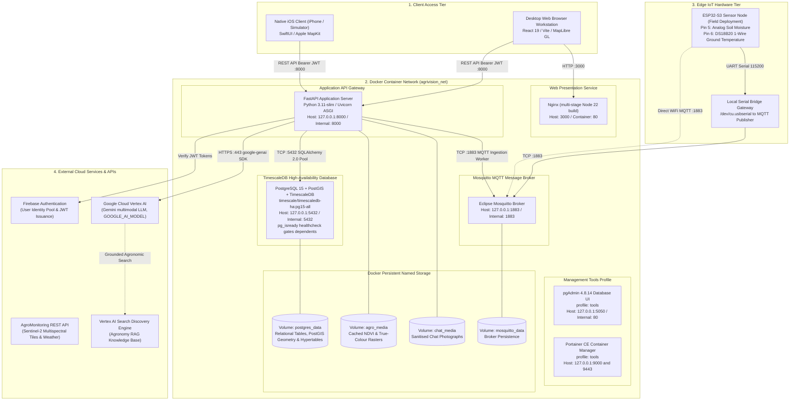

## 7.3 Detailed Architectural Tier Breakdown

### 1. Client Presentation Tier
* **Native iOS Mobile App:** Built using Swift, SwiftUI, Combine and Apple MapKit on an MVVM-C architecture. Session persistence is handled by the Firebase iOS SDK; user preferences (saved email, dashboard refresh interval, onboarding state) are stored in `UserDefaults` behind injected service protocols.
* **Enterprise Web GIS Workstation:** Built using React 19, Vite, TypeScript, Tailwind CSS 4 and MapLibre GL, with TanStack Query for server state and Zustand for client state. Features interactive GIS inspection of the multi-spectral raster layers served for the active scene, hardware fleet pairing, analytics charts and the agronomist advisory review queue.

### 2. Edge Sensing & IoT Hardware Tier
* **ESP32-S3 Microcontroller:** Deployed in physical fields on an `esp32-s3-devkitc-1-n16r8` board, interfaced with an analog resistive soil-moisture probe (12-bit ADC on GPIO 5, averaged across samples with open-circuit and short-circuit fault thresholds) and a Dallas DS18B20 1-Wire temperature sensor on GPIO 6.
* **Non-Blocking Firmware Stack:** Programmed in C++ against the Arduino framework via PlatformIO. A single `loop()` drives millis-scheduled publishing every 5 seconds, a non-blocking WiFi and MQTT reconnect state machine, OTA firmware update, a NeoPixel status indicator, and telemetry suppression when no probe returns a valid reading.
* **Serial UART Bridge:** Supports a local serial bridge (`/dev/cu.usbserial` at 115200 baud) for tethered bench testing and development.

### 3. Ingestion & Message Broker Tier
* **Eclipse Mosquitto:** MQTT broker handling device telemetry on the topic pattern `agrivision/sensors/{device_id}/readings` (subscribed as `agrivision/sensors/+/readings`) on port 1883, with optional username/password authentication.
* **Async Ingestion Worker:** Long-running Paho-MQTT consumer running on a daemon thread that validates each payload (topic/`device_id` agreement, 5-minute clock-skew bound, per-device flood limit of 120 messages per 60 seconds), hands accepted samples to an `asyncio.Queue`, and drains that queue in batches of up to 50 rows written with `ON CONFLICT (time, sensor_id)` handling.
* **Hourly Rollup Engine:** In-process worker (started from the FastAPI lifespan) that upserts Min/Max/Avg/Count aggregates for the trailing 24 hours into `sensor_readings_hourly` every hour, and prunes raw readings once daily at 03:00 UTC beyond the retention window (14 days by default, per-field overridable).

### 4. Application Services & Business Logic Tier
* **FastAPI Gateway (:8000):** Uvicorn-hosted asynchronous ASGI application serving REST endpoints, protected by Firebase JWT authentication middleware.
* **Agromonitoring Satellite Service:** Handles external polygon registration, weather forecast caching, and dynamic multi-spectral raster tile streaming.
* **AI Advisor Service & Scheduler:** Executes the autonomous reasoning loop, computes holistic field health scores (0–100 with a categorical label and rationale, or `insufficient_data` rather than a fabricated number), applies the chemical/dosage safety policy, and maintains the pending expert-review queue.
* **Chat Media Sanitization Service:** Strips GPS/EXIF metadata from uploaded crop photographs, applies EXIF orientation, converts to RGB, downscales to a maximum edge of 2,048 px, re-encodes as progressive JPEG with no EXIF block, and stores the result on a private local volume or a GCS bucket behind a storage abstraction.

### 5. Persistence & Enterprise Storage Tier
* **PostgreSQL 15 + PostGIS:** Stores relational user profiles, fields, invitations, recommendations, notifications and settings, plus spatial vector geometries (`GEOMETRY(Polygon, 4326)`).
* **TimescaleDB Engine:** Powers the `sensor_readings` hypertable created at startup via `create_hypertable(..., if_not_exists => TRUE, migrate_data => TRUE)`, which partitions along `time` using TimescaleDB's default 7-day chunk interval.
* **Persistent Docker Volumes:** Named volumes (`postgres_data`, `agro_media`, `chat_media`, `mosquitto_data`, `portainer_data`) preserve state across container restarts and rebuilds.

### 6. External Cloud & Foundation AI Tier
* **Google Cloud Vertex AI (Gemini):** Multimodal foundation model performing crop-disease diagnosis and autonomous reasoning. The model is configuration-driven (`GOOGLE_AI_MODEL`, default `gemini-3.7-flash`) and can be re-pointed at runtime through the admin AI settings endpoint without redeployment.
* **Vertex AI Search (Discovery Engine):** Serves as the RAG knowledge store, indexing certified agronomy extension documents for grounded advice.
* **Firebase Authentication:** Handles user identity pools, password resets, and cryptographically signed JWT issuance.

---

# 8. Sequence Diagrams OR Usage Scenarios

## 8.1 Sequence 1: Authentication, Token Verification & Session Bootstrap Flow
Illustrates how the mobile/web client authenticates with Firebase, exchanges the ID token with the FastAPI backend, creates or retrieves the internal user record, and bootstraps the user's active field portfolio.

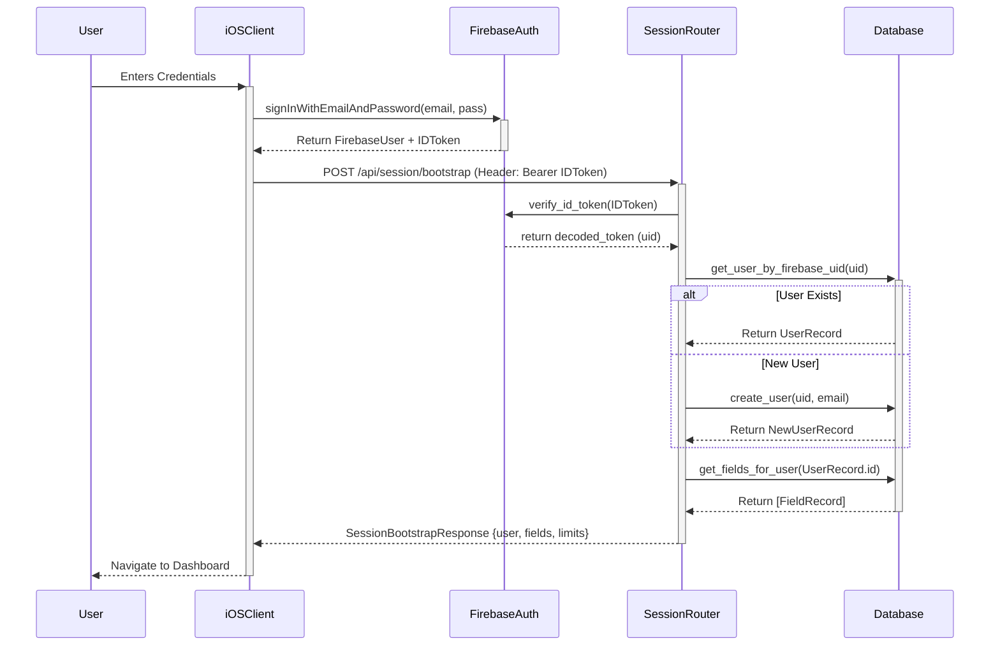

## 8.2 Sequence 2: Field Boundary Creation & AgroMonitoring Satellite Sync Flow
Illustrates the flow when a farmer draws a polygon on the map: PostGIS geometry validation, geodetic acreage calculation, record insertion, a time-boxed synchronous provider registration that degrades to a background retry, and the queued AI reasoning run.

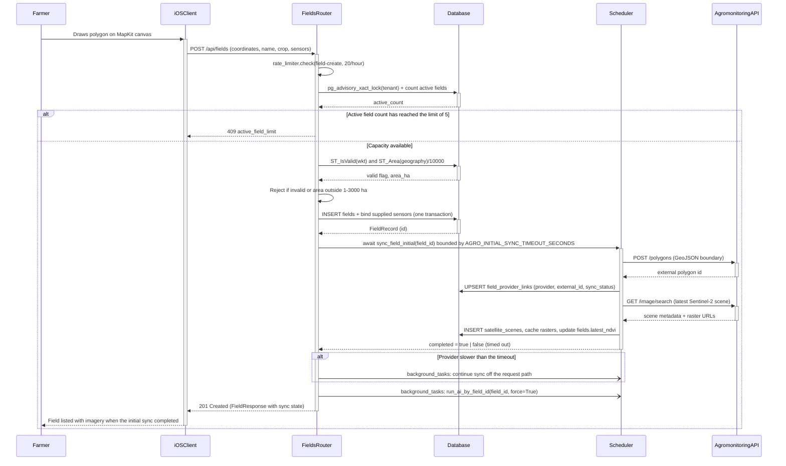

## 8.3 Sequence 3: IoT Hardware MQTT Telemetry Ingestion Loop & Hourly Rollup
Illustrates the telemetry loop: ESP32-S3 sensing with probe fault suppression, non-blocking MQTT transmission to Mosquitto, validated queue-and-batch ingestion into the TimescaleDB hypertable, and the hourly statistical rollup with daily retention pruning.

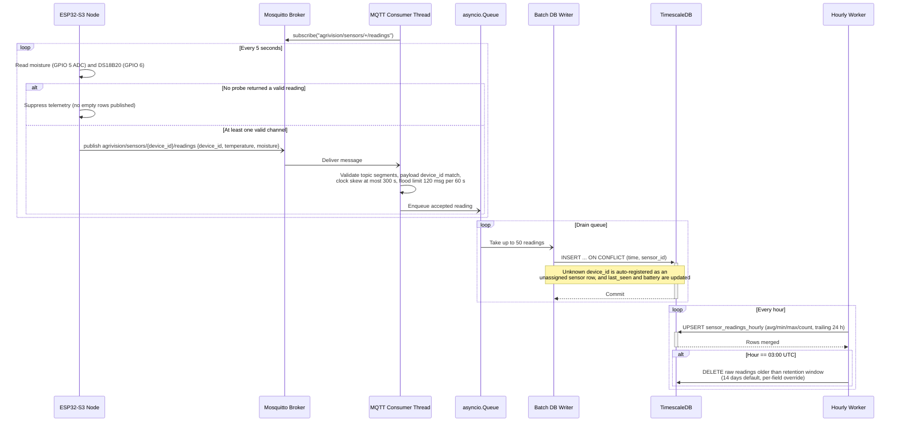

## 8.4 Sequence 4: AI Recommendation Generation, Safety Interception & Agronomist Approval
Illustrates the autonomous reasoning cycle: context assembly and fingerprinting, grounded Gemini generation, rule-based chemical/dosage interception, agronomist clinical validation through the web portal, and in-app notification delivery to the field owner.

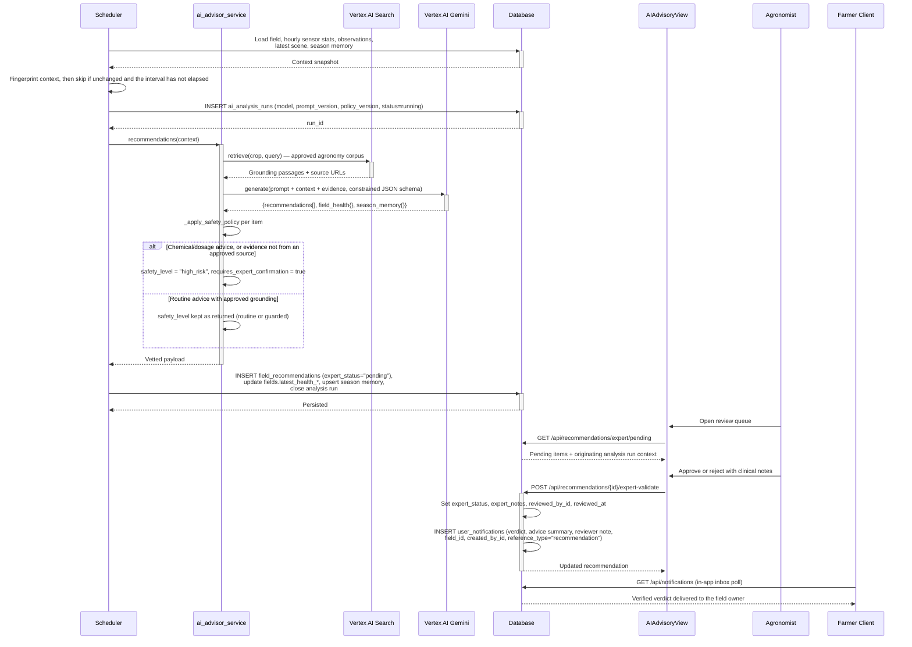

## 8.5 Sequence 5: Farmer Multimodal AI Chat & Media Upload Flow with Grounding
Illustrates a farmer photographing a diseased leaf and submitting it with a question. Images are uploaded directly to the API as multipart form data and sanitised server-side — the client never writes to cloud storage, so an unsanitised original carrying GPS EXIF can never be persisted.

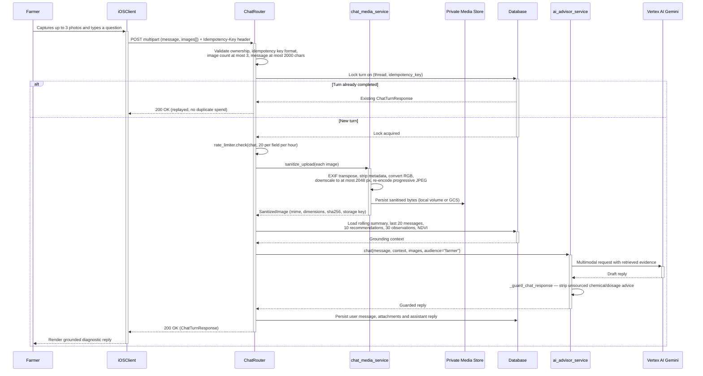

---

# 9. Class Diagram

## 9.1 Backend Domain Models & Persistence Entities (SQLAlchemy 2.0)
Models the 14 core database domain entities implemented in `app/models/db_models.py`, complete with their exact attributes, data types, and primary/foreign key constraints.

```mermaid
classDiagram
    class User {
        PG_UUID id
        String firebase_uid
        String email
        Enum role
        DateTime created_at
    }
    class Invitation {
        PG_UUID id
        String email
        Enum role
        String status
        PG_UUID invited_by_id
        DateTime created_at
    }
    class Field {
        PG_UUID id
        PG_UUID owner_id
        String name
        String crop_type
        DateTime plantation_date
        DateTime expected_harvest_date
        Geometry boundary
        Float area_ha
        String status
        DateTime archived_at
        DateTime created_at
        DateTime updated_at
        Float latest_ndvi
        JSONB interval_overrides
        Float latest_health_score
        String latest_health_label
        Text latest_health_rationale
        DateTime latest_health_updated_at
    }
    class FieldProviderLink {
        PG_UUID id
        PG_UUID field_id
        String provider
        String external_id
        String sync_status
        String sync_error
        Boolean retryable
        DateTime last_sync_at
        DateTime created_at
        DateTime updated_at
    }
    class Sensor {
        PG_UUID id
        PG_UUID owner_id
        PG_UUID field_id
        String device_id
        String name
        String sensor_type
        Float battery_level
        DateTime last_seen
    }
    class SensorReading {
        DateTime time
        PG_UUID sensor_id
        Float temperature
        Float moisture
        Float humidity
        Float ph
        Float ec
        Float npk_n
        Float npk_p
        Float npk_k
    }
    class FieldObservation {
        PG_UUID id
        PG_UUID field_id
        String source
        String metric
        Float value
        String unit
        JSONB payload
        DateTime observed_at
        DateTime fetched_at
        DateTime expires_at
    }
    class SatelliteScene {
        PG_UUID id
        PG_UUID field_id
        String provider_scene_id
        String provider
        String source_type
        DateTime acquired_at
        Float cloud_percent
        Float coverage_percent
        JSONB statistics
        String ndvi_image_path
        String truecolor_image_path
        DateTime created_at
    }
    class AIAnalysisRun {
        PG_UUID id
        PG_UUID field_id
        String provider
        String status
        JSONB context_snapshot
        String context_fingerprint
        String model_name
        String prompt_version
        String policy_version
        String data_quality
        JSONB evidence
        String error
        DateTime started_at
        DateTime completed_at
    }
    class FieldRecommendation {
        PG_UUID id
        PG_UUID field_id
        PG_UUID analysis_run_id
        String category
        String priority
        Text advice
        Text rationale
        Float confidence
        String confidence_reason
        String safety_level
        Boolean requires_expert_confirmation
        JSONB evidence
        String expert_status
        Text expert_notes
        String status
        Float ndvi_at_generation
        DateTime created_at
        DateTime feedback_at
        DateTime expires_at
        String outcome
        Text outcome_notes
        DateTime outcome_at
        PG_UUID reviewed_by_id
        DateTime reviewed_at
    }
    class AIChatThread {
        PG_UUID id
        PG_UUID field_id
        String channel
        Text rolling_summary
        DateTime summarized_through
        DateTime created_at
        DateTime updated_at
    }
    class FieldSeasonMemory {
        PG_UUID id
        PG_UUID field_id
        DateTime season_started_at
        DateTime season_ended_at
        Text narrative
        JSONB key_events
        DateTime created_at
        DateTime updated_at
    }
    class AIChatMessage {
        PG_UUID id
        PG_UUID thread_id
        PG_UUID reply_to_message_id
        String role
        Text content
        String idempotency_key
        String status
        DateTime created_at
    }
    class ChatAttachment {
        PG_UUID id
        PG_UUID message_id
        String storage_key
        String mime_type
        Integer byte_size
        Integer width
        Integer height
        String sha256
        DateTime created_at
    }
    class ProviderCapability {
        PG_UUID id
        String provider
        String capability
        PG_UUID field_id
        String status
        Integer status_code
        DateTime checked_at
        String detail
    }
    class ProviderRequestLog {
        PG_UUID id
        String provider
        String endpoint
        PG_UUID field_id
        String outcome
        Integer status_code
        Boolean cache_hit
        Integer duration_ms
        DateTime created_at
    }
    class ProviderCache {
        String cache_key
        String provider
        String endpoint
        PG_UUID field_id
        JSONB response_payload
        DateTime created_at
        DateTime expires_at
    }
    class FieldDeletionJob {
        PG_UUID id
        PG_UUID field_id
        String provider_polygon_id
        JSONB media_paths
        String status
        Integer attempts
        String last_error
        DateTime next_attempt_at
        DateTime created_at
        DateTime completed_at
    }
    class SensorReadingHourly {
        DateTime bucket
        PG_UUID sensor_id
        Float temperature_avg
        Float temperature_min
        Float temperature_max
        Float moisture_avg
        Float moisture_min
        Float moisture_max
        Float humidity_avg
        Float humidity_min
        Float humidity_max
        Float ph_avg
        Float ph_min
        Float ph_max
        Float ec_avg
        Float ec_min
        Float ec_max
        Float npk_n_avg
        Float npk_n_min
        Float npk_n_max
        Float npk_p_avg
        Float npk_p_min
        Float npk_p_max
        Float npk_k_avg
        Float npk_k_min
        Float npk_k_max
        Integer reading_count
    }
    class AgronomyKnowledgeDocument {
        PG_UUID id
        String external_id
        String title
        String source_url
        String crop
        String region
        String version
        DateTime published_at
        Boolean approved
        DateTime created_at
    }
    class UserNotification {
        PG_UUID id
        PG_UUID user_id
        PG_UUID field_id
        PG_UUID created_by_id
        String title
        Text body
        String priority
        String category
        String reference_id
        String reference_type
        Boolean is_read
        DateTime created_at
    }
    class SystemSettings {
        PG_UUID id
        String key
        JSONB value
        DateTime updated_at
        PG_UUID updated_by
    }
    User -- Field
    User -- Invitation
    Invitation -- User
    Field -- User
    Field -- FieldProviderLink
    Field -- Sensor
    Field -- FieldRecommendation
    Field -- FieldObservation
    Field -- SatelliteScene
    FieldProviderLink -- Field
    Sensor -- Field
    FieldObservation -- Field
    SatelliteScene -- Field
    FieldRecommendation -- Field
    UserNotification -- User
    SystemSettings -- User
```

## 9.2 Backend API Routers & Controllers
Models the FastAPI API router hierarchy implemented in `app/api/`, defining endpoint handler signatures, dependency injections (database session and authenticated user), and request/response lifecycles.

```mermaid
classDiagram
    class FieldsRouter {
        +create_field(field_data, background_tasks, db)
        +get_fields(include_archived, admin_view, db)
        +get_field(field_id, db, current_user)
        +assign_sensor(field_id, sensor_data, db)
        +get_field_sensors(field_id, db, current_user)
        +update_field(field_id, update, db)
        +harvest_field_removed(field_id, db, current_user)
        +delete_field(field_id, background_tasks, db)
        +refresh_field_data(field_id, background_tasks, db)
        +get_dashboard(field_id, db, current_user)
        +weather_soil_compat(field_id, db, current_user)
    }
    class SensorsRouter {
        +get_sensors(db, current_user)
        +get_field_readings(field_id, granularity, limit)
        +verify_sensor_connection(device_id, db, current_user)
        +pair_sensor(request, db, current_user)
    }
    class SatelliteRouter {
        +latest(field_id, db, current_user)
        +ndvi_image(field_id, db, current_user)
        +truecolor_image(field_id, db, current_user)
        +fetch_tile(field_id, layer_type, z)
    }
    class RecommendationsRouter {
        +get_recommendations(field_id, limit, db)
        +get_season_memory(field_id, db, current_user)
        +update_feedback(recommendation_id, feedback, db)
        +update_feedback_compat(field_id, recommendation_id, feedback)
        +get_expert_pending_recommendations(limit, db, current_user)
        +expert_validate(recommendation_id, validation, db)
        +record_outcome(recommendation_id, outcome, db)
        +trigger_refresh(field_id, background_tasks, db)
    }
    class SessionRouter {
        +bootstrap(db, current_user)
    }
    class ExportRouter {
        +export_sensor_readings(field_id, granularity, hours)
        +export_recommendations(field_id, limit, db)
        +export_observations(field_id, limit, db)
        +export_satellite_scenes(field_id, limit, db)
        +export_chat(field_id, limit, db)
    }
    class ChatRouter {
        +get_history(field_id, limit, before)
        +get_attachment(field_id, attachment_id, db)
        +post_message(field_id, message, images)
    }
    class AdminRouter {
        +get_all_users(db)
        +delete_user(user_id, background_tasks, db)
        +transfer_field(field_id, req, db)
        +get_ai_settings(db)
        +update_ai_settings(settings, db, current_user)
    }
    class AgronomistRouter {
        +get_agronomist_history(field_id, limit, before)
        +post_agronomist_message(field_id, body, idempotency_key)
    }
    class NotificationsRouter {
        +get_notifications(limit, db, current_user)
        +mark_notification_read(notification_id, db, current_user)
    }
    class InvitationsRouter {
        +create_invitation(invite_data, db, current_user)
        +get_invitations(db, current_user)
    }
    class KnowledgeProvider {
        +retrieve(crop, query)
    }
    class CuratedKnowledgeProvider {
        +retrieve(crop, query)
    }
    class VertexSearchKnowledgeProvider {
        +retrieve(crop, query)
    }
    class AIProvider {
        +name
        +model_name
        +recommendations(context)
        +chat(message, context, images)
        +summarize_season(existing_narrative, new_recommendations, recommendation_history)
    }
    class UnavailableAIProvider {
        +recommendations(context)
        +summarize_season(existing_narrative, new_recommendations, recommendation_history)
        +chat(message, context, images)
    }
    class GeminiAIProvider {
        +recommendations(context)
        +summarize_season(existing_narrative, new_recommendations, recommendation_history)
        +chat(message, context, images)
    }
```

## 9.3 Backend Core Services & Utilities
Models the core business logic services implemented in `app/services/`, including satellite remote sensing integration, autonomous AI reasoning, image sanitization, and MQTT ingestion.

```mermaid
classDiagram
    class SanitizedImage {
        +data
        +mime_type
        +width
        +height
        +sha256
    }
    class PrivateMediaStorage {
    }
    class LocalPrivateMediaStorage {
    }
    class GCSPrivateMediaStorage {
    }
    class AgroAPIError {
    }
    class AgroEntitlementError {
    }
    class StrictModel {
    }
    class PointCoordinates {
        +longitude
        +latitude
    }
    class SensorCreate {
        +device_id
        +name
        +sensor_type
    }
    class SensorResponse {
        +id
        +field_id
        +device_id
        +name
        +sensor_type
        +battery_level
        +last_seen
    }
    class SensorPairRequest {
        +device_id
    }
    class SensorPairResponse {
        +is_paired
        +message
        +sensor
    }
    class FieldCreate {
        +name
        +coordinates
        +area_ha
        +crop_type
        +plantation_date
        +expected_harvest_date
    }
    class FieldWithSensorsCreate {
        +sensors
    }
    class FieldIntervalOverrides {
        +weather_hours
        +soil_hours
        +uvi_hours
        +satellite_hours
        +ai_hours
        +retention_days
    }
    class FieldUpdate {
        +name
        +crop_type
        +expected_harvest_date
        +interval_overrides
    }
    class FieldResponse {
        +id
        +owner_id
        +name
        +coordinates
        +area_ha
        +status
        +archived_at
        +created_at
        +updated_at
        +crop_type
    }
    class SensorReadingDB {
        +time
        +sensor_id
        +temperature
        +moisture
        +humidity
        +ph
        +ec
        +npk_n
        +npk_p
        +npk_k
    }
    class SensorReadingHourlyDB {
        +bucket
        +sensor_id
        +temperature_avg
        +temperature_min
        +temperature_max
        +moisture_avg
        +moisture_min
        +moisture_max
        +humidity_avg
        +humidity_min
    }
    class RecommendationResponse {
        +id
        +field_id
        +category
        +priority
        +advice
        +rationale
        +confidence
        +confidence_reason
        +evidence
        +safety_level
    }
    class SeasonMemoryResponse {
        +field_id
        +season_started_at
        +narrative
        +key_events
    }
    class RecommendationExpertValidation {
        +status
        +notes
    }
    class RecommendationFeedback {
        +status
    }
    class RecommendationOutcome {
        +outcome
        +notes
    }
    class ChatMessageRequest {
        +message
    }
    class ChatAttachmentResponse {
        +id
        +mime_type
        +byte_size
        +width
        +height
        +url
    }
    class ChatMessageResponse {
        +id
        +role
        +content
        +status
        +attachments
        +created_at
    }
    class ChatTurnResponse {
        +user_message
        +assistant_message
    }
    class UserSchema {
        +id
        +firebase_uid
        +email
        +role
        +created_at
    }
    class SessionBootstrapResponse {
        +user
        +fields
        +active_field_limit
        +active_field_count
    }
    class ErrorBody {
        +code
        +message
        +details
        +retryable
        +request_id
    }
    class ErrorEnvelope {
        +error
    }
    class InvitationCreate {
        +email
        +role
    }
    class InvitationResponse {
        +id
        +email
        +role
        +status
        +created_at
    }
    class AISettingsUpdate {
        +mode
        +model
    }
    class AISettingsResponse {
        +mode
        +model
    }
```

## 9.4 Web Application Architecture & State Stores (React 19 / TypeScript)
Models the client-side architecture of the enterprise web portal (`AgriVision-Web`): the HTTP transport layer, the domain service wrappers that own endpoint knowledge, the TanStack Query hooks that own server state, the Zustand stores that own client state, and the role-based access control layer that gates every privileged view.

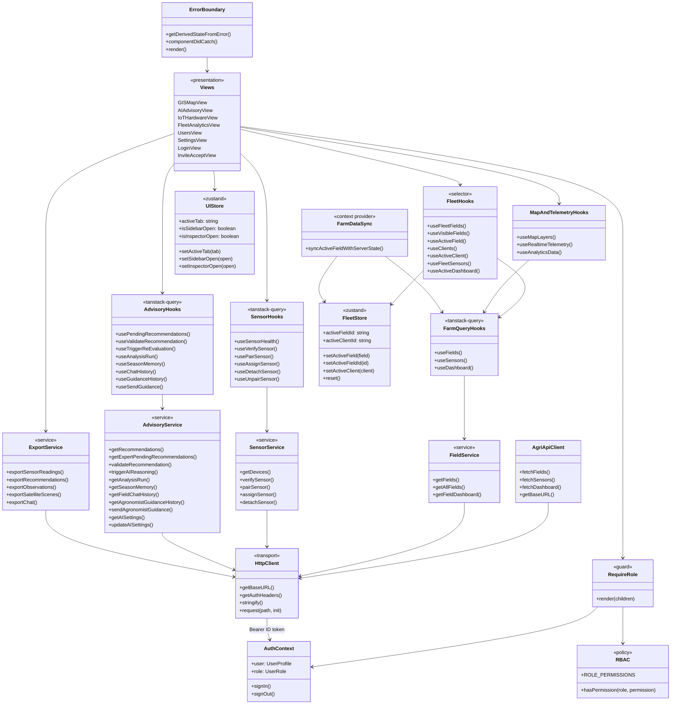

## 9.5 Native iOS Client MVVM Architecture (Swift / SwiftUI)
Models the object-oriented architecture of the native iOS mobile application, detailing ViewModels, Services, Coordinators, and User Preference managers.

```mermaid
classDiagram
    class SettingsViewModel {
        +accountName: String
        +appVersion: String
        +preferencesService: PreferencesService
        +currentFieldName: String
        +isGoogleLinked: Bool
        +successMessage: String
        +profileName: String
        +authService: AuthService
        +accountEmail: String
        +sensorSummary: String
        +errorMessage: String
        +satelliteSummary: String
        +sensors: List~FieldSensor~
        +fieldSessionStore: FieldSessionStore
        +activeFieldId: UUID
        +deleteField()
        +presentError()
        +refreshIntegrationStatus()
        +presentSuccess()
        +setRefreshInterval()
        +pairAndAssignSensor()
        +selectField()
        +signOut()
        +linkGoogleAccount()
        +refreshAll()
    }
    class LoginViewModel {
        +authService: AuthService
        +password: String
        +rememberMe: Bool
        +errorMessage: String
        +preferencesService: PreferencesService
        +isLoading: Bool
        +email: String
        +continueWithGoogle()
        +forgotPassword()
        +login()
    }
    class SignupViewModel {
        +lastNameError: String
        +authService: AuthService
        +password: String
        +lastName: String
        +confirmPasswordError: String
        +errorMessage: String
        +confirmPassword: String
        +isLoading: Bool
        +firstName: String
        +passwordError: String
        +userProfileService: UserProfileService
        +firstNameError: String
        +email: String
        +emailError: String
        +continueWithGoogle()
        +validateField()
        +register()
    }
    class AuthViewModel {
        +selectedTab: AuthTab
        +switchToSignup()
        +authCompleted()
        +switchToLogin()
    }
    class ForgotPasswordViewModel {
        +authService: AuthService
        +errorMessage: String
        +isLoading: Bool
        +email: String
        +successMessage: String
        +sendResetLink()
        +back()
    }
    class VerifyEmailViewModel {
        +isLoading: Bool
        +message: String
        +isVerified: Bool
        +authService: AuthService
        +checkVerificationStatus()
        +resendVerificationEmail()
    }
    class DashboardViewModel {
        +fullDashboardRefreshInterval: TimeInterval
        +ndviData: Data
        +advisorMessage: String
        +preferencesService: PreferencesService
        +currentCropType: String
        +values: List~Double~
        +sensorFleet: List~SensorFleetEntry~
        +recommendations: List~FieldRecommendation~
        +satelliteImageData: Data
        +fieldSessionStore: FieldSessionStore
        +truecolorImageData: Data
        +authService: AuthService
        +weatherSoil: FieldWeatherSoil
        +uvi: SourceState
        +errorMessage: String
        +availabilityItems()
        +refreshRecommendations()
        +refreshNotifications()
        +signOut()
        +loadSatelliteImages()
        +pollUntilCancelled()
        +requestDataRefresh()
        +presentError()
        +clearFieldData()
        +openChat()
        +refreshSensorReadingsOnly()
        +markNotificationRead()
        +openSettings()
        +updateFeedback()
        +recordOutcome()
    }
    class AIChatViewModel {
        +messages: List~ChatMessage~
        +errorMessage: String
        +fieldId: UUID
        +canSend: Bool
        +attachmentData: List~UUID~
        +pendingIdempotencyKey: String
        +dataService: AgriDataService
        +selectedImages: List~ChatImageUpload~
        +imageData()
        +addImage()
        +sendMessage()
        +presentError()
        +removeImage()
        +loadMissingAttachments()
        +fetchHistory()
        +dismiss()
    }
    class AddFieldIntroViewModel {
        +profileInitial: String
        +authService: AuthService
        +userName: String
        +profileImageURL: URL
        +addFieldAction()
        +loadUserData()
        +signOut()
    }
    class FieldDetailsViewModel {
        +selectedCrop: String
        +dataService: AgriDataService
        +authService: AuthService
        +profileInitial: String
        +profileImageURL: URL
        +errorMessage: String
        +coordinates: List~CLLocationCoordinate2D~
        +isLoading: Bool
        +name: String
        +defaultHarvestInterval: TimeInterval
        +monitorWithIoT: Bool
        +calculatedAreaHa: Double
        +plantationDate: Date
        +letSystemDecideHarvestDate: Bool
        +harvestDate: Date
        +performSave()
        +loadUserData()
        +goBack()
        +signOut()
        +saveField()
    }
    class FieldSelectionViewModel {
        +dataService: AgriDataService
        +searchResults: List~MKLocalSearchCompletion~
        +authService: AuthService
        +locationName: String
        +fieldCoordinates: List~CLLocationCoordinate2D~
        +profileImageURL: URL
        +errorMessage: String
        +searchQuery: String
        +profileInitial: String
        +successMessage: String
        +isSearching: Bool
        +movePoint()
        +completerDidUpdateResults()
        +completer()
        +clearPoints()
        +zoomIn()
        +signOut()
        +calculatedAreaHa()
        +selectSearchResult()
        +addPoint()
        +cancelSelection()
        +showMessage()
        +moveToLocation()
        +undoLastPoint()
        +setupProfile()
        +confirmField()
    }
    class OnboardingViewModel {
        +scrollOffset: CGFloat
        +pages: List~OnboardingPage~
        +containerWidth: CGFloat
        +handlePreferenceChange()
        +handleNextAction()
    }
    class SensorIntegrationViewModel {
        +dataService: AgriDataService
        +authService: AuthService
        +createdFieldID: UUID
        +verificationMessage: String
        +isVerifying: Bool
        +fieldData: FieldSelectionData
        +errorMessage: String
        +profileImageURL: URL
        +fieldID: UUID
        +selectedSensorType: String
        +isLoading: Bool
        +profileInitial: String
        +sensorName: String
        +isVerified: Bool
        +pairingCode: String
        +verifyHardware()
        +loadUserData()
        +goBack()
        +completeSetup()
        +signOut()
    }
    class MockAuthService {
        +currentUserID: String
        +currentUserDisplayName: String
        +isLoggedInStub: Bool
        +currentUserEmail: String
        +currentUserPhotoURL: URL
        +isEmailVerified: Bool
        +displayName: String
        +shouldFail: Bool
        +isGoogleProviderLinked: Bool
        +isUserLoggedIn: Bool
        +reloadUser()
        +resetPassword()
        +signOut()
        +signInWithGoogle()
        +sendEmailVerification()
        +linkGoogleAccount()
        +getIDToken()
        +updateDisplayName()
        +signUp()
        +signIn()
    }
    class FirebaseUserProfileService {
        +updateDisplayName()
    }
    class MockPreferencesService {
        +activeFieldId: UUID
        +savedEmail: String
        +dashboardRefreshInterval: TimeInterval
    }
    class FirebaseAuthService {
        +currentUserID: String
        +currentUserDisplayName: String
        +currentUserEmail: String
        +currentUserPhotoURL: URL
        +isEmailVerified: Bool
        +isGoogleProviderLinked: Bool
        +isUserLoggedIn: Bool
        +reloadUser()
        +resetPassword()
        +getTopViewController()
        +signOut()
        +signInWithGoogle()
        +sendEmailVerification()
        +linkGoogleAccount()
        +getIDToken()
        +updateDisplayName()
        +signUp()
        +signIn()
    }
    class UserDefaultsPreferencesService {
        +activeFieldId: UUID
        +savedEmail: String
        +dashboardRefreshInterval: TimeInterval
        +getSavedEmail()
    }
    class UserDefaultsOnboardingStateService {
        +hasSeenOnboarding: Bool
        +defaults: UserDefaults
        +markOnboardingComplete()
    }
    class MockUserProfileService {
        +lastDisplayName: String
        +shouldFail: Bool
        +updateDisplayName()
    }
    class OnboardingStateService {
        +hasSeenOnboarding: Bool
        +markOnboardingComplete()
    }
    class UserProfileService {
        +updateDisplayName()
    }
    class AgriDataService {
        +sendChatMessage()
        +deleteField()
        +refreshRecommendations()
        +saveField()
        +fetchChatHistory()
        +fetchWeatherSoil()
        +fetchFields()
        +fetchSensors()
        +pairSensor()
        +fetchSensorReadings()
        +fetchSatelliteImage()
        +bootstrapSession()
        +refreshFieldData()
        +fetchDashboard()
        +fetchSeasonMemory()
    }
    class AuthService {
        +currentUserID: String
        +currentUserDisplayName: String
        +currentUserEmail: String
        +currentUserPhotoURL: URL
        +isEmailVerified: Bool
        +errorDescription: String
        +isGoogleProviderLinked: Bool
        +isUserLoggedIn: Bool
        +reloadUser()
        +resetPassword()
        +signOut()
        +signInWithGoogle()
        +sendEmailVerification()
        +linkGoogleAccount()
        +getIDToken()
        +updateDisplayName()
        +signUp()
        +signIn()
    }
    class PreferencesService {
        +activeFieldId: UUID
        +savedEmail: String
        +dashboardRefreshInterval: TimeInterval
    }
```

---

# 10. Database Design

## 10.1 Relational Engine & Partitioning Architecture
The AgriVision persistence layer is hosted on PostgreSQL 15/16 utilizing the `timescale/timescaledb-ha:pg15-all` distribution. The database combines three specialized storage paradigms within a single unified engine:
1. **Relational Core (PostgreSQL):** Stores entities requiring ACID transactional guarantees (Users, Invitations, Fields, Recommendations, Settings).
2. **Spatial Engine (PostGIS):** Manages vector field boundaries (Polygons, MultiPolygons) in spatial reference system WGS 84 (SRID 4326), with GiST spatial indexing for ultra-fast point-in-polygon and geometric intersection queries.
3. **Time-Series Hypertables (TimescaleDB):** Automatically partitions the high-volume `sensor_readings` table across 7-day chunk intervals, providing high write throughput and instant continuous aggregation.

## 10.2 PostGIS Spatial Geometry Engine
* **Spatial Reference System:** WGS 84 (EPSG:4326), aligned with GPS and satellite orbital standards.
* **Geometric Types:** `GEOMETRY(Polygon, 4326)` representing field perimeters.
* **Spatial Operations:**
  - `ST_MakePolygon(ST_GeomFromText(...))` for boundary construction from client coordinate arrays.
  - `ST_IsValid(boundary)` to prevent self-intersecting or topologically malformed field polygons.
  - `ST_Area(boundary::geography) / 10000.0` for geodetically accurate surface area computation in hectares.
  - `ST_Centroid(boundary)` for computing the central GPS coordinate for weather forecast fetching.

## 10.3 TimescaleDB Hypertable & Hourly Rollup Strategy
* **Hypertable Creation:** At application startup `sensor_readings` is converted with `SELECT create_hypertable('sensor_readings', 'time', if_not_exists => TRUE, migrate_data => TRUE)`, partitioning along the `time` dimension using TimescaleDB's default 7-day chunk interval. The conversion is guarded by `ENABLE_TIMESCALEDB`, so the schema also runs on plain PostgreSQL (as it does in the test suite).
* **Hourly Rollup (application-level, not a continuous aggregate):** `sensor_readings_hourly` is a **regular table** maintained by an in-process worker rather than a TimescaleDB continuous aggregate. Every hour the worker executes a single `INSERT ... SELECT date_trunc('hour', time) ... GROUP BY bucket, sensor_id ... ON CONFLICT (sensor_id, bucket) DO UPDATE` over the trailing 24 hours, which makes the rollup idempotent and self-healing after downtime. This was a deliberate trade-off: it keeps the schema portable to a database without the TimescaleDB extension, at the cost of the automatic refresh policy a continuous aggregate would provide.
* **Aggregated Columns:** avg/min/max for `temperature`, `moisture`, `humidity`, `ph`, `ec`, `npk_n`, `npk_p` and `npk_k` (24 statistical columns), plus `reading_count`, keyed by the composite primary key `(bucket, sensor_id)`.
* **Data Retention Policy:** Once per day at 03:00 UTC the same worker deletes raw rows older than the retention window, resolved per field as `COALESCE((fields.interval_overrides->>'retention_days')::int * INTERVAL '1 day', INTERVAL '14 days')`. Hourly aggregates are never pruned, so long-term trends survive while the raw-sample footprint stays bounded.

## 10.4 Exhaustive Data Dictionaries for Primary Tables

### Table: `fields`
| Column Name | Data Type | Nullable | Constraints & Indexes | Architectural Description |
| :--- | :--- | :--- | :--- | :--- |
| `id` | UUID | No | PRIMARY KEY, default `uuid4` | Unique identifier for the field parcel. |
| `owner_id` | UUID | No | FK -> `users.id`, INDEXED | The farmer who owns the parcel; the root of every tenancy check. |
| `name` | VARCHAR(100) | No | Required | Human-readable name of the field. |
| `crop_type` | VARCHAR(80) | Yes | Nullable | Primary crop planted (e.g. `'Wheat'`). |
| `plantation_date` | TIMESTAMPTZ | Yes | Nullable | Date the crop was sown. |
| `expected_harvest_date` | TIMESTAMPTZ | Yes | Nullable | Expected harvest date; when null the AI is expected to infer readiness. |
| `boundary` | GEOMETRY(Polygon, 4326) | No | Required, GiST INDEXED | PostGIS polygon of the field perimeter. |
| `area_ha` | DOUBLE PRECISION | No | Required, validated 1–3000 ha | Geodetically computed surface area in hectares. |
| `status` | VARCHAR(20) | No | Default `'active'`, INDEXED | Lifecycle state: `'active'` or `'archived'`. |
| `archived_at` | TIMESTAMPTZ | Yes | Nullable | When the field left the active portfolio. |
| `created_at` | TIMESTAMPTZ | No | Server default `now()` | Row creation timestamp. |
| `updated_at` | TIMESTAMPTZ | No | Server default `now()`, `onupdate` | Last modification timestamp. |
| `latest_ndvi` | DOUBLE PRECISION | Yes | Nullable | Most recent NDVI vegetation index (-1.0 to 1.0). |
| `interval_overrides` | JSONB | No | Server default `'{}'::jsonb` | Per-field overrides for sync/reasoning intervals and raw-reading retention days. |
| `latest_health_score` | DOUBLE PRECISION | Yes | Nullable | AI holistic health score (0–100); null whenever the label is `insufficient_data`. |
| `latest_health_label` | VARCHAR(20) | Yes | Nullable | Categorical health label accompanying the score. |
| `latest_health_rationale` | TEXT | Yes | Nullable | Model's stated reasoning for the current health verdict. |
| `latest_health_updated_at` | TIMESTAMPTZ | Yes | Nullable | When the health verdict was last recomputed. |

> **Note:** the external satellite polygon identifier is **not** stored on this table. It is normalised into `field_provider_links` (`provider`, `external_id`, `sync_status`, `sync_error`, `retryable`, `last_sync_at`) under `UNIQUE (field_id, provider)`, so a field can be linked to several providers and each link carries its own independent sync state.

### Table: `sensor_readings` (TimescaleDB Hypertable)
| Column Name | Data Type | Nullable | Constraints & Indexes | Architectural Description |
| :--- | :--- | :--- | :--- | :--- |
| `time` | TIMESTAMPTZ | No | COMPOSITE PK, hypertable partition key | Sample acquisition timestamp (rejected beyond ±300 s of broker clock). |
| `sensor_id` | UUID | No | COMPOSITE PK, FK -> `sensors.id` ON DELETE CASCADE | The physical node that produced the sample. |
| `temperature` | DOUBLE PRECISION | Yes | Nullable | Soil temperature in °C (DS18B20 on GPIO 6). |
| `moisture` | DOUBLE PRECISION | Yes | Nullable | Volumetric soil moisture percentage (0–100%, ADC on GPIO 5). |
| `humidity` | DOUBLE PRECISION | Yes | Nullable | Relative atmospheric humidity percentage (channel reserved for a future probe). |
| `ph` | DOUBLE PRECISION | Yes | Nullable | Soil acidity/alkalinity (0.0–14.0). |
| `ec` | DOUBLE PRECISION | Yes | Nullable | Electrical conductivity in mS/cm. |
| `npk_n` | DOUBLE PRECISION | Yes | Nullable | Soil nitrogen concentration in mg/kg. |
| `npk_p` | DOUBLE PRECISION | Yes | Nullable | Soil phosphorus concentration in mg/kg. |
| `npk_k` | DOUBLE PRECISION | Yes | Nullable | Soil potassium concentration in mg/kg. |

> **Note:** battery level is device state, not a time-series sample, and is therefore stored on `sensors.battery_level` alongside `sensors.last_seen`, both refreshed by the ingestion worker as readings arrive.

### Table: `field_recommendations`
| Column Name | Data Type | Nullable | Constraints & Indexes | Architectural Description |
| :--- | :--- | :--- | :--- | :--- |
| `id` | UUID | No | PRIMARY KEY, default `uuid4` | Unique recommendation identifier. |
| `field_id` | UUID | No | FK -> `fields.id` ON DELETE CASCADE, INDEXED | Target field receiving the advice. |
| `analysis_run_id` | UUID | Yes | FK -> `ai_analysis_runs.id` ON DELETE SET NULL | The reasoning run that produced this item; preserves provenance. |
| `category` | VARCHAR(50) | No | Required | Advice domain (e.g. `'Irrigation'`, `'Fertilizer'`, `'Pest Control'`, `'Harvest Timing'`). |
| `priority` | VARCHAR(20) | No | Default `'medium'` | Severity: `'low'`, `'medium'`, `'high'`. |
| `advice` | TEXT | No | Required | Plain-language recommendation shown to the farmer. |
| `rationale` | TEXT | Yes | Nullable | Agronomic reasoning citing NDVI, telemetry and weather. |
| `confidence` | DOUBLE PRECISION | Yes | Nullable | Model confidence (0.0–1.0). |
| `confidence_reason` | VARCHAR(500) | Yes | Nullable | Stated basis for that confidence. |
| `safety_level` | VARCHAR(20) | No | Default `'guarded'` | `'routine'`, `'guarded'` or `'high_risk'` after the safety policy runs. |
| `requires_expert_confirmation` | BOOLEAN | No | Default `false` | Set true when chemical/dosage advice or unapproved evidence is detected. |
| `evidence` | JSONB | Yes | Nullable | Approved source passages and URLs supporting the advice. |
| `expert_status` | VARCHAR(20) | No | Default `'pending'` | Review verdict: `'pending'`, `'approved'`, `'rejected'`. |
| `expert_notes` | TEXT | Yes | Nullable | Reviewing agronomist's clinical note, delivered to the farmer. |
| `status` | VARCHAR(20) | No | Default `'pending'` | Farmer-side feedback state on the advice. |
| `ndvi_at_generation` | DOUBLE PRECISION | Yes | Nullable | NDVI captured at generation time for later comparison. |
| `created_at` | TIMESTAMPTZ | No | Server default `now()` | Generation timestamp. |
| `feedback_at` | TIMESTAMPTZ | Yes | Nullable | When the farmer responded. |
| `expires_at` | TIMESTAMPTZ | Yes | Nullable | When the advice ceases to be actionable. |
| `outcome` | VARCHAR(20) | Yes | Nullable | Recorded real-world outcome after application. |
| `outcome_notes` | TEXT | Yes | Nullable | Free-text outcome detail. |
| `outcome_at` | TIMESTAMPTZ | Yes | Nullable | When the outcome was recorded. |
| `reviewed_by_id` | UUID | Yes | FK -> `users.id` ON DELETE SET NULL | Agronomist of record for the review decision. |
| `reviewed_at` | TIMESTAMPTZ | Yes | Nullable | Timestamp of the review decision. |

---

# 11. Interface Design

## 11.1 Design System Tokens & Foundations
Both clients render the same brand palette, defined once as raw hex values and mirrored in each platform's token layer — `Core/DesignSystem/Theme.swift` on iOS and the `@layer base` custom properties in `src/index.css` on the web.

### Brand Colour Palette (shared by iOS and Web)
* **Charcoal Green (`#3d6d40`):** The primary brand colour — primary action buttons, active navigation states and headline accents. Exposed as `--primary` on the web and `Theme.Colors.primary` on iOS.
* **Medium Green (`#6a8e4e`):** Secondary emphasis and mid-scale vegetation indicators (`--primary-medium` / `Theme.Colors.primaryMedium`).
* **Lime Green (`#b0d182`):** Highlight and glow colour — active borders, focus rings, healthy-vegetation indicators and the `--primary-glow` shadow (`--accent-lime` / `Theme.Colors.primaryLight`).
* **Cream (`#f4f1ea`):** Primary text on dark surfaces and the light-mode background on iOS (`--text-main` / `Theme.Colors.creamColor`).

### Web Surface & Status Tokens
The web workstation is a **dark glassmorphic** interface, not a light one: the body is painted `#0e1e11` under a dimmed field photograph, and content sits on translucent green-tinted glass.
* **Surfaces:** `--bg-main: #0e1e11`, `--bg-surface: #17321c`, `--bg-surface-elevated: #214427`, with glass fills `rgba(23,50,28,0.78)` and `rgba(30,64,36,0.65)`.
* **Borders:** lime-tinted at low alpha — `rgba(176,209,130,0.28)` rising to `0.60` on emphasis.
* **Status accents:** cyan `#38bdf8` (informational), orange `#fb923c` (warning / moderate stress), purple `#c084fc` (analytical series), red `#f87171` (critical alerts and high-risk chemical banners).
* **Text ramp:** `--text-main` cream, `--text-muted` `#cbd5e1`, `--text-dim` `#94a3b8`.
* **Radii & elevation:** an 8 / 16 / 22 / 28 px radius scale plus a pill radius, with `--shadow-glass` for depth and `--shadow-glow` for lime emphasis.

### iOS Surface & Status Tokens
The iOS client is adaptive rather than dark-only: `Theme.Colors.background`, `.surface` and `.textPrimary` resolve through `dynamicColor(light:dark:)`, pairing cream/white surfaces in light mode with near-black surfaces in dark mode. Semantic status colours map to the system palette (`.green` success, `.orange` warning, `.red` error), and spacing (4/8/12/16/24/32/48) and corner radii (8/16/24/pill) are centralised in `Theme.Spacing` and `Theme.Radius`.

### Typography
* **Web headings:** `Outfit`, letter-spaced at `-0.02em` (`--font-heading`).
* **Web body:** `Plus Jakarta Sans` (`--font-body`).
* **iOS:** the system font (SF Pro) accessed through the `Typography` text-style ladder, with weights adjusted per style so the mobile client inherits Dynamic Type and accessibility sizing for free rather than shipping a bundled typeface.

## 11.2 Native iOS Application Blueprints (SwiftUI)

### Blueprint 11.2.1: Authentication & Splash View (`SplashView` & `AuthView`)
* **Purpose:** Initial onboarding, user login, and session bootstrapping.
* **Layout Structure:**
  1. *Hero Brand Header:* AgriVision logo mark, charcoal-to-lime brand gradient, and welcome tagline.
  2. *Authentication Form:* Email text field with validation, secure password field, "Remember Me" toggle, and primary "Sign In" button.
  3. *Federated Providers:* "Sign in with Google" branded button leveraging `GoogleSignIn-iOS`.
  4. *Footer:* Password reset link and terms of service disclaimer.

### Blueprint 11.2.2: Field Dashboard & Telemetry Cards (`DashboardView`)
* **Purpose:** Primary home screen displaying active field status, environmental metrics and the AI advisory feed.
* **Layout Structure:**
  1. *Top Navigation Bar (`DashboardHeaderView`):* Field picker (parcel name, crop badge, area in ha), profile control and a notification bell opening `NotificationInboxView`.
  2. *AI Field Health Card (`HealthCardView`):* Holistic AI health score (0–100) with a categorical label and rationale, degrading to an explicit "insufficient data" state rather than showing a fabricated number.
  3. *Metric Card Grid:* Liquid-glass cards for soil moisture (`MoistureCardView`), soil temperature (`SoilTempCardView`), NDVI (`NDVICardView`), vegetation indices (`VegetationIndicesCardView`), soil pH (`PHLevelCardView`), live sensor status (`SensorLiveCardView`), soil chemistry/EC-NPK (`SensorChemistryCardView`), weather (`WeatherCardView`), forecast (`ForecastCardView`), UV index (`UVIndexCardView`), satellite imagery (`SatelliteImageCardView`) and scene quality (`SatelliteQualityCardView`). Each card pushes a matching detail screen from `Views/Detail/`.
  4. *Data Availability Card (`DataAvailabilityCard`):* States plainly which of the sensor, satellite and weather sources are currently reporting, so an empty chart is never mistaken for a zero reading.
  5. *AI Advisor Card & Alerts (`AIAdvisorCard`, `AlertsBottomSheet`):* Latest recommendations with urgency styling, expanding into a snap-to-fit bottom sheet of alert rows.
  6. *Bottom Tab Bar:* 4 tabs — **Home**, **Fields**, **Advisor**, **Settings**.

### Blueprint 11.2.3: Interactive Field Boundary Drawing (`FieldSelectionView`)
* **Purpose:** Georeferenced parcel mapping tool for digitizing field perimeters.
* **Layout Structure:**
  1. *Interactive MapKit Canvas:* Full-screen satellite base layer centered on user's current GPS location.
  2. *Drawing Overlay:* Visual polyline tracing tap points, connecting closed polygon vertices with a translucent charcoal-green fill.
  3. *Floating Action Controls:* "Undo Point" button, "Clear All" button, and computed surface area badge (`e.g., 4.25 ha`).
  4. *Save Drawer (Modal):* Bottom sheet prompting for Field Name, Crop Type dropdown, and Plantation Date picker.

### Blueprint 11.2.4: Multimodal AI Crop Diagnostics Chat (`AIChatView`)
* **Purpose:** Conversational interface for diagnosing leaf pathologies and asking agronomic questions.
* **Layout Structure:**
  1. *Header Bar:* "AI Agronomist", field context pill (`Field: North Wheat`), and session reset button.
  2. *Message Scroll Canvas:* Chat bubbles differentiating farmer questions (charcoal green) from AI responses (neutral surface), rendering markdown lists and bold text.
  3. *Camera Attachment Drawer:* Floating button to capture leaf photo via native camera or select from photo library.
  4. *Input Dock:* Multiline text input field with send icon button and processing spinner.

## 11.3 Web Application Workstation Blueprints (React 19)

### Blueprint 11.3.1: Geospatial Satellite Workstation (`GISMapView`)
* **Purpose:** Desktop GIS workstation for analysing satellite spectral indices across the field portfolio.
* **Layout Structure:**
  1. *Sidebar (`Sidebar.tsx`):* Field portfolio navigation and role-aware section links, collapsible through `useUIStore.setSidebarOpen`.
  2. *GIS Toolbar (`GISToolbar.tsx`):* Raster layer selector listing the layers verified as served for the active scene (NDVI — canopy vigour, NDWI — canopy moisture, EVI — vigour with reduced soil noise, True Color — RGB), a 2D/3D pitch toggle, and a "fit to all fields" control.
  3. *Map Canvas (`useMapLayers.ts`):* MapLibre GL canvas rendering GeoJSON field boundaries over a raster tile layer that requests `/api/fields/{id}/satellite/latest/tile/{layer}/{z}/{x}/{y}` with the bearer token injected per tile request.
  4. *Inspector Drawer (`GISInspectorDrawer.tsx`):* Slide-over panel for the selected field showing crop context, AI health score and the latest telemetry, toggled through `useUIStore.setInspectorOpen`.

### Blueprint 11.3.2: Human-in-the-Loop AI Advisory Review Queue (`AIAdvisoryView`)
* **Purpose:** Clinical review portal where agronomists validate or reject AI-generated high-risk and chemical recommendations before farmers can act on them.
* **Layout Structure:**
  1. *Header:* Advisory validation summary with pending/approved/rejected counts, sourced from `usePendingRecommendations`.
  2. *Pending Review Feed:* Expandable cards showing field name, owner, priority badge, safety level, the model's advice and rationale, and the cited evidence URLs. `useAnalysisRun` opens the originating analysis run so the reviewer can see the exact context snapshot, model name, prompt version and policy version behind the advice.
  3. *Verdict Controls:* Approve and reject actions with a clinical notes field, submitted via `useValidateRecommendation` to `POST /api/recommendations/{id}/expert-validate`; the note is delivered verbatim to the farmer's notification inbox.
  4. *Expert Advisory Composer (`AdvisoryComposer.tsx`):* Free-text advisory (title, message, priority, optional recommendation link) delivered to the field owner's inbox via `POST /api/fields/{id}/advisories`.
  5. *Agronomist Guidance Channel:* A staff-only chat thread per field (`useGuidanceHistory` / `useSendGuidance`) that is kept separate from the farmer-facing conversation, plus a re-evaluation trigger (`useTriggerReEvaluation`) that forces a fresh reasoning run.

### Blueprint 11.3.3: IoT Hardware Fleet & Provisioning (`IoTHardwareView`)
* **Purpose:** Hardware inventory, live telemetry health and device pairing management.
* **Layout Structure:**
  1. *Top Action Bar:* Pair-new-sensor control, fleet status summary, and status filters — **all**, **online**, **offline**, **unassigned** (a paired probe that is not yet on a field).
  2. *Hardware Fleet Table:* Device ID, assigned field (or "Not on a field"), owner, last-seen freshness (rendered down to "Just now" / "Never"), battery gauge, and the latest value for each telemetry channel — Temperature, Moisture, Humidity, Nitrogen, Phosphorus and Potassium — with channels the deployed node does not yet populate shown as unavailable rather than as zero.
  3. *Pairing Flow:* `useVerifySensor` checks a `device_id` against `GET /api/sensors/verify/{device_id}` before `usePairSensor` claims it, then `useAssignSensor` binds it to a field; `useDetachSensor` and `useUnpairSensor` reverse each step independently.

### Blueprint 11.3.4: Team & Multi-Tenant Access Management (`UsersView`)
* **Purpose:** Administration of staff accounts, roles and invitations. The whole view is gated on the `admin` role and renders an explicit access-denied state for anyone else.
* **Layout Structure:**
  1. *Header Bar:* Title, purpose line, and the invite form.
  2. *Invite Form:* Email input and role selector; submitting calls `POST /api/invitations` and then dispatches a Firebase sign-in link to the address, with inline success and error status.
  3. *Staff Table:* User email, role badge (`admin`, `agronomist`, `mobile_user`) styled from `ROLE_METADATA`, and account state.
  4. *Pending Invitations:* Invitations still at status `pending`, with the role they will grant and when they were issued. Invitations carry no expiry in the current schema, and are cleared by being accepted rather than by an explicit revoke action.

### Blueprint 11.3.5: Fleet Risk Triage & Analytics (`FleetAnalyticsView`)
* **Purpose:** Portfolio-level view answering which fields need attention first.
* **Layout Structure:**
  1. *KPI Row:* Total acreage, mean field health, telemetry probe count and a "needs attention" count.
  2. *Distribution Charts:* Health distribution and health-by-crop breakdowns rendered with Recharts.
  3. *Triage Table:* Field name, crop, overall health, the AI's rationale for that verdict, and a drill-down action — with explicit "awaiting AI assessment" and "no rationale recorded" states instead of blank cells.
  4. *Telemetry Provenance Panel:* "Data behind these charts" — probes online, readings in the window, newest reading and empty buckets — so a flat chart can be told apart from missing data, plus a manual telemetry refresh.

### Blueprint 11.3.6: Control Portal Configuration (`SettingsView`)
* **Purpose:** Operational status of the platform's dependencies and, for administrators, live tuning of the AI stack.
* **Layout Structure:**
  1. *Backend Connection:* Active FastAPI server URL with a live reachability indicator.
  2. *Connected External Services:* Firebase Authentication, AgroMonitoring and Vertex AI status, plus Eclipse Mosquitto broker state.
  3. *Dynamic AI Configuration (admin only):* Provider mode and model selection persisted to `system_settings` through `GET`/`PUT /api/admin/settings/ai`, so the reasoning stack can be re-pointed without a redeployment.
