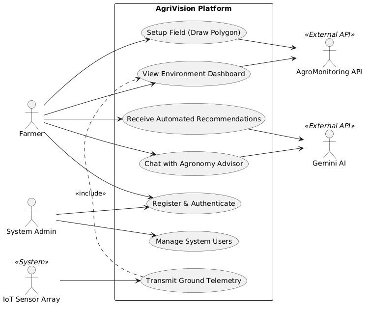

# AgriVision Software Requirements Specification (SRS)

# 1. Scope of the Project

## 1.1 Project Overview
AgriVision is an intelligent precision agriculture platform designed to act as an interactive agronomy advisor. The core objective of the system is to continuously analyze crop health and environmental conditions by synthesizing data from three distinct layers: macro-level satellite telemetry, micro-level IoT field sensors, and direct user input via an AI chatbot. By aggregating this tri-source data, AgriVision interactively guides farmers through the entire crop lifecycle, providing timely, field-specific insights to optimize yield and mitigate risks.

## 1.2 Target Audience
The primary end-users are small to medium-scale farmers and agricultural stakeholders. The platform is designed to bridge the gap between complex agronomic data and accessible mobile technology, translating rich environmental telemetry into simple, interactive conversational guidance that any farmer can act upon.

## 1.3 In-Scope Functionalities
The core functional deliverables of the AgriVision capstone project include:
*   **Tri-Source Data Ingestion & Synthesis:** 
    1.  **Satellite Integration:** Defining field polygons to retrieve automated Sentinel-2 imagery, NDVI vegetation indices, weather forecasts, and soil profiles.
    2.  **IoT Sensor Integration:** Ingesting real-time ground telemetry (Temperature, Moisture, Humidity, pH, EC, NPK) from physical ESP32 sensor nodes via a local MQTT bridge.
    3.  **User Input (Visual & Text):** Allowing farmers to upload diagnostic photos of their crops and ask natural-language questions.
*   **Interactive AI Agronomist:** A central conversational agent (powered by a multi-modal RAG pipeline) that processes the ingested satellite and sensor data alongside user uploads. It acts as a localized agricultural expert, interactively answering farmer queries regarding crop diseases, irrigation needs, and fertilizer application.
*   **Automated Field Recommendations (Background Reasoning):** The generation of customized, safe, step-by-step guidance for field management (e.g., Irrigation, Pest Risk, Fertilizer Windows) based on continuous analysis. This is driven by asynchronous background scheduling loops (`ai_reasoning_loop`, `external_data_loop`) that automatically monitor the field's data streams and trigger AI evaluations without requiring manual user intervention.
*   **Native Mobile Client:** A comprehensive iOS application featuring interactive dashboards, field boundary management, and the AI chat interface.

## 1.4 Out of Scope
To maintain a clear and achievable boundary for the final capstone presentation, the following features are not included in the current system:
*   **Automated Hardware Actuation:** The system will *recommend* when to irrigate or apply fertilizer based on sensor deficits, but it will not automatically actuate physical water valves or farming hardware.
*   **Live Drone Integration:** The ingestion of real-time autonomous drone video feeds is reserved as a future scalability feature.


---

# 2. Functional & Non-Functional Requirements

## 2.1 Functional Requirements
The functional requirements define the core behaviors and capabilities of the AgriVision system. Based on the tri-source data architecture, the primary functional requirements are:

1.  **Multi-Modal AI Chatbot Interface:**
    *   The system must provide an interactive chat interface allowing farmers to ask natural language questions.
    *   The system must allow users to upload images (e.g., crop leaves) for visual disease diagnostics. The backend must enforce secure image sanitization, resize inputs, and strip EXIF metadata to protect user privacy.
    *   The chatbot must provide instant, synchronous responses to direct user queries.
2.  **Automated Satellite Data Ingestion:**
    *   The system must allow users to define field boundaries (polygons).
    *   The system must automatically retrieve Sentinel-2 satellite imagery, NDVI (Normalized Difference Vegetation Index) data, and soil profiles for registered fields.
    *   The system must fetch and display localized weather forecasts and UV indices.
3.  **Real-Time IoT Telemetry Aggregation:**
    *   The system must ingest real-time hardware sensor data (Temperature, Moisture, Humidity, pH, EC, NPK) via an MQTT bridge. The backend must enforce per-device rate limits and asynchronously batch-write readings to maximize ingestion throughput.
    *   The system must aggregate and store this telemetry mapped to specific farmer fields.
4.  **Asynchronous Field Recommendations:**
    *   The system must run background AI analysis on the combined field data (satellite + sensors) to generate actionable agronomic recommendations. If the AI provider fails, the system must generate deterministic fallback recommendations based on sensor telemetry.
5.  **Push Notification & Alert System:**
    *   The system must notify users asynchronously when long-running field analyses or recommendations are completed.
    *   The system must push immediate, critical emergency alerts to the user's device (even if the app is closed) if severe weather or critical sensor thresholds are breached.
6.  **User Authentication:**
    *   The system must provide secure user registration and login functionalities via Firebase Authentication.

## 2.2 Non-Functional Requirements
The non-functional requirements define the system's operational constraints, performance, and deployment strategy for the capstone presentation and future scalability.

1.  **Performance & Latency:**
    *   **Chatbot:** Must provide near-instantaneous replies to maintain a conversational user experience.
    *   **Background Processing:** Heavy AI recommendations and satellite data syncing must run asynchronously without blocking the user interface.
2.  **Deployment & Architecture (Version 1.0 - Capstone Presentation):**
    *   The primary presentation architecture will be hosted locally to ensure demonstration stability.
    *   The backend must be fully containerized using Docker, running on a local host machine.
    *   The frontend will be demonstrated via the Xcode iOS Simulator.
    *   IoT sensor data will be bridged locally via a physical USB-C serial connection to the host machine.
    *   External internet connectivity is strictly required *only* for third-party cloud APIs (Firebase, AgroMonitoring, Google Gemini).
3.  **Scalability & Cloud Readiness (Version 2.0):**
    *   While presented locally, the Dockerized FastAPI backend and MQTT architecture must be inherently designed for seamless migration to cloud infrastructure (e.g., AWS, Google Cloud) for the v2.0 production release.
4.  **Security:**
    *   All API endpoints must be secured using JWT (JSON Web Tokens) validated against the Firebase Authentication provider.


---

# 3. Use Case Diagram & Usage Scenarios

## 3.1 Actors Description
*   **Farmer (Primary Human Actor):** Interacts with the mobile application to manage fields, upload crop images, view dashboards, and converse with the AI chatbot.
*   **System Admin (Secondary Human Actor):** Manages user accounts, oversees system health, and handles backend configurations.
*   **IoT Sensor Array (System Actor):** Physical ESP32 nodes planted in the field that continuously transmit telemetry (moisture, temperature, NPK) via the MQTT bridge.
*   **AgroMonitoring API (External Actor):** Third-party service providing satellite imagery, NDVI statistics, weather, and soil data based on geographical polygons.
*   **Gemini AI (External Actor):** Google's GenAI model that processes visual and textual inputs alongside field data to generate agronomic recommendations.

## 3.2 Use Case Diagram
*You can copy the code block below and paste it directly into PlantText.com or any PlantUML editor.*



## 3.3 Primary Usage Scenario: Field Setup & Satellite Integration

**Use Case:** Setup Field (Draw Polygon)
**Primary Actor:** Farmer
**Secondary Actors:** AgroMonitoring API
**Pre-condition:** The Farmer has successfully authenticated and is viewing the empty field dashboard.

**Main Success Scenario (Flow of Events):**
1.  The Farmer selects the "Add New Field" option from the mobile application menu.
2.  The system renders an interactive map interface centered on the user's current GPS location.
3.  The Farmer taps on the map to draw a geographical boundary (polygon) that outlines their physical farm.
4.  The Farmer names the field and selects the current crop type (e.g., "Wheat").
5.  The Farmer clicks "Save Field".
6.  The backend system receives the GeoJSON polygon data and transmits it to the **AgroMonitoring API**.
7.  The external API registers the boundary and returns a unique `Polygon_ID`.
8.  The system immediately triggers asynchronous background workers (`sync_field_background`) to fetch Sentinel-2 satellite imagery, NDVI (health) statistics, soil moisture profiles, UV indices, and a 5-day weather forecast for that specific polygon.
9.  The system stores the field profile and satellite data in the local database.
10. The Farmer is redirected to the Dashboard, which successfully populates with live weather data, UVI, soil profiles, and a satellite view of their newly created field.

**Alternative Flows (Exceptions):**
*   **3a. Invalid Polygon:** If the lines of the polygon intersect or the area is too large, the system prompts the farmer to redraw the boundary.
*   **7a. API Timeout:** If the AgroMonitoring API fails to respond, the system saves the polygon locally and marks the satellite sync status as "Pending Retry" to prevent blocking the user's workflow.


---

# 4. Adopted Methodology

## 4.1 Agile Scrum Framework
For the development of AgriVision, the **Agile Scrum** methodology was officially adopted. Given the complexity of integrating three highly distinct technology stacks—physical IoT hardware (ESP32), an AI-driven backend (FastAPI/Gemini), and a native mobile frontend (iOS/Swift)—a rigid, sequential Waterfall approach was deemed unviable. 

Agile Scrum allowed the development to occur iteratively and concurrently. 
*   **Iterative Development:** The project was divided into a series of time-boxed iterations called "Sprints", each resulting in a testable increment of the system.
*   **Parallel Tracks:** Agile enabled the hardware telemetry bridge to be developed in parallel with the iOS UI design and AI pipeline engineering, drastically reducing bottlenecks.
*   **Adaptability:** Frequent testing at the end of each sprint allowed the team to refine the multi-modal AI prompts and adjust sensor calibration without derailing the overall project timeline.

---

# 5. Work Plan (MS Project Schedule Breakdown)

The project was executed over a standard **6-Month** timeframe, structured into 6 primary Sprints.

## 5.1 Project Gantt Chart
*You can copy the code block below and paste it into any Mermaid.js viewer (like mermaid.live) to generate the visual Gantt chart for your documentation.*

```
Error rendering diagram
```

## 5.2 Sprint Breakdown
*   **Sprint 1-2 (Setup & Architecture):** Focused entirely on securing project approval, documenting requirements, modeling the PostgreSQL database, and scaffolding the Dockerized FastAPI environment and iOS project structure.
*   **Sprint 3-5 (Core Feature Development):** The most intensive phase, executed in parallel tracks. The IoT bridge was established to read raw telemetry. Simultaneously, external API integrations (AgroMonitoring, Gemini) were coded, and the native iOS screens (Dashboard, AI Chat) were built.
*   **Sprint 6 (Final Integration & Testing):** Focused on tying the three data sources together, ensuring the AI model correctly ingested live sensor data and satellite polygons, followed by rigorous testing and final documentation preparation.


---

# 6. Entity Relationship Diagram (ERD) & Database Design

To maintain clarity for the capstone presentation, this ERD focuses strictly on the core business entities that drive the AgriVision platform, omitting lower-level telemetry logging tables.

## 6.1 Core Database ERD
*Copy the code block below into Mermaid Live (mermaid.live) to generate the database diagram.*

```
Error rendering diagram
```

---

# 7. Architecture Design Diagram

To comprehensively demonstrate the system to the evaluation panel, the architecture is broken down into two perspectives: High-Level Logical Flow and Low-Level Deployment.

## 7.1 High-Level Logical Architecture
This diagram illustrates how data flows between the primary actors, the backend core, and the external AI/Satellite APIs.

```
Error rendering diagram
```

## 7.2 Low-Level Deployment Architecture (v1.0 Capstone)
This diagram illustrates exactly how the software components are deployed and isolated on the local host machine for the final presentation.

```
Error rendering diagram
```


---

# 8. Sequence Diagrams

To demonstrate the dynamic interactions between the components of the AgriVision system, the four most critical processes are modeled below.

*You can copy the code blocks below and paste them into Mermaid Live (mermaid.live) to generate the visual sequence diagrams.*

## 8.1 Field Creation & Satellite Sync
This flow demonstrates how a user establishes a field boundary and how the backend asynchronously pulls initial satellite data to prevent UI blocking.

```
Error rendering diagram
```

## 8.2 AI Image Upload & Diagnosis
This flow demonstrates the multi-modal AI capabilities, highlighting the Retrieval-Augmented Generation (RAG) and the strict safety guardrails.

```
Error rendering diagram
```

## 8.3 IoT Sensor Telemetry Ingestion
This flow shows how continuous physical ground data makes its way into the backend database.

```
Error rendering diagram
```

## 8.4 User Registration & Authentication
This flow outlines the secure, token-based authentication mechanism using Firebase.

```
Error rendering diagram
```

## 8.5 Automated AI Reasoning Loop
This flow demonstrates the background scheduler that wakes up periodically to run AI evaluations across all fields.

```
Error rendering diagram
```

---

# 9. Class Diagram

This hybrid class diagram bridges the gap between the iOS client architecture (MVVM-C) and the Python backend structure. It highlights how frontend `ViewModels` map to backend `Services` and database `Entities`.

```
Error rendering diagram
```


---

# 10. Interface Design (Figma Screen Wireframe Specifications)

The AgriVision frontend is designed with a mobile-first philosophy. The user interface prioritizes high legibility out in the field (high contrast) and quick access to core metrics. The following specifications act as the blueprint for the Figma wireframes and the final iOS implementations.

## 10.1 Global Design System
*   **Typography:** Modern, clean sans-serif (e.g., Apple San Francisco or Inter) to ensure readability of data-heavy metrics.
*   **Color Palette:**
    *   *Primary:* Forest Green (Agriculture motif, success states).
    *   *Secondary:* Deep Blue (Action buttons, links).
    *   *Alerts:* Amber/Red (Sensor anomalies, high-risk pest warnings).
    *   *Background:* Soft off-white/light gray (to reduce glare outdoors).
*   **Navigation:** Bottom Tab Bar for quick switching between `Dashboard`, `Chat`, `Fields`, and `Settings`.

---

## 10.2 Screen Blueprint: User Login & Onboarding
**Purpose:** Secure entry point via Firebase Auth.
**Layout Structure (Top to Bottom):**
1.  **Header:** Large AgriVision Logo and "Welcome Back" greeting.
2.  **Input Form:** 
    *   Email Address text field (with icon).
    *   Password secure text field (with toggle visibility eye icon).
3.  **Action Buttons:**
    *   Solid Primary Button: "Sign In".
    *   Outline Button: "Continue with Google".
4.  **Footer:** "Forgot Password?" link and "Create an Account" toggle.

---

## 10.3 Screen Blueprint: Field Setup (Polygon Drawing)
**Purpose:** Allow farmers to map their physical fields for satellite syncing.
**Layout Structure (Top to Bottom):**
1.  **Header Bar:** "Add New Field", Back Button, and "Save" button in the top right.
2.  **Map Canvas (Center/Full):** Interactive Apple Map / Google Map taking up 70% of the screen.
    *   *Floating Action:* A floating crosshair target button to snap to the user's current GPS location.
    *   *Overlay:* Polygon drawing nodes that the user drops on the map.
3.  **Bottom Sheet (Slide Up):**
    *   Text Field: "Field Name" (e.g., North Wheat Field).
    *   Dropdown Selection: "Crop Type" (Wheat, Rice, Sugarcane).
    *   Status Text: "AgroMonitoring Sync Ready".

---

## 10.4 Screen Blueprint: Main Dashboard
**Purpose:** The central hub displaying synthesized data from satellites and IoT sensors.
**Layout Structure (Top to Bottom):**
1.  **Top Navigation:** Field selector dropdown (if the user owns multiple fields) and Notification bell icon.
2.  **Hero Section (Satellite View):** A horizontal card displaying the latest Sentinel-2 true-color or NDVI image of the selected field, overlaying the weather summary (Temperature, Rain Icon).
3.  **Telemetry Grid (IoT Sensors):** A 2-column grid of data cards displaying live metrics from the ESP32 bridge:
    *   *Card 1:* Soil Moisture % (with an animated circular progress bar).
    *   *Card 2:* Ground Temperature °C.
    *   *Card 3:* NPK Nutrient Levels.
    *   *Card 4:* pH Level.
4.  **Action Banner:** A highlighted banner (Amber if urgent) showing the latest AI Recommendation (e.g., "Irrigation recommended in 2 hours").

---

## 10.5 Screen Blueprint: AI Chat Interface
**Purpose:** Conversational UI for the farmer to get diagnostic help and ask agronomic questions.
**Layout Structure (Top to Bottom):**
1.  **Header:** "AI Agronomy Advisor" title with an online status indicator (green dot).
2.  **Chat Scroll View (Main Body):**
    *   User Message Bubbles (Aligned right, grey background).
    *   AI Response Bubbles (Aligned left, green background). Contains Markdown support for bold text and bullet points.
    *   *Safety Disclaimers:* If an AI response mentions pesticides, a secondary red-tinted box appears below the bubble explicitly warning the user to verify with a local expert.
3.  **Input Area (Bottom Pinned):**
    *   Camera/Attachment Icon: To upload photos of diseased crops.
    *   Text Input Field: "Type your question here...".
    *   Send Button (Paper airplane icon).

---

## 10.6 Screen Blueprint: Settings & Profile
**Purpose:** Manage account preferences and hardware connections.
**Layout Structure (Top to Bottom):**
1.  **Profile Banner:** User avatar, Display Name, and Email Address.
2.  **List View Categories:**
    *   *Section 1: Account* (Edit Profile, Change Password).
    *   *Section 2: Hardware* (Manage IoT Devices, Check MQTT Connection Status).
    *   *Section 3: Preferences* (Notification settings for push alerts).
3.  **Danger Zone:** Red "Sign Out" button at the very bottom.


---

