# AgriVision - Comprehensive Software Requirements and Design Document

## 1. EXECUTIVE SUMMARY
**AgriVision** is a comprehensive, multi-tenant agricultural management platform designed to provide precision agronomy at scale. Built on a modern tech stack (React/TypeScript frontend, FastAPI/Python backend, PostgreSQL/PostGIS/TimescaleDB), the system fuses Geographical Information Systems (GIS), real-time IoT sensor telemetry, satellite imagery, and generative AI to deliver context-aware, safety-guarded recommendations to farmers and agronomists.

---

## 2. DETAILED SCOPE & USE CASES

### 2.1 Use Case Diagram
The following flowchart represents the system actors and their primary use cases.

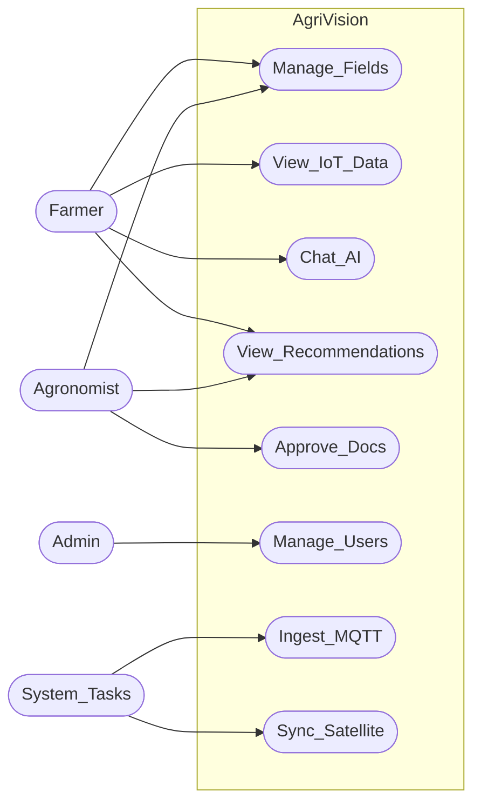

### 2.2 Role-Based Access Matrix
The system uses Firebase Authentication mapped to an internal PostgreSQL `users` table via `firebase_uid`. The platform enforces strict role-based constraints (`UserRole` Enum).

| Feature / Resource | `mobile_user` (Farmer) | `agronomist` (Expert) | `admin` (System Owner) |
|--------------------|------------------------|-----------------------|------------------------|
| **Field Management** | Create, view, update own fields | View assigned/all fields | Full Access |
| **IoT Sensors** | View own sensors & readings | View assigned/all sensors | Full Access |
| **AI Recommendations** | View approved/safe advice | Review & Validate queued advice | Full Access |
| **AI Chat (Farmer)** | Chat directly with AI | View transcript | Read-only |
| **AI Guidance (Expert)**| *Denied* | Direct AI steering/prompting | Full Access |
| **User Invitations**| *Denied* | Send to farmers/agronomists | Full Access |

### 2.3 Full Application Flow (End-to-End Lifecycle)

The system operates via a continuous cycle of data ingestion and AI evaluation. Below is the complete lifecycle flow of a standard farm within the AgriVision ecosystem:

1. **Onboarding & GIS Mapping**: 
   - A farmer logs into the iOS/Web app and uses the mapping tool (Leaflet/Mapbox) to draw their field boundaries. 
   - The backend validates the PostGIS polygon, creates the field, and triggers a background sync with the Agromonitoring satellite API.
2. **Hardware Deployment**:
   - The farmer installs ESP32 IoT sensors in the soil and links the `device_id` to their field in the app.
   - The sensors immediately begin streaming temperature, moisture, and NPK data over MQTT to the backend broker.
3. **Continuous Monitoring & Aggregation**:
   - The backend ingests the MQTT payload into a TimescaleDB hypertable. 
   - Hourly aggregator workers compress this raw data into statistical buckets to power real-time dashboards without querying millions of rows.
   - Satellite jobs fetch daily/weekly NDVI imagery to track canopy health.
4. **AI Generation & Guardrails**:
   - Periodically (or on-demand), the AI Advisor service pulls the aggregated sensor data, satellite imagery, and crop "Season Memory".
   - The Vertex AI model analyzes the data against a Vertex Search knowledge-base of approved agronomy rules.
   - *If* the AI recommends chemical interventions or pesticide dosages, the system flags it as `high_risk` and queues it.
5. **Expert Review**:
   - An Agronomist reviews the queued `high_risk` recommendation via the web dashboard.
   - If approved, the farmer receives a push notification on their iOS app.
6. **Farmer Action & AI Chat**:
   - The farmer reviews the approved recommendation and can open a direct AI chat thread to ask follow-up questions (e.g., "Can I use brand X instead?").
   - Agronomists can privately inject "Guidance" into this chat to steer the AI's future responses for that specific field.

---

## 3. CLEAR FUNCTIONAL REQUIREMENTS (FR)

The requirements have been explicitly detailed for clarity across the system's core modules.

### Module 1: Field & GIS Management
- **FR-1 (Field Creation):** Users must be able to create a field by providing at least 3 distinct GPS coordinates to form a PostGIS polygon.
- **FR-2 (Crop Tracking):** The system must track the `crop_type`, `plantation_date`, and compute the `area_ha` for every field.
- **FR-3 (Field Syncing):** The system must automatically queue new field boundaries to be synchronized with external satellite providers via `FieldProviderLink`.

### Module 2: IoT Sensor Telemetry & Ingestion
- **FR-4 (Sensor Registration):** Farmers must be able to register IoT sensors by assigning a `device_id` to a specific field.
- **FR-5 (Telemetry Ingestion):** The system must ingest raw telemetry (Moisture, Temperature, pH, NPK, EC) via an MQTT broker using a background worker.
- **FR-6 (Time-Series Rollup):** The system must automatically aggregate raw sensor readings into hourly buckets (Min, Max, Avg) to power fast rendering on the `FleetAnalyticsView`.

### Module 3: AI Advisory & Insights
- **FR-7 (AI Chat Interface):** Farmers must be able to chat with an AI advisor about their specific field, with the AI maintaining context of the field's sensor data and satellite imagery.
- **FR-8 (Recommendation Engine):** The system must periodically generate actionable agronomic advice (e.g., Irrigation, Pest Risk) based on real-time data.
- **FR-9 (Safety Guardrails & Expert Validation):** If the AI generates advice containing chemical/dosage keywords, the system must intercept the recommendation, mark it as `pending`, and queue it for an Agronomist to manually approve or reject via the `AIAdvisoryView`.
- **FR-10 (Season Memory):** The system must continuously compress the entire lifecycle of a crop into a 1200-character narrative to maintain long-term memory without overflowing the LLM context window.

---

## 4. SYSTEM ARCHITECTURE

The architecture follows a decoupled, async-first pattern. Background workers handle intensive tasks (MQTT ingestion, Satellite Sync) to keep the FastAPI gateway highly responsive.

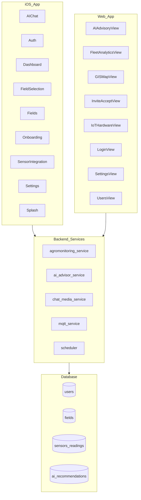

---

## 5. SEQUENCE DIAGRAMS & USAGE SCENARIOS

### 5.1 Authentication & Token Flow (Firebase to Backend)
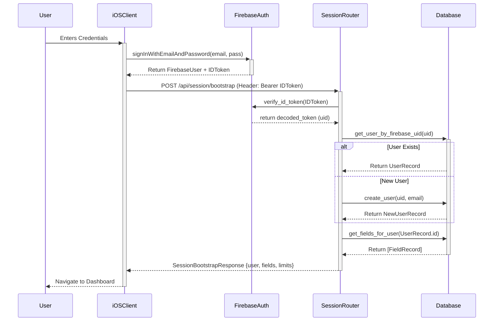

### 5.2 Field Creation & IoT Registration Flow
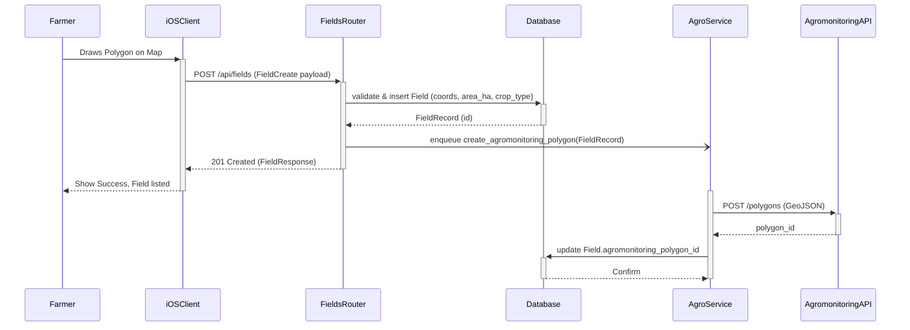

### 5.3 IoT Hardware MQTT Telemetry Ingestion Loop
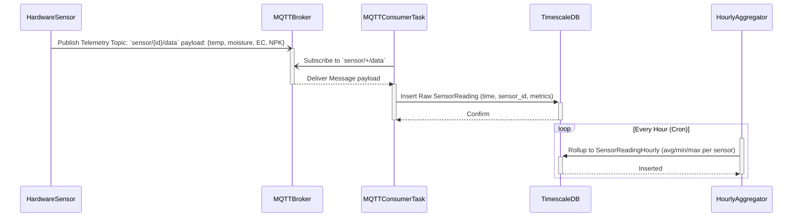

### 5.4 AI Recommendation Generation & Expert Approval
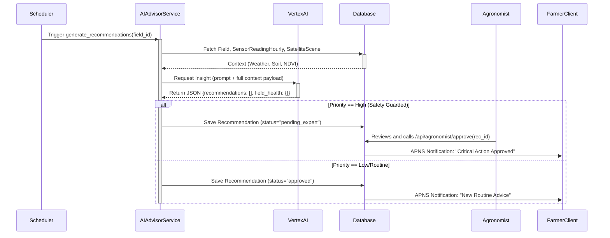

### 5.5 Farmer AI Chat & Media Upload Flow
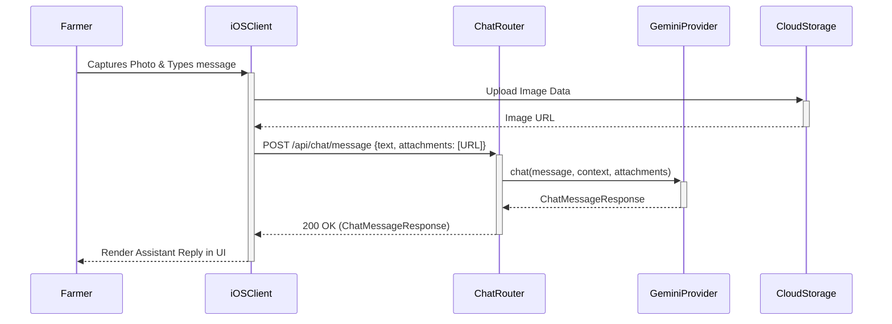

## 6. CLASS DIAGRAMS (DOMAIN BREAKDOWN)

To ensure clarity across such a large codebase, the class structures are broken down by application domain.

### 6.1 Backend API & Database Domain

```mermaid
classDiagram
    class User {
        PG_UUID id
        String firebase_uid
        String email
        Enum role
        DateTime created_at
    }
    class Invitation {
        PG_UUID id
        String email
        Enum role
        String status
        PG_UUID invited_by_id
        DateTime created_at
    }
    class Field {
        PG_UUID id
        PG_UUID owner_id
        String name
        String crop_type
        DateTime plantation_date
        DateTime expected_harvest_date
        Geometry boundary
        Float area_ha
        String status
        DateTime archived_at
        DateTime created_at
        DateTime updated_at
        Float latest_ndvi
        JSONB interval_overrides
        Float latest_health_score
        String latest_health_label
        Text latest_health_rationale
        DateTime latest_health_updated_at
    }
    class FieldProviderLink {
        PG_UUID id
        PG_UUID field_id
        String provider
        String external_id
        String sync_status
        String sync_error
        Boolean retryable
        DateTime last_sync_at
        DateTime created_at
        DateTime updated_at
    }
    class Sensor {
        PG_UUID id
        PG_UUID owner_id
        PG_UUID field_id
        String device_id
        String name
        String sensor_type
        Float battery_level
        DateTime last_seen
    }
    class SensorReading {
        DateTime time
        PG_UUID sensor_id
        Float temperature
        Float moisture
        Float humidity
        Float ph
        Float ec
        Float npk_n
        Float npk_p
        Float npk_k
    }
    class FieldObservation {
        PG_UUID id
        PG_UUID field_id
        String source
        String metric
        Float value
        String unit
        JSONB payload
        DateTime observed_at
        DateTime fetched_at
        DateTime expires_at
    }
    class SatelliteScene {
        PG_UUID id
        PG_UUID field_id
        String provider_scene_id
        String provider
        String source_type
        DateTime acquired_at
        Float cloud_percent
        Float coverage_percent
        JSONB statistics
        String ndvi_image_path
        String truecolor_image_path
        DateTime created_at
    }
    class AIAnalysisRun {
        PG_UUID id
        PG_UUID field_id
        String provider
        String status
        JSONB context_snapshot
        String context_fingerprint
        String model_name
        String prompt_version
        String policy_version
        String data_quality
        JSONB evidence
        String error
        DateTime started_at
        DateTime completed_at
    }
    class FieldRecommendation {
        PG_UUID id
        PG_UUID field_id
        PG_UUID analysis_run_id
        String category
        String priority
        Text advice
        Text rationale
        Float confidence
        String confidence_reason
        String safety_level
        Boolean requires_expert_confirmation
        JSONB evidence
        String expert_status
        Text expert_notes
        String status
        Float ndvi_at_generation
        DateTime created_at
        DateTime feedback_at
        DateTime expires_at
        String outcome
        Text outcome_notes
        DateTime outcome_at
    }
    class AIChatThread {
        PG_UUID id
        PG_UUID field_id
        String channel
        Text rolling_summary
        DateTime summarized_through
        DateTime created_at
        DateTime updated_at
    }
    class FieldSeasonMemory {
        PG_UUID id
        PG_UUID field_id
        DateTime season_started_at
        DateTime season_ended_at
        Text narrative
        JSONB key_events
        DateTime created_at
        DateTime updated_at
    }
    class AIChatMessage {
        PG_UUID id
        PG_UUID thread_id
        PG_UUID reply_to_message_id
        String role
        Text content
        String idempotency_key
        String status
        DateTime created_at
    }
    class ChatAttachment {
        PG_UUID id
        PG_UUID message_id
        String storage_key
        String mime_type
        Integer byte_size
        Integer width
        Integer height
        String sha256
        DateTime created_at
    }
    class ProviderCapability {
        PG_UUID id
        String provider
        String capability
        PG_UUID field_id
        String status
        Integer status_code
        DateTime checked_at
        String detail
    }
    class ProviderRequestLog {
        PG_UUID id
        String provider
        String endpoint
        PG_UUID field_id
        String outcome
        Integer status_code
        Boolean cache_hit
        Integer duration_ms
        DateTime created_at
    }
    class ProviderCache {
        String cache_key
        String provider
        String endpoint
        PG_UUID field_id
        JSONB response_payload
        DateTime created_at
        DateTime expires_at
    }
    class FieldDeletionJob {
        PG_UUID id
        PG_UUID field_id
        String provider_polygon_id
        JSONB media_paths
        String status
        Integer attempts
        String last_error
        DateTime next_attempt_at
        DateTime created_at
        DateTime completed_at
    }
    class SensorReadingHourly {
        DateTime bucket
        PG_UUID sensor_id
        Float temperature_avg
        Float temperature_min
        Float temperature_max
        Float moisture_avg
        Float moisture_min
        Float moisture_max
        Float humidity_avg
        Float humidity_min
        Float humidity_max
        Float ph_avg
        Float ph_min
        Float ph_max
        Float ec_avg
        Float ec_min
        Float ec_max
        Float npk_n_avg
        Float npk_n_min
        Float npk_n_max
        Float npk_p_avg
        Float npk_p_min
        Float npk_p_max
        Float npk_k_avg
        Float npk_k_min
        Float npk_k_max
        Integer reading_count
    }
    class AgronomyKnowledgeDocument {
        PG_UUID id
        String external_id
        String title
        String source_url
        String crop
        String region
        String version
        DateTime published_at
        Boolean approved
        DateTime created_at
    }
    class UserNotification {
        PG_UUID id
        PG_UUID user_id
        String title
        Text body
        String reference_id
        String reference_type
        Boolean is_read
        DateTime created_at
    }
    class SystemSettings {
        PG_UUID id
        String key
        JSONB value
        DateTime updated_at
        PG_UUID updated_by
    }
    User -- Field
    User -- Invitation
    Invitation -- User
    Field -- User
    Field -- FieldProviderLink
    Field -- Sensor
    Field -- FieldRecommendation
    Field -- FieldObservation
    Field -- SatelliteScene
    FieldProviderLink -- Field
    Sensor -- Field
    FieldObservation -- Field
    SatelliteScene -- Field
    FieldRecommendation -- Field
    UserNotification -- User
    SystemSettings -- User
```

### 6.1.1 Backend API Routers & Services

```mermaid
classDiagram
    class FieldsRouter {
        +create_field(field_data, background_tasks, db)
        +get_fields(include_archived, admin_view, db)
        +get_field(field_id, db, current_user)
        +assign_sensor(field_id, sensor_data, db)
        +get_field_sensors(field_id, db, current_user)
        +update_field(field_id, update, db)
        +harvest_field_removed(field_id, db, current_user)
        +delete_field(field_id, background_tasks, db)
        +refresh_field_data(field_id, background_tasks, db)
        +get_dashboard(field_id, db, current_user)
        +weather_soil_compat(field_id, db, current_user)
    }
    class SensorsRouter {
        +get_sensors(db, current_user)
        +get_field_readings(field_id, granularity, limit)
        +verify_sensor_connection(device_id, db, current_user)
        +pair_sensor(request, db, current_user)
    }
    class SatelliteRouter {
        +latest(field_id, db, current_user)
        +ndvi_image(field_id, db, current_user)
        +truecolor_image(field_id, db, current_user)
        +fetch_tile(field_id, layer_type, z)
    }
    class RecommendationsRouter {
        +get_recommendations(field_id, limit, db)
        +get_season_memory(field_id, db, current_user)
        +update_feedback(recommendation_id, feedback, db)
        +update_feedback_compat(field_id, recommendation_id, feedback)
        +get_expert_pending_recommendations(limit, db, current_user)
        +expert_validate(recommendation_id, validation, db)
        +record_outcome(recommendation_id, outcome, db)
        +trigger_refresh(field_id, background_tasks, db)
    }
    class SessionRouter {
        +bootstrap(db, current_user)
    }
    class ExportRouter {
        +export_sensor_readings(field_id, granularity, hours)
        +export_recommendations(field_id, limit, db)
        +export_observations(field_id, limit, db)
        +export_satellite_scenes(field_id, limit, db)
        +export_chat(field_id, limit, db)
    }
    class ChatRouter {
        +get_history(field_id, limit, before)
        +get_attachment(field_id, attachment_id, db)
        +post_message(field_id, message, images)
    }
    class AdminRouter {
        +get_all_users(db)
        +delete_user(user_id, background_tasks, db)
        +transfer_field(field_id, req, db)
        +get_ai_settings(db)
        +update_ai_settings(settings, db, current_user)
    }
    class AgronomistRouter {
        +get_agronomist_history(field_id, limit, before)
        +post_agronomist_message(field_id, body, idempotency_key)
    }
    class NotificationsRouter {
        +get_notifications(limit, db, current_user)
        +mark_notification_read(notification_id, db, current_user)
    }
    class InvitationsRouter {
        +create_invitation(invite_data, db, current_user)
        +get_invitations(db, current_user)
    }
    class KnowledgeProvider {
        +retrieve(crop, query)
    }
    class CuratedKnowledgeProvider {
        +retrieve(crop, query)
    }
    class VertexSearchKnowledgeProvider {
        +retrieve(crop, query)
    }
    class AIProvider {
        +name
        +model_name
        +recommendations(context)
        +chat(message, context, images)
        +summarize_season(existing_narrative, new_recommendations, recommendation_history)
    }
    class UnavailableAIProvider {
        +recommendations(context)
        +summarize_season(existing_narrative, new_recommendations, recommendation_history)
        +chat(message, context, images)
    }
    class GeminiAIProvider {
        +recommendations(context)
        +summarize_season(existing_narrative, new_recommendations, recommendation_history)
        +chat(message, context, images)
    }
```

### 6.1.2 Backend Pydantic Schemas

```mermaid
classDiagram
    class SanitizedImage {
        +data
        +mime_type
        +width
        +height
        +sha256
    }
    class PrivateMediaStorage {
    }
    class LocalPrivateMediaStorage {
    }
    class GCSPrivateMediaStorage {
    }
    class AgroAPIError {
    }
    class AgroEntitlementError {
    }
    class StrictModel {
    }
    class PointCoordinates {
        +longitude
        +latitude
    }
    class SensorCreate {
        +device_id
        +name
        +sensor_type
    }
    class SensorResponse {
        +id
        +field_id
        +device_id
        +name
        +sensor_type
        +battery_level
        +last_seen
    }
    class SensorPairRequest {
        +device_id
    }
    class SensorPairResponse {
        +is_paired
        +message
        +sensor
    }
    class FieldCreate {
        +name
        +coordinates
        +area_ha
        +crop_type
        +plantation_date
        +expected_harvest_date
    }
    class FieldWithSensorsCreate {
        +sensors
    }
    class FieldIntervalOverrides {
        +weather_hours
        +soil_hours
        +uvi_hours
        +satellite_hours
        +ai_hours
        +retention_days
    }
    class FieldUpdate {
        +name
        +crop_type
        +expected_harvest_date
        +interval_overrides
    }
    class FieldResponse {
        +id
        +owner_id
        +name
        +coordinates
        +area_ha
        +status
        +archived_at
        +created_at
        +updated_at
        +crop_type
    }
    class SensorReadingDB {
        +time
        +sensor_id
        +temperature
        +moisture
        +humidity
        +ph
        +ec
        +npk_n
        +npk_p
        +npk_k
    }
    class SensorReadingHourlyDB {
        +bucket
        +sensor_id
        +temperature_avg
        +temperature_min
        +temperature_max
        +moisture_avg
        +moisture_min
        +moisture_max
        +humidity_avg
        +humidity_min
    }
    class RecommendationResponse {
        +id
        +field_id
        +category
        +priority
        +advice
        +rationale
        +confidence
        +confidence_reason
        +evidence
        +safety_level
    }
    class SeasonMemoryResponse {
        +field_id
        +season_started_at
        +narrative
        +key_events
    }
    class RecommendationExpertValidation {
        +status
        +notes
    }
    class RecommendationFeedback {
        +status
    }
    class RecommendationOutcome {
        +outcome
        +notes
    }
    class ChatMessageRequest {
        +message
    }
    class ChatAttachmentResponse {
        +id
        +mime_type
        +byte_size
        +width
        +height
        +url
    }
    class ChatMessageResponse {
        +id
        +role
        +content
        +status
        +attachments
        +created_at
    }
    class ChatTurnResponse {
        +user_message
        +assistant_message
    }
    class UserSchema {
        +id
        +firebase_uid
        +email
        +role
        +created_at
    }
    class SessionBootstrapResponse {
        +user
        +fields
        +active_field_limit
        +active_field_count
    }
    class ErrorBody {
        +code
        +message
        +details
        +retryable
        +request_id
    }
    class ErrorEnvelope {
        +error
    }
    class InvitationCreate {
        +email
        +role
    }
    class InvitationResponse {
        +id
        +email
        +role
        +status
        +created_at
    }
    class AISettingsUpdate {
        +mode
        +model
    }
    class AISettingsResponse {
        +mode
        +model
    }
```

### 6.2 Web Application Domain (React TSX)

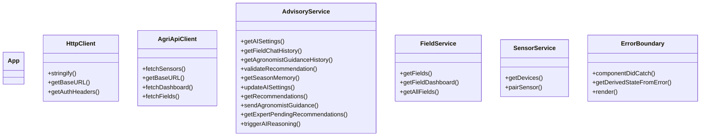

### 6.3 iOS Application Domain (Swift)

```mermaid
classDiagram
    class SettingsViewModel {
        +accountName: String
        +appVersion: String
        +preferencesService: PreferencesService
        +currentFieldName: String
        +isGoogleLinked: Bool
        +successMessage: String?
        +profileName: String
        +authService: AuthService
        +accountEmail: String
        +sensorSummary: String
        +errorMessage: String?
        +satelliteSummary: String
        +sensors: [FieldSensor]
        +fieldSessionStore: FieldSessionStore?
        +activeFieldId: UUID?
        +deleteField()
        +presentError()
        +refreshIntegrationStatus()
        +presentSuccess()
        +setRefreshInterval()
        +pairAndAssignSensor()
        +selectField()
        +signOut()
        +linkGoogleAccount()
        +refreshAll()
    }
    class LoginViewModel {
        +authService: AuthService
        +password: String
        +rememberMe: Bool
        +errorMessage: String?
        +preferencesService: PreferencesService
        +isLoading: Bool
        +email: String
        +continueWithGoogle()
        +forgotPassword()
        +login()
    }
    class SignupViewModel {
        +lastNameError: String?
        +authService: AuthService
        +password: String
        +lastName: String
        +confirmPasswordError: String?
        +errorMessage: String?
        +confirmPassword: String
        +isLoading: Bool
        +firstName: String
        +passwordError: String?
        +userProfileService: UserProfileService
        +firstNameError: String?
        +email: String
        +emailError: String?
        +continueWithGoogle()
        +validateField()
        +register()
    }
    class AuthViewModel {
        +selectedTab: AuthTab
        +switchToSignup()
        +authCompleted()
        +switchToLogin()
    }
    class ForgotPasswordViewModel {
        +authService: AuthService
        +errorMessage: String?
        +isLoading: Bool
        +email: String
        +successMessage: String?
        +sendResetLink()
        +back()
    }
    class VerifyEmailViewModel {
        +isLoading: Bool
        +message: String?
        +isVerified: Bool
        +authService: AuthService
        +checkVerificationStatus()
        +resendVerificationEmail()
    }
    class DashboardViewModel {
        +fullDashboardRefreshInterval: TimeInterval
        +ndviData: Data?
        +advisorMessage: String?
        +preferencesService: PreferencesService
        +currentCropType: String
        +values: [
        +sensorFleet: [SensorFleetEntry]
        +recommendations: [FieldRecommendation]
        +satelliteImageData: Data?
        +fieldSessionStore: FieldSessionStore
        +truecolorImageData: Data?
        +authService: AuthService
        +weatherSoil: FieldWeatherSoil?
        +uvi: SourceState
        +errorMessage: String?
        +availabilityItems()
        +refreshRecommendations()
        +refreshNotifications()
        +signOut()
        +loadSatelliteImages()
        +pollUntilCancelled()
        +requestDataRefresh()
        +presentError()
        +clearFieldData()
        +openChat()
        +refreshSensorReadingsOnly()
        +markNotificationRead()
        +openSettings()
        +updateFeedback()
        +recordOutcome()
    }
    class AIChatViewModel {
        +messages: [ChatMessage]
        +errorMessage: String?
        +fieldId: UUID
        +canSend: Bool
        +attachmentData: [UUID
        +pendingIdempotencyKey: String?
        +dataService: AgriDataService
        +selectedImages: [ChatImageUpload]
        +imageData()
        +addImage()
        +sendMessage()
        +presentError()
        +removeImage()
        +loadMissingAttachments()
        +fetchHistory()
        +dismiss()
    }
    class AddFieldIntroViewModel {
        +profileInitial: String
        +authService: AuthService
        +userName: String
        +profileImageURL: URL?
        +addFieldAction()
        +loadUserData()
        +signOut()
    }
    class FieldDetailsViewModel {
        +selectedCrop: String
        +dataService: AgriDataService
        +authService: AuthService
        +profileInitial: String
        +profileImageURL: URL?
        +errorMessage: String?
        +coordinates: [CLLocationCoordinate2D]
        +isLoading: Bool
        +name: String
        +defaultHarvestInterval: TimeInterval
        +monitorWithIoT: Bool
        +calculatedAreaHa: Double
        +plantationDate: Date
        +letSystemDecideHarvestDate: Bool
        +harvestDate: Date
        +performSave()
        +loadUserData()
        +goBack()
        +signOut()
        +saveField()
    }
    class FieldSelectionViewModel {
        +dataService: AgriDataService
        +searchResults: [MKLocalSearchCompletion]
        +authService: AuthService
        +locationName: String
        +fieldCoordinates: [CLLocationCoordinate2D]
        +profileImageURL: URL?
        +errorMessage: String?
        +searchQuery: String
        +profileInitial: String
        +successMessage: String?
        +isSearching: Bool
        +movePoint()
        +completerDidUpdateResults()
        +completer()
        +clearPoints()
        +zoomIn()
        +signOut()
        +calculatedAreaHa()
        +selectSearchResult()
        +addPoint()
        +cancelSelection()
        +showMessage()
        +moveToLocation()
        +undoLastPoint()
        +setupProfile()
        +confirmField()
    }
    class OnboardingViewModel {
        +scrollOffset: CGFloat
        +pages: [OnboardingPage]
        +containerWidth: CGFloat
        +handlePreferenceChange()
        +handleNextAction()
    }
    class SensorIntegrationViewModel {
        +dataService: AgriDataService
        +authService: AuthService
        +createdFieldID: UUID?
        +verificationMessage: String?
        +isVerifying: Bool
        +fieldData: FieldSelectionData
        +errorMessage: String?
        +profileImageURL: URL?
        +fieldID: UUID
        +selectedSensorType: String
        +isLoading: Bool
        +profileInitial: String
        +sensorName: String
        +isVerified: Bool
        +pairingCode: String
        +verifyHardware()
        +loadUserData()
        +goBack()
        +completeSetup()
        +signOut()
    }
    class MockAuthService {
        +currentUserID: String?
        +currentUserDisplayName: String?
        +isLoggedInStub: Bool
        +currentUserEmail: String?
        +currentUserPhotoURL: URL?
        +isEmailVerified: Bool
        +displayName: String?
        +shouldFail: Bool
        +isGoogleProviderLinked: Bool
        +isUserLoggedIn: Bool
        +reloadUser()
        +resetPassword()
        +signOut()
        +signInWithGoogle()
        +sendEmailVerification()
        +linkGoogleAccount()
        +getIDToken()
        +updateDisplayName()
        +signUp()
        +signIn()
    }
    class FirebaseUserProfileService {
        +updateDisplayName()
    }
    class MockPreferencesService {
        +activeFieldId: UUID?
        +savedEmail: String?
        +dashboardRefreshInterval: TimeInterval
    }
    class FirebaseAuthService {
        +currentUserID: String?
        +currentUserDisplayName: String?
        +currentUserEmail: String?
        +currentUserPhotoURL: URL?
        +isEmailVerified: Bool
        +isGoogleProviderLinked: Bool
        +isUserLoggedIn: Bool
        +reloadUser()
        +resetPassword()
        +getTopViewController()
        +signOut()
        +signInWithGoogle()
        +sendEmailVerification()
        +linkGoogleAccount()
        +getIDToken()
        +updateDisplayName()
        +signUp()
        +signIn()
    }
    class UserDefaultsPreferencesService {
        +activeFieldId: UUID?
        +savedEmail: String?
        +dashboardRefreshInterval: TimeInterval
        +getSavedEmail()
    }
    class UserDefaultsOnboardingStateService {
        +hasSeenOnboarding: Bool
        +defaults: UserDefaults
        +markOnboardingComplete()
    }
    class MockUserProfileService {
        +lastDisplayName: String?
        +shouldFail: Bool
        +updateDisplayName()
    }
    class OnboardingStateService {
        +hasSeenOnboarding: Bool
        +markOnboardingComplete()
    }
    class UserProfileService {
        +updateDisplayName()
    }
    class AgriDataService {
        +sendChatMessage()
        +deleteField()
        +refreshRecommendations()
        +saveField()
        +fetchChatHistory()
        +fetchWeatherSoil()
        +fetchFields()
        +fetchSensors()
        +pairSensor()
        +fetchSensorReadings()
        +fetchSatelliteImage()
        +bootstrapSession()
        +refreshFieldData()
        +fetchDashboard()
        +fetchSeasonMemory()
    }
    class AuthService {
        +currentUserID: String?
        +currentUserDisplayName: String?
        +currentUserEmail: String?
        +currentUserPhotoURL: URL?
        +isEmailVerified: Bool
        +errorDescription: String?
        +isGoogleProviderLinked: Bool
        +isUserLoggedIn: Bool
        +reloadUser()
        +resetPassword()
        +signOut()
        +signInWithGoogle()
        +sendEmailVerification()
        +linkGoogleAccount()
        +getIDToken()
        +updateDisplayName()
        +signUp()
        +signIn()
    }
    class PreferencesService {
        +activeFieldId: UUID?
        +savedEmail: String?
        +dashboardRefreshInterval: TimeInterval
    }
```

---

## 7. COMPREHENSIVE DATABASE DESIGN (ERD & DATA DICTIONARY)

### 7.1 Entity Relationship Diagram (ERD)

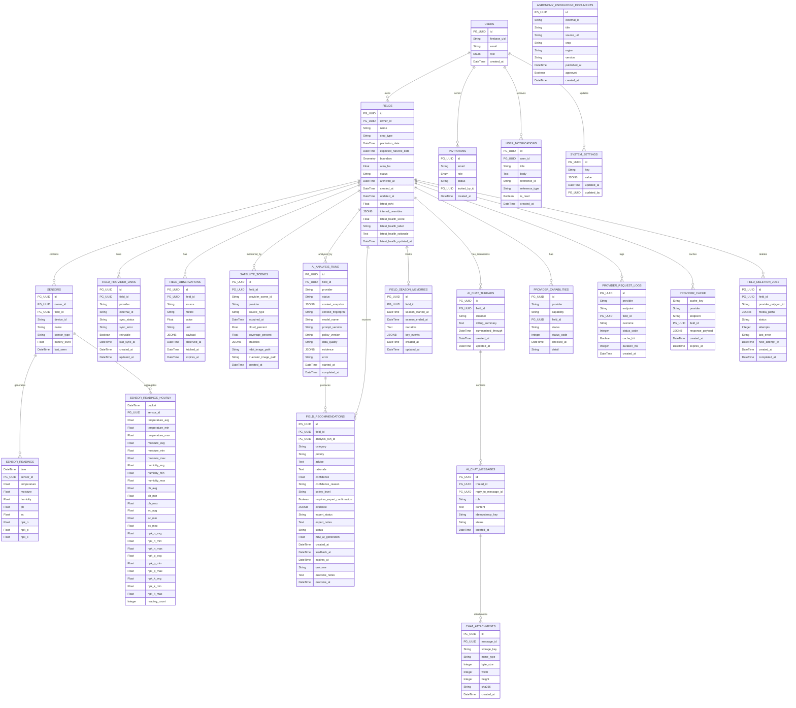

### 7.2 Data Dictionary (Key Tables)

#### Table: `fields`
| Field | Type | Modifiers | Description |
|-------|------|-----------|-------------|
| id | UUID | PK, Default UUID4 | Field identifier. |
| owner_id | UUID | FK(users.id), Index, Not Null | The farmer who owns the field. |
| boundary | GEOMETRY | Not Null | PostGIS Polygon. |
| area_ha | FLOAT | Not Null | Computed area. |
| crop_type | VARCHAR(80) | | e.g., wheat, rice. |
| plantation_date | DATETIME | | Seeding date. |
| latest_health_score| FLOAT | | Computed 0-100 score by AI. |

#### Table: `sensor_readings` (TimescaleDB)
| Field | Type | Modifiers | Description |
|-------|------|-----------|-------------|
| time | DATETIME | PK | Time-series partition key. |
| sensor_id | UUID | PK, FK(sensors.id) | Hardware source. |
| temperature | FLOAT | | |
| moisture | FLOAT | | |
| ph | FLOAT | | |
| ec | FLOAT | | Electrical Conductivity. |
| npk_n / p / k | FLOAT | | Nitrogen, Phosphorus, Potassium. |

#### Table: `field_recommendations`
| Field | Type | Modifiers | Description |
|-------|------|-----------|-------------|
| id | UUID | PK | Recommendation ID. |
| category | VARCHAR(50) | Not Null | E.g., `Irrigation`, `Pest Risk`. |
| priority | VARCHAR(20) | Not Null | `low`, `medium`, `high`. |
| advice | TEXT | Not Null | Jargon-free advice for the farmer. |
| rationale | TEXT | | Technical justification (includes NDVI/sensor raw data). |
| confidence | FLOAT | | AI's self-assessed certainty. |
| safety_level | VARCHAR(20) | Not Null | `routine`, `guarded`, `high_risk`. |
| expert_status | VARCHAR(20) | Not Null, Default 'pending' | `pending`, `approved`, `rejected`. |

---

## 8. SDLC & WORK PLAN (MS PROJECT WBS)

**Methodology: Agile Scrum (2-Week Sprints)**

| WBS | Task Name | Duration | Dependencies | Resource |
|-----|-----------|----------|--------------|----------|
| **1.0** | **Infrastructure & Database Initialization** | **7d** | | |
| 1.1 | PostGIS & TimescaleDB Docker configuration | 2d | | DevOps |
| 1.2 | Alembic Schema Migrations (`db_models.py`) | 3d | 1.1 | Backend Eng. |
| 1.3 | Firebase Authentication Setup | 2d | | Backend Eng. |
| **2.0** | **Backend Core Services** | **14d** | | |
| 2.1 | Pydantic Schema Validation (`pydantic_schemas.py`) | 3d | 1.2 | Backend Eng. |
| 2.2 | Field & Sensor CRUD APIs | 4d | 2.1 | Backend Eng. |
| 2.3 | MQTT Broker Integration & Ingestion Task | 4d | 2.2 | IoT Eng. |
| 2.4 | Hourly Rollup Aggregation Engine | 3d | 2.3 | Backend Eng. |
| **3.0** | **AI & External Integrations** | **12d** | | |
| 3.1 | Agromonitoring Sync Background Worker | 4d | 2.2 | Backend Eng. |
| 3.2 | Vertex AI GenAI SDK Integration | 3d | | AI Eng. |
| 3.3 | Vertex Search (RAG) Document Indexing | 2d | | AI Eng. |
| 3.4 | AI Safety Policies & Expert Queue Logic | 3d | 3.2, 3.3 | AI Eng. |
| **4.0** | **Frontend (React) Implementation** | **16d** | | |
| 4.1 | GISMapView (Mapbox/Polygon Rendering) | 4d | 2.2 | Frontend Eng. |
| 4.2 | FleetAnalyticsView (Time-Series Charts) | 4d | 2.4 | Frontend Eng. |
| 4.3 | AIAdvisoryView (Farmer Chat & Expert Queue) | 5d | 3.4 | Frontend Eng. |
| 4.4 | SettingsView & Access Control Guarding | 3d | 1.3 | Frontend Eng. |
| **5.0** | **Testing & Deployment** | **7d** | | |
| 5.1 | End-to-End Test (Sensor Ingestion to AI) | 4d | 2.0, 3.0, 4.0| QA Eng. |
| 5.2 | Staging & Production Deployment | 3d | 5.1 | DevOps |

---

## 9. COMPREHENSIVE TECHNOLOGY STACK & LIBRARIES

The AgriVision ecosystem spans web, mobile, IoT hardware, and scalable cloud infrastructure.

### 9.1 Web Application (AgriVision-Web)
- **Framework:** React 19.x with TypeScript 6.x
- **Build Tool:** Vite 8.x
- **Styling:** TailwindCSS 4.x
- **Mapping/GIS Visualization:** Leaflet (`leaflet` and `@types/leaflet`)
- **Data Visualization:** Recharts (for IoT Fleet Analytics)
- **Icons:** Lucide React
- **Auth Client:** Firebase JS SDK (`firebase` v12.x)

### 9.2 Native iOS Application (AgriVision)
- **Language/Framework:** Swift (UIKit/SwiftUI)
- **Package Manager:** Swift Package Manager (SPM)
- **Auth & Backend:** `firebase-ios-sdk` (Firebase Authentication)
- **Authentication:** `GoogleSignIn-iOS`

### 9.3 Backend API (AgriVision-Backend)
- **Framework:** FastAPI with Uvicorn (ASGI server)
- **ORM & Database Drivers:** SQLAlchemy 2.0, GeoAlchemy2 (for spatial queries), Psycopg2
- **Data Validation:** Pydantic 2.x and Pydantic Settings
- **Migrations:** Alembic
- **IoT / Hardware Sync:** Paho MQTT (for subscribing to telemetry topics)
- **External API Clients:** `httpx`, Google Cloud GenAI SDK (`google-genai`), Google Cloud Storage SDK.
- **Image Processing:** Pillow and `pillow-heif` (for parsing farmer-uploaded chat attachments)
- **Testing:** Pytest & Pytest-Asyncio

### 9.4 IoT Firmware (AgriVision ESP)
- **Hardware:** ESP32-S3 (board: `esp32-s3-devkitc-1-n16r8`)
- **Framework:** Arduino framework via PlatformIO
- **Core Libraries:**
  - `knolleary/PubSubClient` (MQTT Communication)
  - `bblanchon/ArduinoJson` (Telemetry Payload Formatting)
  - `milesburton/DallasTemperature` & `paulstoffregen/OneWire` (Temperature & Soil Sensors)
  - `adafruit/Adafruit NeoPixel` (On-board LED Status Indicators)

### 9.5 Docker Infrastructure & Orchestration
The backend suite is fully containerized and orchestrated via a robust `docker-compose.yml` defining multiple dependent services on an isolated `agrivision_net` bridge network:
- **FastAPI Backend:** Built dynamically via `Dockerfile` and mounts live volumes for media (`agro_media`, `chat_media`).
- **Database Node (`agrivision_db`):** Uses the `timescale/timescaledb-ha:pg15-all` high-availability image. It runs PostgreSQL 15, PostGIS, and TimescaleDB together.
- **MQTT Broker (`agrivision_mqtt`):** Uses `eclipse-mosquitto:latest` with mounted configurations (`mosquitto.conf`).
- **Management Tools (Profiles: `tools`):**
  - **pgAdmin 4 (`agrivision_pgadmin`):** Database management UI.
  - **Portainer CE (`agrivision_portainer`):** Container orchestration and management UI.

### 9.6 External Cloud Services & Third-Party APIs
- **Google Cloud Platform (GCP):**
  - **Vertex AI (Gemini):** Used via `google-genai` for analyzing field data. Configured to use `gemini-3.7-flash`.
  - **Vertex Search (Discovery Engine):** Serves as the RAG backend (`agronomy-knowledge` data store).
  - **Cloud Storage:** For storing uploaded media/attachments linked to chat messages.
- **Firebase:** Manages the user identity pool and role tokens securely.
- **Agromonitoring API:** Fetches historical and real-time NDVI satellite imagery.
- **MQTT Broker:** Mosquitto (or equivalent) for IoT telemetry.
